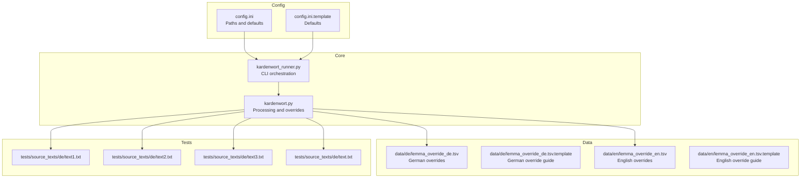
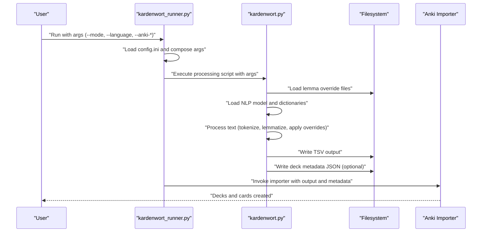
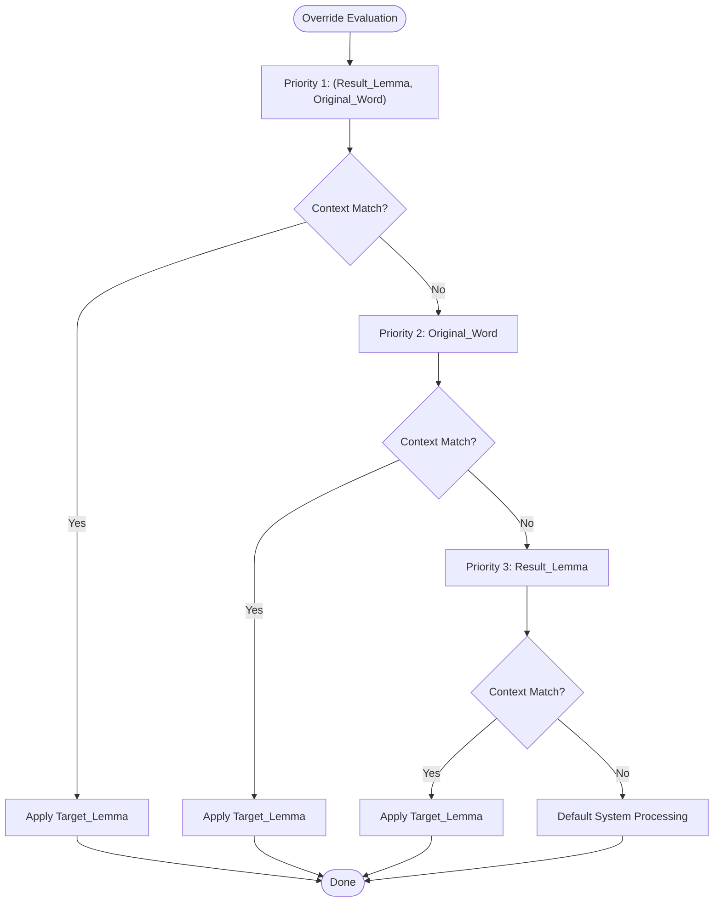
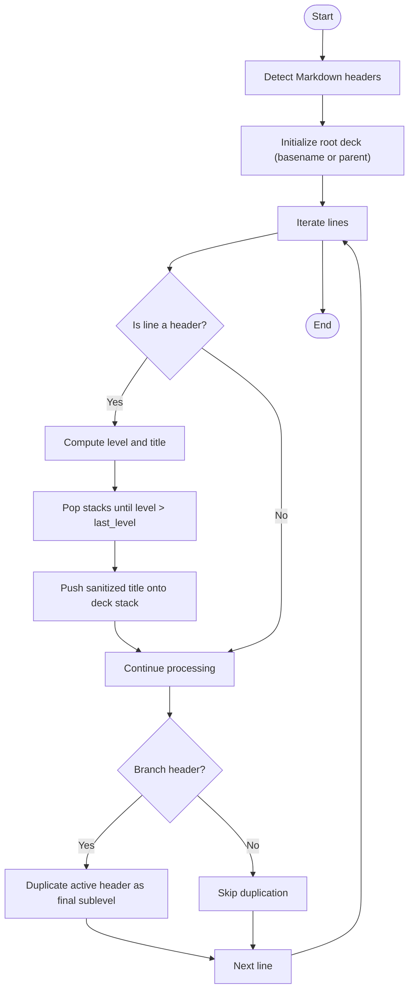
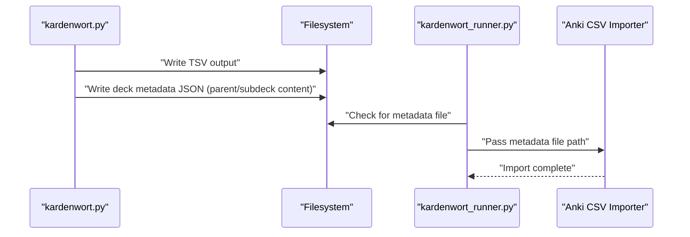
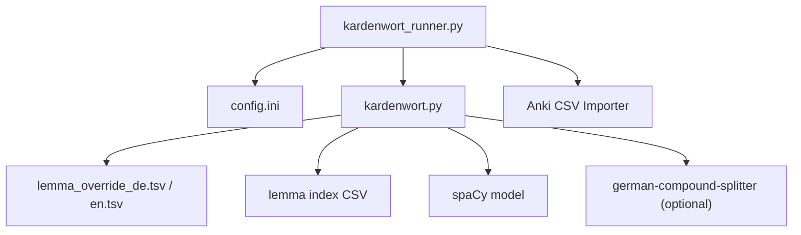

# Advanced Features

<cite>
**Referenced Files in This Document**
- [kardenwort.py](file://src/kardenwort/core/kardenwort.py)
- [kardenwort_runner.py](file://src/kardenwort/core/kardenwort_runner.py)
- [config.ini](file://config.ini)
- [config.ini.template](file://config.ini.template)
- [README.md](file://README.md)
- [lemma_override_de.tsv](file://data/de/lemma_override_de.tsv)
- [lemma_override_de.tsv.template](file://data/de/lemma_override_de.tsv.template)
- [lemma_override_en.tsv](file://data/en/lemma_override_en.tsv)
- [lemma_override_en.tsv.template](file://data/en/lemma_override_en.tsv.template)
- [text1.txt](file://tests/source_texts/de/text1.txt)
- [text2.txt](file://tests/source_texts/de/text2.txt)
- [text3.txt](file://tests/source_texts/de/text3.txt)
- [text.txt](file://tests/source_texts/de/text.txt)
</cite>

## Table of Contents
1. [Introduction](#introduction)
2. [Project Structure](#project-structure)
3. [Core Components](#core-components)
4. [Architecture Overview](#architecture-overview)
5. [Detailed Component Analysis](#detailed-component-analysis)
6. [Dependency Analysis](#dependency-analysis)
7. [Performance Considerations](#performance-considerations)
8. [Troubleshooting Guide](#troubleshooting-guide)
9. [Conclusion](#conclusion)
10. [Appendices](#appendices)

## Introduction
This section documents Kardenwort’s advanced capabilities: the user-trainable lemma override system and the hierarchical deck creation feature. It explains how override rules are structured, loaded, and applied to correct lemmatization errors, including priority levels and context-aware rules with regex support. It also covers how Markdown headers are parsed to build nested Anki deck structures, and how deck descriptions are populated with source text and translations. Practical examples demonstrate creating override rules for specific linguistic challenges and organizing content hierarchically with Markdown. Finally, it addresses common issues such as rule precedence, regex errors, and header parsing edge cases, with targeted troubleshooting guidance.

## Project Structure
Kardenwort’s advanced features are implemented primarily in the core processing module and orchestrated by the runner script. Configuration ties language resources and output templates to the processing pipeline. The data directory contains language-specific override files and templates that define the rule format and behavior.

**Diagram sources**
- [kardenwort.py](file://src/kardenwort/core/kardenwort.py#L1-L120)
- [kardenwort_runner.py](file://src/kardenwort/core/kardenwort_runner.py#L1-L120)
- [config.ini](file://config.ini#L1-L65)
- [config.ini.template](file://config.ini.template#L1-L65)
- [lemma_override_de.tsv](file://data/de/lemma_override_de.tsv#L1-L144)
- [lemma_override_de.tsv.template](file://data/de/lemma_override_de.tsv.template#L1-L227)
- [lemma_override_en.tsv](file://data/en/lemma_override_en.tsv#L1-L1)
- [lemma_override_en.tsv.template](file://data/en/lemma_override_en.tsv.template#L1-L174)
- [text1.txt](file://tests/source_texts/de/text1.txt#L1-L14)
- [text2.txt](file://tests/source_texts/de/text2.txt#L1-L14)
- [text3.txt](file://tests/source_texts/de/text3.txt#L1-L14)
- [text.txt](file://tests/source_texts/de/text.txt#L1-L9)

**Section sources**
- [README.md](file://README.md#L92-L131)
- [config.ini](file://config.ini#L1-L65)
- [config.ini.template](file://config.ini.template#L1-L65)

## Core Components
- Lemma override system: Loads and applies user-defined rules to correct lemmatization outcomes. Rules are grouped by priority and evaluated in a strict order, with optional context substrings and regex support.
- Hierarchical deck creation: Parses Markdown headers to build nested Anki decks, with optional sentence-level subdecks and branch header handling.
- Automatic deck descriptions: Populates Anki deck descriptions with source text and translations when enabled.

**Section sources**
- [kardenwort.py](file://src/kardenwort/core/kardenwort.py#L74-L144)
- [kardenwort.py](file://src/kardenwort/core/kardenwort.py#L146-L242)
- [kardenwort.py](file://src/kardenwort/core/kardenwort.py#L461-L593)
- [kardenwort.py](file://src/kardenwort/core/kardenwort.py#L594-L671)
- [kardenwort.py](file://src/kardenwort/core/kardenwort.py#L715-L810)
- [kardenwort.py](file://src/kardenwort/core/kardenwort.py#L1086-L1166)
- [kardenwort.py](file://src/kardenwort/core/kardenwort.py#L1509-L1595)

## Architecture Overview
The runner script composes command-line arguments and invokes the core processing module. The core module orchestrates text ingestion, tokenization, lemmatization, override application, and deck construction. When enabled, it writes deck metadata for Anki.

**Diagram sources**
- [kardenwort_runner.py](file://src/kardenwort/core/kardenwort_runner.py#L1-L120)
- [kardenwort_runner.py](file://src/kardenwort/core/kardenwort_runner.py#L120-L260)
- [kardenwort.py](file://src/kardenwort/core/kardenwort.py#L594-L671)
- [kardenwort.py](file://src/kardenwort/core/kardenwort.py#L1509-L1595)

## Detailed Component Analysis

### User-Trainable Lemma Override System
The override system defines precise corrections for lemmatization outcomes. It uses a four-column, tab-separated format and supports three priority levels with optional context and regex.

- Rule format and columns:
  - Column 1: Result_Lemma (initial lemma or component part)
  - Column 2: Original_Word (inflected form from source)
  - Column 3: Target_Lemma (desired lemma)
  - Column 4: Optional_Context (substring or regex)

- Priority levels:
  1. Highest: Specific Match (Result_Lemma + Original_Word)
  2. Medium: Source Word Match (Original_Word only)
  3. Low: Result Lemma Match (Result_Lemma only)
  4. Default: System processing if no rule matches

- Context-awareness:
  - Contextual rules apply only when the substring is present in the sentence.
  - Within each priority, contextual rules are preferred over global rules.
  - Context is a flexible substring search; regex is supported via a prefix in the Context column.

- Regex support:
  - Prefix “regex:” enables regex matching for Original_Word or Context.
  - In Context, the entire sentence is searched.
  - In Original_Word, the pattern is matched against the single word.
  - Invalid regex patterns produce warnings and are skipped.

- Loading and evaluation:
  - Rules are loaded from the language-specific override file.
  - They are indexed by priority and evaluated in strict order.
  - For compound parts, a specialized function applies overrides to individual components.

**Diagram sources**
- [kardenwort.py](file://src/kardenwort/core/kardenwort.py#L74-L144)
- [kardenwort.py](file://src/kardenwort/core/kardenwort.py#L146-L242)

Practical examples of override rules:
- Whole-word correction: ensure a specific word always maps to a target lemma.
- Contextual correction: apply a rule only when a sentence contains a specific substring.
- Regex-based correction:
  - Correct a component inside compound words safely using a pattern that matches words containing a specific substring.
  - Enforce capitalization rules only when a word is not at the start of a sentence.

**Section sources**
- [lemma_override_de.tsv.template](file://data/de/lemma_override_de.tsv.template#L1-L227)
- [lemma_override_en.tsv.template](file://data/en/lemma_override_en.tsv.template#L1-L174)
- [kardenwort.py](file://src/kardenwort/core/kardenwort.py#L74-L144)
- [kardenwort.py](file://src/kardenwort/core/kardenwort.py#L146-L242)

### Hierarchical Deck Creation from Markdown Headers
Kardenwort can parse Markdown headers in the source text to create nested Anki decks. It supports:
- Root deck naming from output basename or explicit parent deck
- Branch header handling to create intermediate levels
- Optional sentence-level subdecks
- Optional stripping of Markdown headers from output content

Key behaviors:
- Detects Markdown headers and computes header levels
- Maintains stacks for deck names and levels
- Builds deck names using a counter and sanitized titles
- Applies branch header logic to optionally duplicate the active header as a final sublevel
- Collects content per subdeck when deck descriptions are enabled

**Diagram sources**
- [kardenwort.py](file://src/kardenwort/core/kardenwort.py#L461-L593)
- [kardenwort.py](file://src/kardenwort/core/kardenwort.py#L715-L810)
- [kardenwort.py](file://src/kardenwort/core/kardenwort.py#L1086-L1166)
- [kardenwort.py](file://src/kardenwort/core/kardenwort.py#L1509-L1595)

Practical examples:
- Use headers to group vocabulary by chapters or themes.
- Enable sentence-level subdecks to study each sentence in isolation.
- Combine with deck descriptions to include source text and translations for each subdeck.

**Section sources**
- [kardenwort.py](file://src/kardenwort/core/kardenwort.py#L461-L593)
- [kardenwort.py](file://src/kardenwort/core/kardenwort.py#L715-L810)
- [kardenwort.py](file://src/kardenwort/core/kardenwort.py#L1086-L1166)
- [kardenwort.py](file://src/kardenwort/core/kardenwort.py#L1509-L1595)

### Automatic Deck Description Population
When enabled, Kardenwort writes a JSON metadata file alongside the TSV output. This file contains deck descriptions for parent and subdecks, populated with:
- Parent deck: source text and/or translations
- Subdecks: source lines and translation lines

The runner script detects the presence of the metadata file and passes it to the Anki importer, which updates deck descriptions accordingly.

**Diagram sources**
- [kardenwort.py](file://src/kardenwort/core/kardenwort.py#L594-L671)
- [kardenwort_runner.py](file://src/kardenwort/core/kardenwort_runner.py#L211-L260)

**Section sources**
- [kardenwort.py](file://src/kardenwort/core/kardenwort.py#L594-L671)
- [kardenwort_runner.py](file://src/kardenwort/core/kardenwort_runner.py#L211-L260)

## Dependency Analysis
- Language resource selection:
  - The runner selects language-specific lemma index and override files based on configuration.
  - The core module reads these files and integrates them into the processing pipeline.

- External dependencies:
  - spaCy for tokenization and lemmatization
  - Optional German compound splitting library for advanced deconstruction
  - Anki CSV importer for deck creation and card import

**Diagram sources**
- [kardenwort_runner.py](file://src/kardenwort/core/kardenwort_runner.py#L56-L120)
- [config.ini](file://config.ini#L52-L62)
- [kardenwort.py](file://src/kardenwort/core/kardenwort.py#L1-L33)

**Section sources**
- [kardenwort_runner.py](file://src/kardenwort/core/kardenwort_runner.py#L56-L120)
- [config.ini](file://config.ini#L52-L62)

## Performance Considerations
- Override evaluation order is strict and early-exiting; keep rule counts reasonable and prioritize the most specific rules first.
- Regex patterns in Context and Original_Word add overhead; use them sparingly and ensure patterns are efficient.
- Compound splitting and GCS can increase processing time for long texts; tune splitting modes and POS tag filters as needed.
- Deck metadata generation adds I/O; enable only when needed.

[No sources needed since this section provides general guidance]

## Troubleshooting Guide

Common issues and resolutions:

- Override rules not applied:
  - Verify the override file path is configured correctly and the file is readable.
  - Ensure the Target_Lemma column is present and at least one of Result_Lemma or Original_Word is set.
  - Confirm the rule order and priority; earlier rules take precedence when priorities match.
  - Check for invalid regex patterns; invalid patterns produce warnings and are skipped.

- Regex pattern errors:
  - Validate patterns and flags; invalid patterns cause warnings and are ignored.
  - For Context regex, remember it searches the entire sentence.
  - For Original_Word regex, ensure the pattern matches the single word.

- Header parsing edge cases:
  - If no headers are present, a placeholder deck may be created based on the first real header level.
  - Branch header duplication occurs only for headers marked as branches; verify the branch detection logic.
  - Deck names are sanitized and prefixed with a counter; ensure deck names remain unique.

- Deck hierarchy not created as expected:
  - Confirm the Markdown header parsing option is enabled.
  - Verify the root deck naming and parent deck settings.
  - Check that sentence-level subdecks are enabled only when intended.

- Deck descriptions missing:
  - Ensure the deck content option is enabled and the metadata file is present.
  - Confirm the Anki importer is invoked with the metadata file path.

**Section sources**
- [kardenwort.py](file://src/kardenwort/core/kardenwort.py#L74-L144)
- [kardenwort.py](file://src/kardenwort/core/kardenwort.py#L146-L242)
- [kardenwort.py](file://src/kardenwort/core/kardenwort.py#L461-L593)
- [kardenwort.py](file://src/kardenwort/core/kardenwort.py#L594-L671)
- [kardenwort_runner.py](file://src/kardenwort/core/kardenwort_runner.py#L211-L260)

## Conclusion
Kardenwort’s advanced features provide precise control over lemmatization through user-defined overrides and powerful deck construction via Markdown headers. The override system’s priority levels, context awareness, and regex support enable robust corrections tailored to specific texts. Hierarchical deck creation and automatic deck descriptions streamline organization and context provision in Anki. By following the guidelines and troubleshooting tips here, you can reliably train the system to handle challenging linguistic phenomena and build well-structured, context-rich learning decks.

[No sources needed since this section summarizes without analyzing specific files]

## Appendices

### Practical Examples

- Creating override rules for German compounds:
  - Use regex in Original_Word to safely correct components inside compound words that contain a specific substring.
  - Prefer specific-match rules for high-confidence corrections.

- Creating override rules for capitalization:
  - Use regex in Context to enforce capitalization only when a word is not at the start of a sentence.

- Organizing content hierarchically:
  - Structure your source text with Markdown headers to create nested decks.
  - Optionally enable sentence-level subdecks for granular study sessions.
  - Enable deck descriptions to include source text and translations for each subdeck.

**Section sources**
- [lemma_override_de.tsv.template](file://data/de/lemma_override_de.tsv.template#L100-L170)
- [lemma_override_en.tsv.template](file://data/en/lemma_override_en.tsv.template#L102-L126)
- [kardenwort.py](file://src/kardenwort/core/kardenwort.py#L461-L593)
- [kardenwort.py](file://src/kardenwort/core/kardenwort.py#L715-L810)
- [kardenwort.py](file://src/kardenwort/core/kardenwort.py#L1086-L1166)
- [kardenwort.py](file://src/kardenwort/core/kardenwort.py#L1509-L1595)
- [text1.txt](file://tests/source_texts/de/text1.txt#L1-L14)
- [text2.txt](file://tests/source_texts/de/text2.txt#L1-L14)
- [text3.txt](file://tests/source_texts/de/text3.txt#L1-L14)
- [text.txt](file://tests/source_texts/de/text.txt#L1-L9)