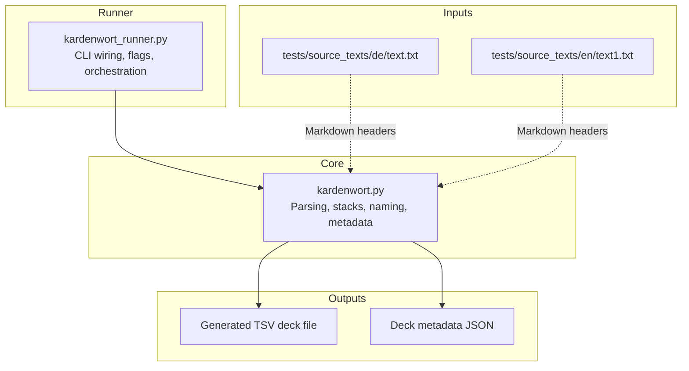
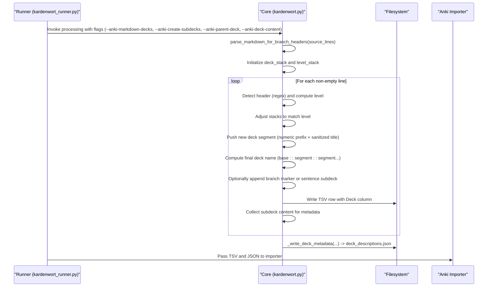
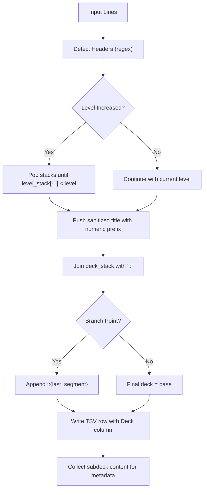

# Hierarchical Deck Creation

<cite>
**Referenced Files in This Document**
- [kardenwort.py](file://src/kardenwort/core/kardenwort.py)
- [kardenwort_runner.py](file://src/kardenwort/core/kardenwort_runner.py)
- [README.md](file://README.md)
- [text.txt](file://tests/source_texts/de/text.txt)
- [text1.txt](file://tests/source_texts/en/text1.txt)
- [kardenwort-goldendict-config.txt](file://docs/kardenwort-goldendict-config.txt)
</cite>

## Table of Contents
1. [Introduction](#introduction)
2. [Project Structure](#project-structure)
3. [Core Components](#core-components)
4. [Architecture Overview](#architecture-overview)
5. [Detailed Component Analysis](#detailed-component-analysis)
6. [Dependency Analysis](#dependency-analysis)
7. [Performance Considerations](#performance-considerations)
8. [Troubleshooting Guide](#troubleshooting-guide)
9. [Conclusion](#conclusion)
10. [Appendices](#appendices)

## Introduction
This document explains how Kardenwort builds nested Anki decks from Markdown headers in source text. It focuses on:
- How Markdown headers (#, ##, etc.) are parsed to drive deck hierarchy
- The role of the parse_markdown_for_branch_headers function in identifying branch points
- How process_parallel_text_files manages the deck_stack and level_stack while processing each line
- How header levels determine deck nesting (higher-level headers create parents, lower-level headers create children)
- The naming convention using a numeric prefix combined with a sanitized header text
- Integration with command-line arguments: --anki-markdown-decks, --anki-create-subdecks, --anki-parent-deck, and --anki-deck-content
- Automatic generation of deck description metadata via _write_deck_metadata
- Practical examples and edge cases
- Troubleshooting guidance

## Project Structure
Kardenwort’s hierarchical deck creation lives primarily in the core processing module and is orchestrated by the runner. The relevant files are:
- src/kardenwort/core/kardenwort.py: Contains the parsing and deck-building logic, including parse_markdown_for_branch_headers, process_parallel_text_files, and _write_deck_metadata
- src/kardenwort/core/kardenwort_runner.py: Adds command-line integration and passes deck-related flags to the core
- README.md: Provides high-level feature descriptions and CLI reference
- tests/source_texts/de/text.txt and tests/source_texts/en/text1.txt: Example Markdown inputs for testing
- docs/kardenwort-goldendict-config.txt: Example invocations that demonstrate hierarchical deck creation

**Diagram sources**
- [kardenwort.py](file://src/kardenwort/core/kardenwort.py#L461-L474)
- [kardenwort.py](file://src/kardenwort/core/kardenwort.py#L672-L811)
- [kardenwort.py](file://src/kardenwort/core/kardenwort.py#L594-L671)
- [kardenwort_runner.py](file://src/kardenwort/core/kardenwort_runner.py#L281-L300)
- [text.txt](file://tests/source_texts/de/text.txt#L1-L9)
- [text1.txt](file://tests/source_texts/en/text1.txt#L1-L15)

**Section sources**
- [kardenwort.py](file://src/kardenwort/core/kardenwort.py#L461-L474)
- [kardenwort.py](file://src/kardenwort/core/kardenwort.py#L672-L811)
- [kardenwort.py](file://src/kardenwort/core/kardenwort.py#L594-L671)
- [kardenwort_runner.py](file://src/kardenwort/core/kardenwort_runner.py#L281-L300)
- [README.md](file://README.md#L330-L365)

## Core Components
- parse_markdown_for_branch_headers: Scans the full source text to identify “branch” header lines that should act as branch points in the deck tree
- process_parallel_text_files: Drives line-by-line processing, maintains deck_stack and level_stack, computes final deck names, and collects content for metadata
- _write_deck_metadata: Writes deck descriptions to a JSON file based on flags and collected content

Key responsibilities:
- Header parsing and branch detection
- Stack-based deck name construction
- Naming convention with numeric prefix and sanitized title
- Metadata population for parent and subdecks

**Section sources**
- [kardenwort.py](file://src/kardenwort/core/kardenwort.py#L461-L474)
- [kardenwort.py](file://src/kardenwort/core/kardenwort.py#L672-L811)
- [kardenwort.py](file://src/kardenwort/core/kardenwort.py#L594-L671)

## Architecture Overview
The hierarchical deck creation pipeline integrates parsing, stack management, and metadata generation.

**Diagram sources**
- [kardenwort_runner.py](file://src/kardenwort/core/kardenwort_runner.py#L281-L300)
- [kardenwort.py](file://src/kardenwort/core/kardenwort.py#L461-L474)
- [kardenwort.py](file://src/kardenwort/core/kardenwort.py#L672-L811)
- [kardenwort.py](file://src/kardenwort/core/kardenwort.py#L594-L671)

## Detailed Component Analysis

### parse_markdown_for_branch_headers
Purpose:
- Identify header lines that introduce branching points in the deck hierarchy. These are headers whose level increases compared to the previous header.

Behavior:
- Iterates through all lines
- Matches lines starting with one or more hash characters
- Tracks last header level and last header index
- Adds the previous header index to a set of branch indices when encountering a deeper header

Result:
- A set of line indices representing branch headers used later to decide whether to append a branch marker to the final deck name.

Edge cases handled:
- Lines without leading hashes are ignored
- Only transitions from shallower to deeper levels mark branches

**Section sources**
- [kardenwort.py](file://src/kardenwort/core/kardenwort.py#L461-L474)

### process_parallel_text_files: deck_stack and level_stack management
Purpose:
- Drive line-by-line processing of source text and manage deck_stack and level_stack to construct nested deck names.

Key steps:
- Initialize deck_stack and level_stack
- Optionally push a root deck prefix derived from output filename or explicit parent deck
- Scan for headers; compute level and sanitized title
- While level_stack[-1] >= level, pop from both stacks to backtrack to the correct parent
- Push new deck segment onto deck_stack and level_stack
- Compute base_deck as "::"-joined stack; optionally append branch marker or sentence subdeck
- Collect content lines per subdeck when --anki-deck-content is enabled

Naming convention:
- Each deck segment is prefixed with a numeric counter (starting at 100001) followed by a hyphen and a sanitized slug derived from the header text

Header level semantics:
- Higher-level headers (fewer hashes) create parent decks
- Lower-level headers (more hashes) create child decks
- Consecutive headers at the same level create siblings at the same depth

Branch markers:
- If a header is identified as a branch point, the final deck name appends ::{last_segment} to indicate the branch

Sentence subdecks:
- When enabled, a final sentence-level subdeck is appended using a zero-padded index and a slug from the sentence text

**Section sources**
- [kardenwort.py](file://src/kardenwort/core/kardenwort.py#L672-L811)
- [kardenwort.py](file://src/kardenwort/core/kardenwort.py#L1537-L1668)

### _write_deck_metadata: automatic deck description generation
Purpose:
- Generate a deck_descriptions.json file with deck descriptions based on flags and collected content.

Behavior:
- Determine parent deck name from either:
  - Explicit --anki-parent-deck
  - Output filename base (without .word/.sentence suffix)
- Build description parts from:
  - Parent source text (when enabled)
  - Parent translations (when enabled)
- For subdecks, optionally include:
  - Subdeck source lines
  - Subdeck translation lines
- Write JSON file alongside the TSV

Integration:
- Called at the end of processing to attach deck descriptions for both parent and subdecks

**Section sources**
- [kardenwort.py](file://src/kardenwort/core/kardenwort.py#L594-L671)

### Command-line integration and flags
Key flags:
- --anki-markdown-decks: Enable parsing Markdown headers to create hierarchical decks
- --anki-create-subdecks: Create a parent deck and sub-decks based on output filename
- --anki-parent-deck: Manually set the root deck name
- --anki-deck-content: Populate deck descriptions with source text and/or translations

Runner wiring:
- The runner composes the core arguments and passes deck flags to the core processing function

**Section sources**
- [kardenwort_runner.py](file://src/kardenwort/core/kardenwort_runner.py#L281-L300)
- [README.md](file://README.md#L330-L365)

### Practical examples

Example 1: German multi-language input with headers
- Input: tests/source_texts/de/text.txt
- Behavior:
  - Root header # Nachrichten...
  - Child header ## Erste Städte...
  - Translation lines separated by ---
  - With --anki-markdown-decks and --anki-create-subdecks, produces a parent deck and a subdeck
  - With --anki-deck-content, writes deck_descriptions.json with parent and subdeck content

Example 2: English prose without headers
- Input: tests/source_texts/en/text1.txt
- Behavior:
  - Without headers, the processor can still create a single deck or a placeholder deck depending on flags
  - If headers appear later, they create nested decks

Example 3: Mixed-triple mode with hierarchical decks
- Runner configuration demonstrates:
  - --mode mixed-triple
  - --anki-create-subdecks
  - --anki-markdown-decks
  - --anki-sentence-subdecks
  - --anki-deck-content parent-source parent-translations subdeck-source subdeck-translations

**Section sources**
- [text.txt](file://tests/source_texts/de/text.txt#L1-L9)
- [text1.txt](file://tests/source_texts/en/text1.txt#L1-L15)
- [kardenwort-goldendict-config.txt](file://docs/kardenwort-goldendict-config.txt#L205-L229)

### Edge cases and handling
- Consecutive headers at the same level:
  - They become siblings at the same depth; deck_stack remains unchanged except for the last pushed segment
- Missing headers:
  - If no headers are found, the processor can still operate; a placeholder deck may be created based on output filename and flags
- Non-header content:
  - Non-header lines contribute to the current subdeck content and are included in deck descriptions when enabled
- Branch headers:
  - Only headers that increase in level from the previous header are considered branch points; they trigger branch markers in the final deck name

**Section sources**
- [kardenwort.py](file://src/kardenwort/core/kardenwort.py#L461-L474)
- [kardenwort.py](file://src/kardenwort/core/kardenwort.py#L672-L811)

## Dependency Analysis
The hierarchical deck creation depends on:
- Regex-based header detection
- Stack-based deck name construction
- Sanitization of header text for filenames
- Conditional metadata generation

**Diagram sources**
- [kardenwort.py](file://src/kardenwort/core/kardenwort.py#L461-L474)
- [kardenwort.py](file://src/kardenwort/core/kardenwort.py#L672-L811)

**Section sources**
- [kardenwort.py](file://src/kardenwort/core/kardenwort.py#L461-L474)
- [kardenwort.py](file://src/kardenwort/core/kardenwort.py#L672-L811)

## Performance Considerations
- Header scanning is linear in the number of lines
- Stack operations are O(1) per line; total stack adjustments are O(n) across the file
- Metadata generation is O(n) for content collection plus O(d) for writing d decks
- Regex matching is performed per line; complexity is acceptable for typical text sizes

## Troubleshooting Guide
Common issues and resolutions:
- Decks not created as expected
  - Ensure --anki-markdown-decks is enabled
  - Verify header syntax starts with one or more hash characters followed by whitespace and text
  - Confirm --anki-create-subdecks is set if you expect a parent deck
  - If using --anki-parent-deck, ensure the name is valid and matches your intended root
- Incorrect header syntax
  - Headers must start with #, ##, etc., followed by a space and content
  - Lines without leading hashes are not treated as headers
- Misconfigured flags
  - --anki-deck-content requires deck descriptions to be written; confirm the flags include parent-source, parent-translations, subdeck-source, or subdeck-translations
  - --anki-sentence-subdecks requires --anki-markdown-decks
- Missing output deck descriptions
  - Ensure the JSON metadata file is present alongside the TSV and that the importer is configured to use it

**Section sources**
- [kardenwort.py](file://src/kardenwort/core/kardenwort.py#L594-L671)
- [kardenwort_runner.py](file://src/kardenwort/core/kardenwort_runner.py#L281-L300)
- [README.md](file://README.md#L330-L365)

## Conclusion
Kardenwort’s hierarchical deck creation transforms Markdown headers into nested Anki decks by parsing header levels, maintaining deck_stack and level_stack, and applying a consistent naming convention. The feature integrates tightly with command-line flags to control root decks, branch markers, sentence-level subdecks, and automatic deck descriptions. With proper header syntax and flag configuration, users can produce well-organized, context-rich study sets that reflect the structure of their source texts.

## Appendices

### Appendix A: Example Markdown input and expected deck hierarchy
- Example input structure:
  - Root header: # Level 1 Topic
  - Child header: ## Level 2 Subtopic
  - Grandchild header: ### Level 3 Sub-subtopic
- Expected deck hierarchy:
  - Parent deck: {root}
  - Subdeck: {root}::{sanitized-title-of-level-2}
  - Sub-subdeck: {root}::{sanitized-title-of-level-2}::{sanitized-title-of-level-3}

**Section sources**
- [text.txt](file://tests/source_texts/de/text.txt#L1-L9)
- [kardenwort.py](file://src/kardenwort/core/kardenwort.py#L672-L811)

### Appendix B: Example invocations
- Mixed-triple mode with hierarchical decks and descriptions:
  - See the example in docs/kardenwort-goldendict-config.txt for a complete invocation

**Section sources**
- [kardenwort-goldendict-config.txt](file://docs/kardenwort-goldendict-config.txt#L205-L229)