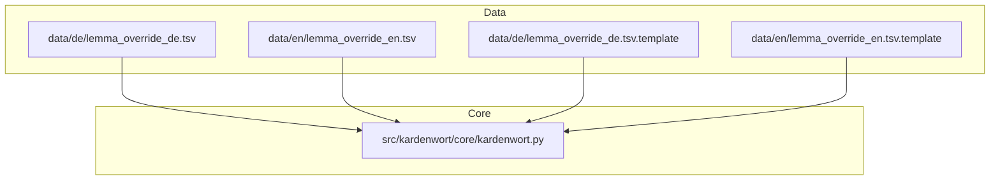
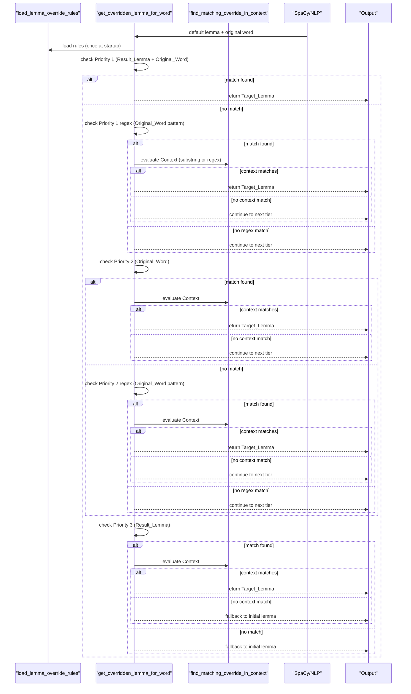
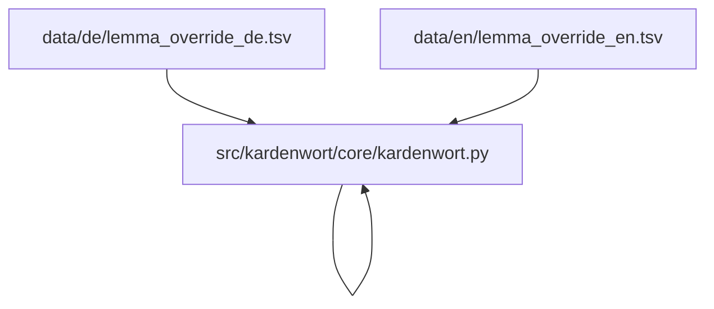
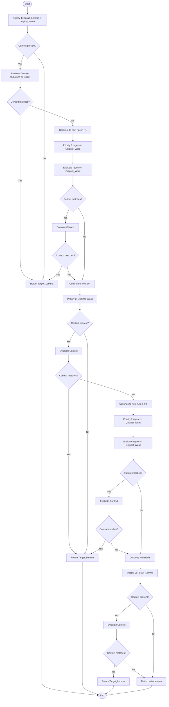

# Lemma Override System

<cite>
**Referenced Files in This Document**
- [kardenwort.py](file://src/kardenwort/core/kardenwort.py)
- [lemma_override_de.tsv](file://data/de/lemma_override_de.tsv)
- [lemma_override_de.tsv.template](file://data/de/lemma_override_de.tsv.template)
- [lemma_override_en.tsv](file://data/en/lemma_override_en.tsv)
- [lemma_override_en.tsv.template](file://data/en/lemma_override_en.tsv.template)
</cite>

## Table of Contents
1. [Introduction](#introduction)
2. [Project Structure](#project-structure)
3. [Core Components](#core-components)
4. [Architecture Overview](#architecture-overview)
5. [Detailed Component Analysis](#detailed-component-analysis)
6. [Dependency Analysis](#dependency-analysis)
7. [Performance Considerations](#performance-considerations)
8. [Troubleshooting Guide](#troubleshooting-guide)
9. [Conclusion](#conclusion)
10. [Appendices](#appendices)

## Introduction
This document explains the lemma override system, a core advanced feature of Kardenwort that lets users correct and customize lemmatization results. It focuses on how the system parses override rules from tab-separated TSV files, applies a three-tiered priority scheme, and supports context-aware rules using plain text and regular expressions. It also covers the internal functions that implement rule evaluation, including regex compilation, error handling, and precedence logic.

## Project Structure
The lemma override system spans:
- Data files: language-specific TSV files that define override rules
- Template files: documentation and examples for writing rules
- Core implementation: Python functions that load, parse, and apply rules during lemmatization

**Diagram sources**
- [kardenwort.py](file://src/kardenwort/core/kardenwort.py#L74-L144)
- [lemma_override_de.tsv](file://data/de/lemma_override_de.tsv#L1-L144)
- [lemma_override_en.tsv](file://data/en/lemma_override_en.tsv#L1-L1)
- [lemma_override_de.tsv.template](file://data/de/lemma_override_de.tsv.template#L1-L227)
- [lemma_override_en.tsv.template](file://data/en/lemma_override_en.tsv.template#L1-L174)

**Section sources**
- [kardenwort.py](file://src/kardenwort/core/kardenwort.py#L74-L144)
- [lemma_override_de.tsv](file://data/de/lemma_override_de.tsv#L1-L144)
- [lemma_override_en.tsv](file://data/en/lemma_override_en.tsv#L1-L1)
- [lemma_override_de.tsv.template](file://data/de/lemma_override_de.tsv.template#L1-L227)
- [lemma_override_en.tsv.template](file://data/en/lemma_override_en.tsv.template#L1-L174)

## Core Components
- Rule file format: tab-separated values with columns for Result_Lemma, Original_Word, Target_Lemma, and optional Context.
- Three-tiered priority:
  - Priority 1: Specific match (Result_Lemma + Original_Word)
  - Priority 2: Source word match (Original_Word only)
  - Priority 3: Result lemma match (Result_Lemma only)
- Context-aware rules:
  - Plain text substring matching against the full sentence
  - Regular expressions supported in both Original_Word and Context via a "regex:" prefix
- Internal functions:
  - load_lemma_override_rules: reads and validates TSV rows, builds in-memory rule structures
  - find_matching_override_in_context: selects contextual or global rules within a tier
  - get_overridden_lemma_for_word: applies priority tiers and regex matching to decide overrides
  - get_overridden_lemma_for_compound_part: variant for compound word parts

Key implementation references:
- [load_lemma_override_rules](file://src/kardenwort/core/kardenwort.py#L74-L144)
- [find_matching_override_in_context](file://src/kardenwort/core/kardenwort.py#L146-L168)
- [get_overridden_lemma_for_word](file://src/kardenwort/core/kardenwort.py#L170-L205)
- [get_overridden_lemma_for_compound_part](file://src/kardenwort/core/kardenwort.py#L207-L242)

**Section sources**
- [kardenwort.py](file://src/kardenwort/core/kardenwort.py#L74-L144)
- [kardenwort.py](file://src/kardenwort/core/kardenwort.py#L146-L168)
- [kardenwort.py](file://src/kardenwort/core/kardenwort.py#L170-L205)
- [kardenwort.py](file://src/kardenwort/core/kardenwort.py#L207-L242)

## Architecture Overview
The lemma override pipeline integrates with the broader lemmatization workflow. At runtime, the system loads override rules from the configured TSV file, then applies them during sentence processing to correct lemmas for individual tokens and compound parts.

**Diagram sources**
- [kardenwort.py](file://src/kardenwort/core/kardenwort.py#L74-L144)
- [kardenwort.py](file://src/kardenwort/core/kardenwort.py#L146-L168)
- [kardenwort.py](file://src/kardenwort/core/kardenwort.py#L170-L205)

## Detailed Component Analysis

### Rule File Format and Columns
- Columns:
  - Result_Lemma: The initial lemma or component part produced by the system
  - Original_Word: The original, inflected word as it appears in the source text
  - Target_Lemma: The desired lemma to use instead
  - Context: Optional substring or regex condition; if present, the rule applies only when the condition holds in the sentence
- Supported prefixes:
  - "regex:" in Original_Word enables regex matching against the single word
  - "regex:" in Context enables regex matching against the full sentence
- Whitespace handling:
  - Standard fields: leading/trailing whitespace is stripped
  - Regex fields: pattern is used exactly as written

Examples from templates:
- Whole-word unconditional rules
- Whole-word conditional rules with Context substring
- Lemma-part conditional rules
- Regex-based rules for Original_Word and Context

**Section sources**
- [lemma_override_de.tsv.template](file://data/de/lemma_override_de.tsv.template#L12-L35)
- [lemma_override_de.tsv.template](file://data/de/lemma_override_de.tsv.template#L101-L110)
- [lemma_override_de.tsv.template](file://data/de/lemma_override_de.tsv.template#L110-L143)
- [lemma_override_de.tsv.template](file://data/de/lemma_override_de.tsv.template#L144-L167)
- [lemma_override_en.tsv.template](file://data/en/lemma_override_en.tsv.template#L12-L35)
- [lemma_override_en.tsv.template](file://data/en/lemma_override_en.tsv.template#L103-L113)
- [lemma_override_en.tsv.template](file://data/en/lemma_override_en.tsv.template#L114-L126)

### Three-Tiered Priority System
- Priority 1: Specific match (Result_Lemma + Original_Word)
  - Highest precision; targets a specific source word that was lemmatized to a specific result
  - Supports regex in Original_Word via "regex:" prefix
- Priority 2: Source word match (Original_Word only)
  - Targets a specific word regardless of the default lemma
  - Supports regex in Original_Word via "regex:" prefix
- Priority 3: Result lemma match (Result_Lemma only)
  - Broad replacement for any lemma produced by the system
  - No regex in this tier; regex is only supported in Original_Word or Context

Within each tier:
- Contextual rule (Context present) is preferred over a global rule (Context empty)
- Context matching:
  - Plain text: substring presence anywhere in the sentence
  - Regex: compiled and evaluated against the full sentence

**Section sources**
- [lemma_override_de.tsv.template](file://data/de/lemma_override_de.tsv.template#L37-L96)
- [lemma_override_en.tsv.template](file://data/en/lemma_override_en.tsv.template#L37-L101)
- [kardenwort.py](file://src/kardenwort/core/kardenwort.py#L146-L168)
- [kardenwort.py](file://src/kardenwort/core/kardenwort.py#L170-L205)

### Context-Aware Rules: Plain Text and Regex
- Plain text Context:
  - The rule applies if the Context substring is present anywhere in the sentence
- Regex Context:
  - Prefix Context with "regex:" to enable regex matching against the full sentence
  - Example: enforce "Ihr" not at sentence start using a negative lookbehind
- Regex in Original_Word:
  - Prefix Original_Word with "regex:" to match many variants with a single rule
  - Example: safely correct "Date" -> "Daten" in compound words containing "daten"

Implementation highlights:
- Regex compilation occurs at rule evaluation time
- Invalid regex patterns are caught and reported without crashing
- Case sensitivity applies to all matching unless regex flags are used

**Section sources**
- [lemma_override_de.tsv.template](file://data/de/lemma_override_de.tsv.template#L144-L167)
- [lemma_override_de.tsv.template](file://data/de/lemma_override_de.tsv.template#L110-L143)
- [kardenwort.py](file://src/kardenwort/core/kardenwort.py#L146-L168)
- [kardenwort.py](file://src/kardenwort/core/kardenwort.py#L170-L205)

### Loading and Parsing Rules
- load_lemma_override_rules:
  - Opens the TSV file and uses a tab-separated reader
  - Skips blank lines and comments (starting with "#")
  - Validates minimal columns and required fields
  - Builds separate structures for:
    - Priority 1: exact Result_Lemma + Original_Word (with optional regex)
    - Priority 1 regex: regex on Original_Word only
    - Priority 2: exact Original_Word (with optional regex)
    - Priority 2 regex: regex on Original_Word only
    - Priority 3: exact Result_Lemma
  - Stores Target_Lemma and Context for each rule
  - Handles missing files and general exceptions with warnings

Common issues handled:
- Malformed lines (too few columns)
- Missing required fields
- Invalid regex patterns in Context or Original_Word

**Section sources**
- [kardenwort.py](file://src/kardenwort/core/kardenwort.py#L74-L144)

### Applying Overrides: get_overridden_lemma_for_word
- Priority order:
  1) Priority 1 exact match
  2) Priority 1 regex match on Original_Word
  3) Priority 2 exact match
  4) Priority 2 regex match on Original_Word
  5) Priority 3 exact match
- For each tier, if a rule matches:
  - If Context is present, evaluate it against the full sentence
  - If Context matches (or absent), return Target_Lemma
  - Otherwise, continue to the next rule in the same tier
- If no rule matches any tier, return the initial lemma

Regex handling:
- Compiles regex patterns at evaluation time
- Reports invalid regex errors and continues processing

**Section sources**
- [kardenwort.py](file://src/kardenwort/core/kardenwort.py#L170-L205)

### Compound Word Parts: get_overridden_lemma_for_compound_part
- Applies the same three-tiered priority to each component of a compound word
- Uses the component’s lemma as the Result_Lemma for Priority 3 matching
- Supports regex in Original_Word for compound parts

**Section sources**
- [kardenwort.py](file://src/kardenwort/core/kardenwort.py#L207-L242)

### Concrete Examples from TSV Files
- German examples:
  - Exact lemma + word correction for "Donaudampfschifffahrtsgesellschaftskapitäne" -> "Donaudampfschifffahrtsgesellschaftskapitän" when sentence contains "bibliografische Daten"
  - Correction of possessive pronouns "Ihr" not at sentence start using regex context
  - Safe correction of "Date" -> "Daten" in compounds using regex on Original_Word
- English example:
  - Minimal English rule file included for demonstration

These examples illustrate:
- Contextual specificity
- Regex power for broad yet safe corrections
- Priority-driven precedence

**Section sources**
- [lemma_override_de.tsv](file://data/de/lemma_override_de.tsv#L25-L30)
- [lemma_override_de.tsv](file://data/de/lemma_override_de.tsv#L56-L60)
- [lemma_override_de.tsv](file://data/de/lemma_override_de.tsv#L120-L120)
- [lemma_override_de.tsv.template](file://data/de/lemma_override_de.tsv.template#L193-L227)
- [lemma_override_en.tsv](file://data/en/lemma_override_en.tsv#L1-L1)

## Dependency Analysis
The lemma override system depends on:
- The TSV rule files for language-specific corrections
- The core lemmatization pipeline to supply default lemmas and sentence context
- SpaCy for tokenization and basic lemmatization

**Diagram sources**
- [kardenwort.py](file://src/kardenwort/core/kardenwort.py#L74-L144)
- [lemma_override_de.tsv](file://data/de/lemma_override_de.tsv#L1-L144)
- [lemma_override_en.tsv](file://data/en/lemma_override_en.tsv#L1-L1)

**Section sources**
- [kardenwort.py](file://src/kardenwort/core/kardenwort.py#L74-L144)
- [kardenwort.py](file://src/kardenwort/core/kardenwort.py#L170-L205)

## Performance Considerations
- Rule evaluation is linear in the number of rules per tier; keep rule sets focused and ordered to minimize unnecessary checks
- Regex evaluation happens per rule; prefer plain substring matching when possible
- Regex compilation errors are caught and logged; avoid invalid patterns to prevent repeated failures
- Compound splitting and lemma deduplication occur in the broader pipeline; overrides integrate seamlessly

## Troubleshooting Guide
Common issues and resolutions:
- Invalid regex syntax
  - Symptom: Warning messages indicating invalid regex in Context or Original_Word
  - Resolution: Fix the regex pattern; ensure it compiles against the intended target
  - References:
    - [find_matching_override_in_context](file://src/kardenwort/core/kardenwort.py#L146-L168)
    - [get_overridden_lemma_for_word](file://src/kardenwort/core/kardenwort.py#L170-L205)
- Rule conflicts
  - Symptom: Unexpected override behavior when multiple rules match
  - Resolution: Adjust rule order (top-to-bottom) and tier selection; use more specific rules first
  - References:
    - [load_lemma_override_rules](file://src/kardenwort/core/kardenwort.py#L74-L144)
    - [get_overridden_lemma_for_word](file://src/kardenwort/core/kardenwort.py#L170-L205)
- Overrides not applied due to context
  - Symptom: Rule appears correct but does not trigger
  - Resolution: Verify Context substring presence or regex correctness; remember matching is case-sensitive
  - References:
    - [find_matching_override_in_context](file://src/kardenwort/core/kardenwort.py#L146-L168)
    - [lemma_override_de.tsv.template](file://data/de/lemma_override_de.tsv.template#L106-L113)
    - [lemma_override_en.tsv.template](file://data/en/lemma_override_en.tsv.template#L106-L113)
- Capitalization and case sensitivity
  - Symptom: Context or rule mismatches due to case
  - Resolution: Use appropriate regex flags (e.g., case-insensitive) or ensure exact casing
  - References:
    - [lemma_override_de.tsv.template](file://data/de/lemma_override_de.tsv.template#L172-L174)
    - [lemma_override_en.tsv.template](file://data/en/lemma_override_en.tsv.template#L114-L116)
- Compound word nuances
  - Symptom: Overrides not applied to parts
  - Resolution: Use Priority 3 matching on Result_Lemma or regex on Original_Word for parts
  - References:
    - [get_overridden_lemma_for_compound_part](file://src/kardenwort/core/kardenwort.py#L207-L242)

Best practices:
- Prefer exact matches (Priority 1) for highest reliability
- Use regex sparingly and test patterns carefully
- Place the most specific rules earlier in the file to avoid unintended fallbacks
- Use Context to constrain when rules apply, especially for ambiguous words

**Section sources**
- [kardenwort.py](file://src/kardenwort/core/kardenwort.py#L74-L144)
- [kardenwort.py](file://src/kardenwort/core/kardenwort.py#L146-L168)
- [kardenwort.py](file://src/kardenwort/core/kardenwort.py#L170-L205)
- [kardenwort.py](file://src/kardenwort/core/kardenwort.py#L207-L242)
- [lemma_override_de.tsv.template](file://data/de/lemma_override_de.tsv.template#L172-L174)
- [lemma_override_en.tsv.template](file://data/en/lemma_override_en.tsv.template#L114-L116)

## Conclusion
The lemma override system provides a robust, extensible mechanism to fine-tune lemmatization outcomes. By combining three-tiered priority, contextual constraints, and regex support, users can craft precise corrections tailored to their content. The implementation is resilient to malformed inputs and invalid regex patterns, and integrates cleanly into the broader lemmatization pipeline.

## Appendices

### Appendix A: Priority Flowchart

**Diagram sources**
- [kardenwort.py](file://src/kardenwort/core/kardenwort.py#L170-L205)
- [kardenwort.py](file://src/kardenwort/core/kardenwort.py#L146-L168)