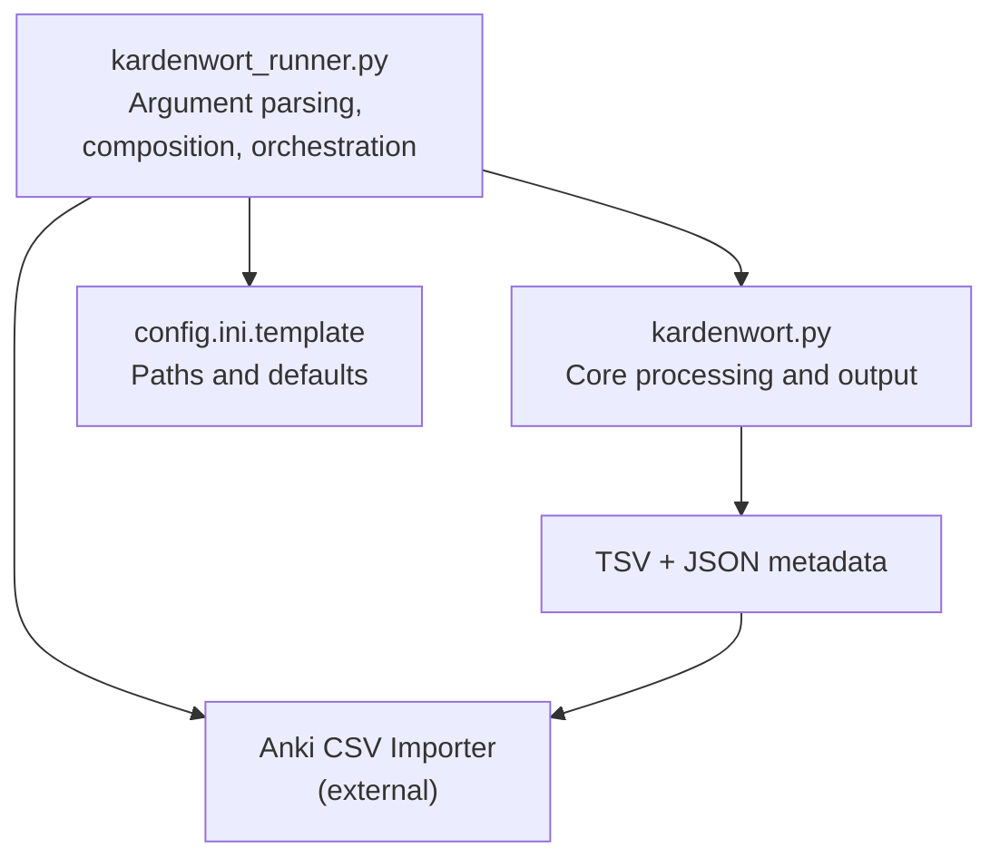
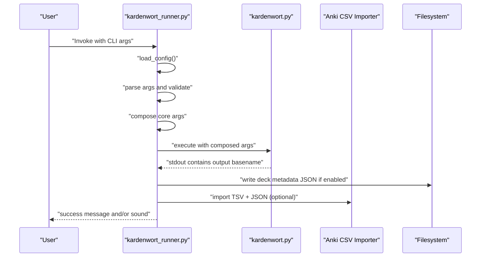
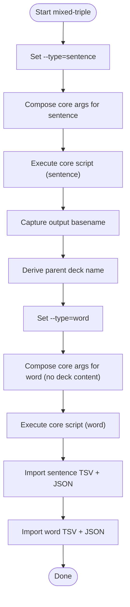
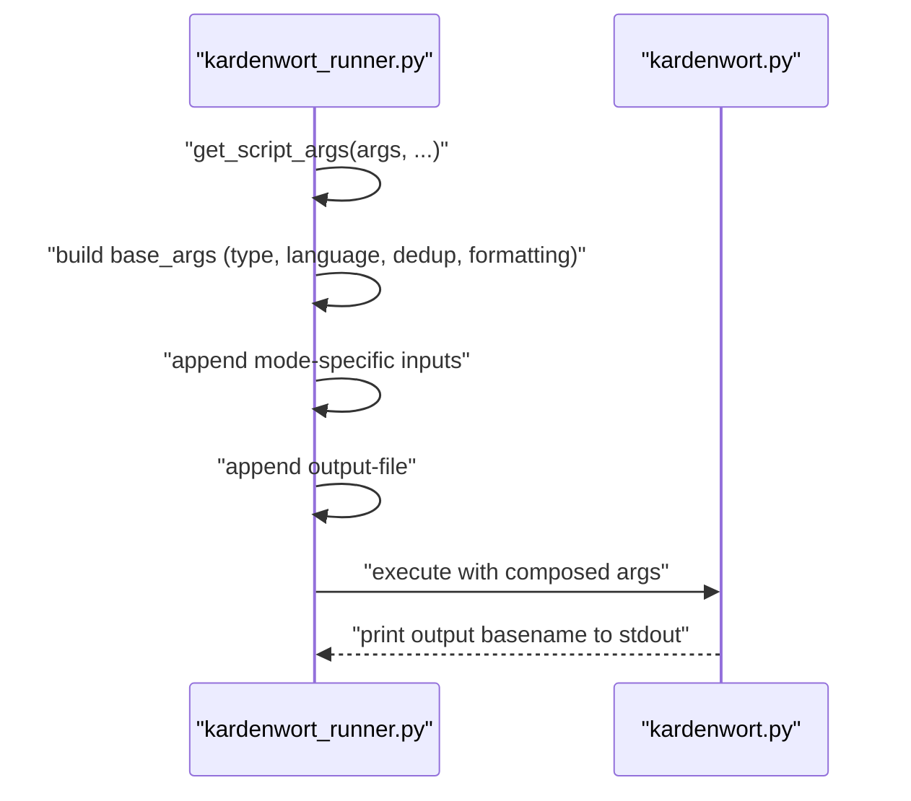
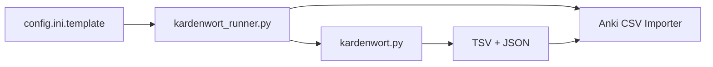

# Command-Line Interface

<cite>
**Referenced Files in This Document**
- [kardenwort_runner.py](file://src/kardenwort/core/kardenwort_runner.py)
- [kardenwort.py](file://src/kardenwort/core/kardenwort.py)
- [config.ini.template](file://config.ini.template)
- [README.md](file://README.md)
- [kardenwort_run_de_ws_t3_s_anki_v3.cmd](file://scripts/run/cmd/kardenwort_run_de_ws_t3_s_anki_v3.cmd)
- [text1.txt](file://tests/source_texts/de/text1.txt)
- [text2.txt](file://tests/source_texts/de/text2.txt)
- [text3.txt](file://tests/source_texts/de/text3.txt)
</cite>

## Table of Contents
1. [Introduction](#introduction)
2. [Project Structure](#project-structure)
3. [Core Components](#core-components)
4. [Architecture Overview](#architecture-overview)
5. [Detailed Component Analysis](#detailed-component-analysis)
6. [Dependency Analysis](#dependency-analysis)
7. [Performance Considerations](#performance-considerations)
8. [Troubleshooting Guide](#troubleshooting-guide)
9. [Conclusion](#conclusion)

## Introduction
This document explains the command-line interface of the Kardenwort runner script, focusing on how command-line arguments are parsed, validated, transformed, and passed to the core processing script. It covers:
- Core arguments: --type, --mode, --language
- Input/output options: --text, --text1-file, --output-file
- Anki deck control: --anki-create-subdecks, --anki-markdown-decks
- Card content formatting: --sentence-context-size, --add-wordlist-col
- NLP controls: --deduplication-scope, --force-proper-noun-capitalization
- German compound splitting options: --de-gcs, --de-gcs-split-mode
- Runner-specific UX options: --show-success-message, --play-sound-on-completion
- Argument conflicts and resolution strategies
- How the runner composes and executes the core script with appropriate arguments

## Project Structure
The CLI is implemented in a runner script that orchestrates the core processing script and the Anki importer. Configuration is loaded from a central configuration file.

**Diagram sources**
- [kardenwort_runner.py](file://src/kardenwort/core/kardenwort_runner.py#L267-L364)
- [kardenwort.py](file://src/kardenwort/core/kardenwort.py#L1712-L1862)
- [config.ini.template](file://config.ini.template#L1-L65)

**Section sources**
- [kardenwort_runner.py](file://src/kardenwort/core/kardenwort_runner.py#L267-L364)
- [config.ini.template](file://config.ini.template#L1-L65)

## Core Components
- Argument parser in the runner script defines and validates all CLI flags and options.
- The runner composes a command line for the core script, including language-specific resources and mode-dependent inputs.
- The runner executes the core script and, if configured, the Anki importer with deck metadata.

Key responsibilities:
- Parse and validate arguments
- Resolve input sources (direct text, files, environment, stdin)
- Compose core script arguments and filenames
- Invoke the core script and importer
- Provide user feedback and completion sounds

**Section sources**
- [kardenwort_runner.py](file://src/kardenwort/core/kardenwort_runner.py#L267-L364)

## Architecture Overview
The runner acts as a thin adapter around the core processing script. It reads configuration, resolves language resources, builds the core script command, and optionally triggers the Anki importer.

**Diagram sources**
- [kardenwort_runner.py](file://src/kardenwort/core/kardenwort_runner.py#L178-L261)
- [kardenwort.py](file://src/kardenwort/core/kardenwort.py#L1712-L1862)

## Detailed Component Analysis

### Core Arguments
- --type: Determines whether to produce word-type or sentence-type cards. Required for single/dual/triple modes; ignored for mixed-triple mode.
- --mode: Processing mode. single, dual, triple, or mixed-triple. mixed-triple runs sentence pass then word pass.
- --language: de or en. Controls language resources and processing behavior.

Behavioral notes:
- Validation ensures --type is required for non-mixed modes.
- mixed-triple mode ignores --type and runs both sentence and word modes sequentially.

**Section sources**
- [kardenwort_runner.py](file://src/kardenwort/core/kardenwort_runner.py#L267-L300)
- [README.md](file://README.md#L334-L341)

### Input/Output Options
- --text: Direct text input for single mode. Overrides default file selection.
- --text1-file, --text2-file, --text3-file: Explicit file paths for parallel texts.
- --output-file: Final TSV output path. Derived from configuration and mode/type.

Runner logic:
- If --text is provided or an environment variable is set, use it for single mode.
- Otherwise, resolve default files from configuration based on mode.
- Construct output filename from template and language/type/mode.

**Section sources**
- [kardenwort_runner.py](file://src/kardenwort/core/kardenwort_runner.py#L152-L176)
- [config.ini.template](file://config.ini.template#L41-L51)

### Anki Deck Control and Import Options
- --anki-create-subdecks: Create parent and subdecks based on output filename.
- --anki-markdown-decks: Parse Markdown headers to build hierarchical decks.
- --anki-sentence-subdecks: Create a final subdeck level for each sentence.
- --anki-parent-deck: Manually set the parent deck name for batch runs.
- --anki-deck-content: Populate deck descriptions with source/translations.
- --suspend-cards: Suspend newly imported/updated cards.
- --strip-headers: Remove Markdown headers from output text fields.

Runner behavior:
- When --anki-markdown-decks is disabled, derive deck names from output filename or explicit parent.
- When enabled, derive deck names from Markdown headers and optional parent.
- Deck metadata JSON is written alongside the TSV for deck descriptions.

**Section sources**
- [kardenwort_runner.py](file://src/kardenwort/core/kardenwort_runner.py#L98-L114)
- [kardenwort_runner.py](file://src/kardenwort/core/kardenwort_runner.py#L211-L261)
- [kardenwort.py](file://src/kardenwort/core/kardenwort.py#L594-L671)

### Card Content Formatting
- --sentence-context-size: Number of surrounding sentences included as context. Runner default is 4.
- --add-wordlist-col: Include a list of unique words from the source sentence.
- Additional formatting flags are passed to the core script for consistent output.

Runner sets sentence context size to 4 by default and adds several formatting flags to the core command.

**Section sources**
- [kardenwort_runner.py](file://src/kardenwort/core/kardenwort_runner.py#L86-L87)
- [kardenwort_runner.py](file://src/kardenwort/core/kardenwort_runner.py#L80-L85)

### NLP Controls
- --deduplication-scope: global, sentence, or none. Controls lemma deduplication granularity.
- --prefer-shortest-form: When deduplicating globally, prefer the shortest form of a lemma.
- --force-proper-noun-capitalization: Capitalize PROPN lemmas.

Runner passes these flags to the core script. The core script applies deduplication and capitalization logic during processing.

**Section sources**
- [kardenwort_runner.py](file://src/kardenwort/core/kardenwort_runner.py#L74-L75)
- [kardenwort.py](file://src/kardenwort/core/kardenwort.py#L417-L439)

### German Compound Splitting Options
- --de-gcs: Enable German Compound Splitting.
- --de-gcs-split-mode: combined, only-nouns, or any (runner sets combined when enabled).
- --de-gcs-pos-tags: POS tags to restrict splitting (e.g., NOUN PROPN or !VERB).
- Additional GCS flags are passed to the core script when enabled.

Runner adds German-specific enhancements when language is de, including dictionary file and GCS-related flags.

**Section sources**
- [kardenwort_runner.py](file://src/kardenwort/core/kardenwort_runner.py#L115-L135)
- [kardenwort.py](file://src/kardenwort/core/kardenwort.py#L516-L583)

### Runner-Specific UX Options
- --show-success-message: Print a friendly success message to stdout.
- --play-sound-on-completion: Emit a system beep on completion.

Runner handles these UX flags after successful processing.

**Section sources**
- [kardenwort_runner.py](file://src/kardenwort/core/kardenwort_runner.py#L267-L271)
- [kardenwort_runner.py](file://src/kardenwort/core/kardenwort_runner.py#L353-L361)

### Mixed-Mode Processing Flow
mixed-triple mode runs sentence processing first, then word processing, sharing a common parent deck name derived from the sentence output.

**Diagram sources**
- [kardenwort_runner.py](file://src/kardenwort/core/kardenwort_runner.py#L303-L339)

**Section sources**
- [kardenwort_runner.py](file://src/kardenwort/core/kardenwort_runner.py#L303-L339)

### Argument Propagation to Core Script
The runner constructs the core command by combining:
- Fixed flags for formatting and output behavior
- Mode-dependent input flags (--text/--text1-file/--text2-file/--text3-file)
- Language-specific resources (lemma index, lemma override, dictionary)
- German-specific flags when language is de
- Output file path derived from configuration

**Diagram sources**
- [kardenwort_runner.py](file://src/kardenwort/core/kardenwort_runner.py#L56-L176)
- [kardenwort.py](file://src/kardenwort/core/kardenwort.py#L1712-L1862)

**Section sources**
- [kardenwort_runner.py](file://src/kardenwort/core/kardenwort_runner.py#L56-L176)

### Example Usage Patterns
- Single German word cards from default files:
  - python src/kardenwort/core/kardenwort_runner.py --type word --mode single --language de
- Dual English sentence cards with compound splitting:
  - python src/kardenwort/core/kardenwort_runner.py --type sentence --mode dual --language en --de-gcs
- Mixed-triple with Markdown decks and deck descriptions:
  - python src/kardenwort/core/kardenwort_runner.py --mode mixed-triple --language de --anki-markdown-decks --anki-deck-content parent-source parent-translations subdeck-source subdeck-translations
- Direct text input with multi-text support:
  - echo "Source text. --- Translation 1. --- Translation 2." | python src/kardenwort/core/kardenwort_runner.py --mode single --language de --multi-text

These examples demonstrate how the runner composes the core command and how the core script handles multi-text inputs.

**Section sources**
- [README.md](file://README.md#L209-L231)
- [kardenwort.py](file://src/kardenwort/core/kardenwort.py#L1830-L1862)

## Dependency Analysis
The runner depends on:
- Configuration file for paths and defaults
- Language resource files (lemma index, overrides, dictionary)
- Core script for processing
- Anki importer for deck creation/update

**Diagram sources**
- [config.ini.template](file://config.ini.template#L1-L65)
- [kardenwort_runner.py](file://src/kardenwort/core/kardenwort_runner.py#L16-L53)
- [kardenwort.py](file://src/kardenwort/core/kardenwort.py#L1712-L1862)

**Section sources**
- [config.ini.template](file://config.ini.template#L1-L65)
- [kardenwort_runner.py](file://src/kardenwort/core/kardenwort_runner.py#L16-L53)

## Performance Considerations
- Mixed-triple mode doubles processing time by running sentence and word passes sequentially.
- Global deduplication increases memory usage compared to sentence-level or none scopes.
- Enabling German compound splitting adds overhead due to dictionary lookups and potential merging of fractions.
- Using --anki-markdown-decks introduces additional parsing of Markdown headers.

[No sources needed since this section provides general guidance]

## Troubleshooting Guide
Common issues and resolutions:
- Missing configuration file: Ensure config.ini exists and paths are correct.
  - Resolution: Copy config.ini.template to config.ini and update paths.
- Missing language resources: Missing lemma or override files for the selected language.
  - Resolution: Verify entries under [language_resources] for the chosen language.
- Argument conflicts:
  - --type is required for single/dual/triple modes; ignored for mixed-triple.
  - mixed-triple mode automatically enables --multi-text when --text is provided.
- Mixed-triple deck naming:
  - Parent deck name is derived from the sentence output filename; use --anki-parent-deck to enforce a consistent name in batch runs.
- Input sources:
  - --text and --text1-file are mutually exclusive; use one or the other.
  - When using --multi-text, provide up to three texts separated by --- via --text or stdin.
- Output visibility:
  - Use --stdout-print-output-basename to capture the final output filename when not writing to a file.
- Importer failures:
  - If deck descriptions fail to update, ensure the modified AnkiConnect add-on is installed as required.

**Section sources**
- [kardenwort_runner.py](file://src/kardenwort/core/kardenwort_runner.py#L16-L53)
- [kardenwort_runner.py](file://src/kardenwort/core/kardenwort_runner.py#L292-L300)
- [kardenwort.py](file://src/kardenwort/core/kardenwort.py#L1830-L1862)
- [README.md](file://README.md#L134-L207)

## Conclusion
The Kardenwort runner script provides a robust, configurable CLI that translates user intent into precise invocations of the core processing script and optional Anki integration. By understanding argument categories, validation rules, and propagation to the core script, users can compose reliable workflows for vocabulary and sentence card generation, with special attention to mixed-triple mode, German compound splitting, and deck metadata.