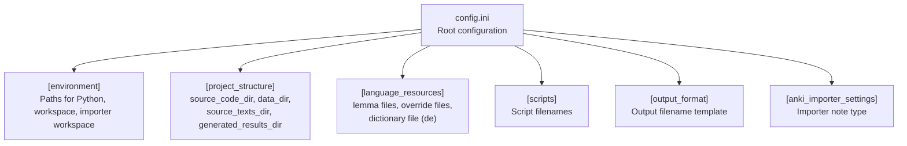
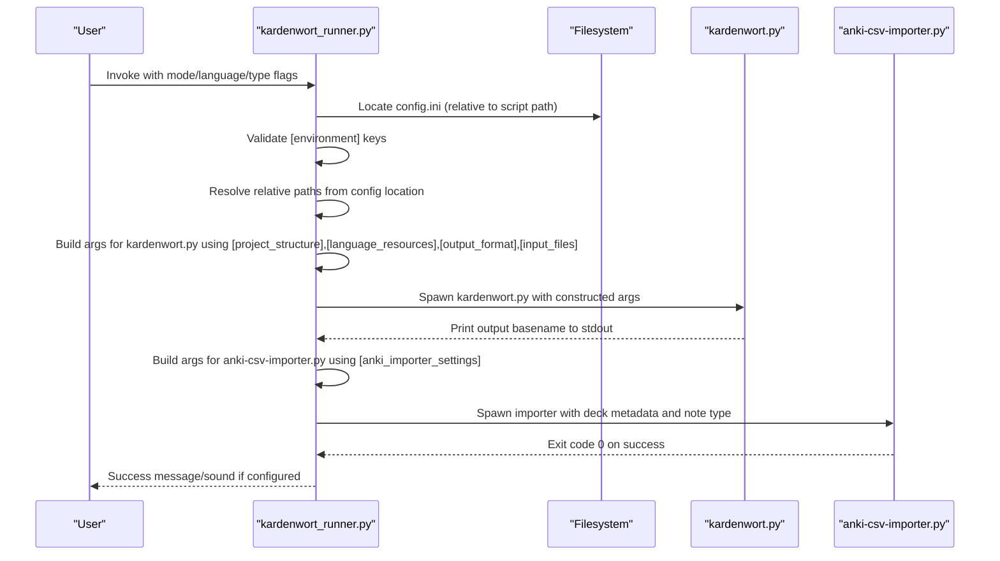
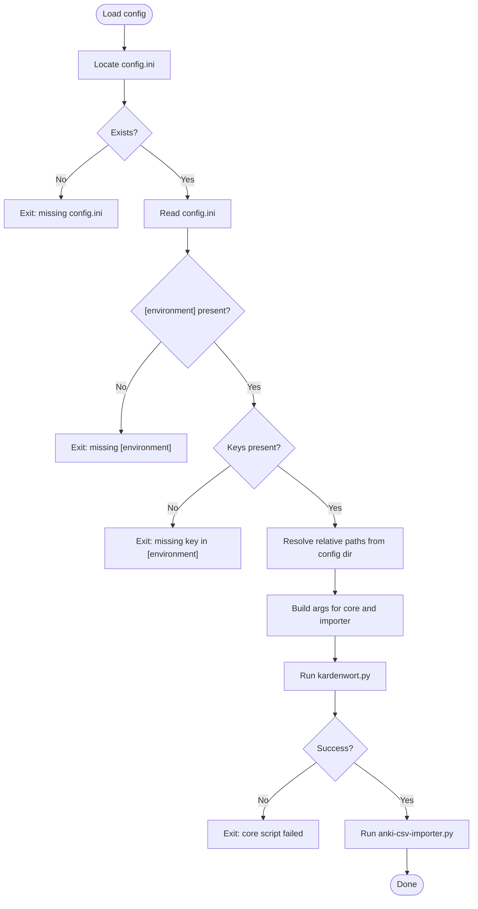
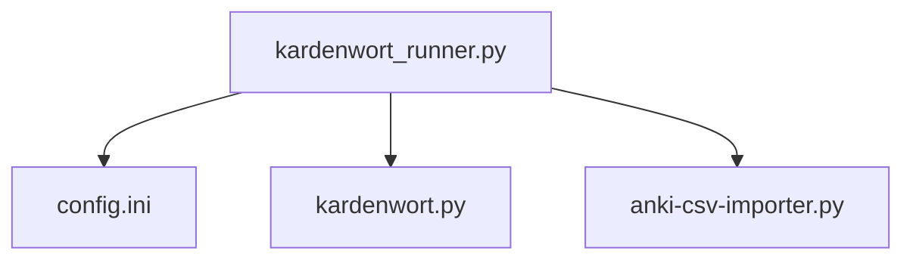

# Configuration

<cite>
**Referenced Files in This Document**
- [config.ini](file://config.ini)
- [config.ini.template](file://config.ini.template)
- [kardenwort_runner.py](file://src/kardenwort/core/kardenwort_runner.py)
- [README.md](file://README.md)
- [_config_loader.cmd](file://scripts/_config_loader.cmd)
- [kardenwort-goldendict-config.txt](file://docs/kardenwort-goldendict-config.txt)
</cite>

## Table of Contents
1. [Introduction](#introduction)
2. [Project Structure](#project-structure)
3. [Core Components](#core-components)
4. [Architecture Overview](#architecture-overview)
5. [Detailed Component Analysis](#detailed-component-analysis)
6. [Dependency Analysis](#dependency-analysis)
7. [Performance Considerations](#performance-considerations)
8. [Troubleshooting Guide](#troubleshooting-guide)
9. [Conclusion](#conclusion)

## Introduction
This section explains the configuration system of Kardenwort, focusing on the config.ini file and how it controls the runtime behavior of the kardenwort_runner.py script. It covers the [environment] section and how relative paths resolve from the configuration file’s location, the roles of [project_structure], [language_resources], [scripts], [output_format], and [anki_importer_settings], and how the runner loads and validates configuration with fallback values for optional settings. It also provides practical guidance on creating and maintaining config.ini across environments, including common issues and best practices.

## Project Structure
Kardenwort’s configuration is centralized in a single file, config.ini, located at the repository root. The runner script resolves its absolute paths relative to the config file’s location, enabling portability across machines and environments. The configuration file defines:
- The Python interpreter path
- The project workspace root
- The importer workspace root
- Script filenames
- Directory locations within the workspace
- Language resource files
- Output filename template
- Anki importer settings

**Diagram sources**
- [config.ini](file://config.ini#L1-L65)

**Section sources**
- [config.ini](file://config.ini#L1-L65)
- [README.md](file://README.md#L413-L426)

## Core Components
- [environment]: Defines the Python interpreter path, the project workspace, and the importer workspace. Paths can be absolute or relative; relative paths are resolved from the config file’s directory.
- [scripts]: Names of the executable scripts used by the runner.
- [project_structure]: Directory layout inside the workspace (source code, data, source texts, results).
- [input_files]: Input file names relative to source_texts_dir.
- [output_format]: Template for generated output filenames.
- [language_resources]: Language-specific data files (English and German).
- [anki_importer_settings]: Settings for the Anki CSV Importer script.

**Section sources**
- [config.ini](file://config.ini#L1-L65)

## Architecture Overview
The kardenwort_runner.py script locates config.ini, validates required keys, resolves relative paths, and builds argument lists for the core processing script and the Anki importer. It uses fallback values for optional settings and prints helpful diagnostics on failure.

**Diagram sources**
- [kardenwort_runner.py](file://src/kardenwort/core/kardenwort_runner.py#L15-L364)
- [config.ini](file://config.ini#L1-L65)

## Detailed Component Analysis

### [environment] Section
Purpose:
- Define the Python interpreter path used to run both the core script and the importer.
- Define the project workspace root and the importer workspace root.
- Enable portability by allowing relative paths resolved from the config file’s directory.

Behavior:
- The runner reads the three keys under [environment].
- If any key is missing, the runner exits with an error.
- Relative paths are resolved against the directory containing config.ini.
- Absolute paths are used as-is.

Resolution of relative paths:
- The runner computes the project root from the config file’s directory.
- It then resolves python_executable, kardenwort_workspace, and importer_workspace relative to this root.

Validation:
- Missing section or keys cause immediate failure with a clear diagnostic.

Best practices:
- Keep the virtual environment close to the project root to simplify relative paths.
- Use forward slashes or double backslashes for cross-platform compatibility.

**Section sources**
- [kardenwort_runner.py](file://src/kardenwort/core/kardenwort_runner.py#L15-L53)
- [config.ini](file://config.ini#L1-L26)

### [scripts] Section
Purpose:
- Provide the filenames of the core script, runner script, and importer script.
- Allow customization of script names if your project layout differs.

Behavior:
- The runner retrieves these filenames and constructs absolute paths using the resolved workspace roots.
- Fallback values are used if keys are missing.

**Section sources**
- [kardenwort_runner.py](file://src/kardenwort/core/kardenwort_runner.py#L56-L70)
- [config.ini](file://config.ini#L27-L32)

### [project_structure] Section
Purpose:
- Define internal directory layout within the workspace.
- Provide defaults for source code, data, source texts, and results directories.

Behavior:
- The runner resolves these directories relative to the workspace.
- Fallback values are used if keys are missing.

**Section sources**
- [kardenwort_runner.py](file://src/kardenwort/core/kardenwort_runner.py#L56-L61)
- [config.ini](file://config.ini#L33-L40)

### [input_files] Section
Purpose:
- Define the names of input files under source_texts_dir.
- Allow customization of which files are used for single/dual/triple modes.

Behavior:
- The runner reads these keys and constructs absolute paths under source_texts_dir.
- Fallback values are used if keys are missing.

**Section sources**
- [kardenwort_runner.py](file://src/kardenwort/core/kardenwort_runner.py#L148-L151)
- [config.ini](file://config.ini#L41-L46)

### [output_format] Section
Purpose:
- Define the template for generated output filenames.
- Allow customization of filename composition.

Behavior:
- The runner reads the template and substitutes variables for mode, suffix, and language.
- Fallback value is used if the key is missing.

**Section sources**
- [kardenwort_runner.py](file://src/kardenwort/core/kardenwort_runner.py#L140-L146)
- [config.ini](file://config.ini#L47-L51)

### [language_resources] Section
Purpose:
- Provide language-specific resource files (lemma index, lemma override rules, and German dictionary).
- Support English and German configurations.

Behavior:
- The runner selects the appropriate keys for the chosen language.
- Missing keys for the selected language cause a clear error.
- For German, an additional dictionary file is used when enabled.

**Section sources**
- [kardenwort_runner.py](file://src/kardenwort/core/kardenwort_runner.py#L65-L67)
- [kardenwort_runner.py](file://src/kardenwort/core/kardenwort_runner.py#L115-L122)
- [config.ini](file://config.ini#L52-L62)

### [anki_importer_settings] Section
Purpose:
- Configure the Anki CSV Importer script behavior.
- Provide the note type used by the importer.

Behavior:
- The runner reads the note type and constructs importer arguments.
- Fallback value is used if the key is missing.

**Section sources**
- [kardenwort_runner.py](file://src/kardenwort/core/kardenwort_runner.py#L216-L216)
- [config.ini](file://config.ini#L63-L65)

### How kardenwort_runner.py Loads and Validates Configuration
- Locates config.ini relative to the runner script’s directory.
- Exits early if the file is missing or the [environment] section is absent.
- Reads and validates required keys; exits on missing keys.
- Resolves relative paths against the config file’s directory.
- Builds argument lists for the core script and importer using configuration values and fallbacks.
- Prints detailed error messages on failures and exits with non-zero status when appropriate.

**Diagram sources**
- [kardenwort_runner.py](file://src/kardenwort/core/kardenwort_runner.py#L15-L364)
- [config.ini](file://config.ini#L1-L65)

**Section sources**
- [kardenwort_runner.py](file://src/kardenwort/core/kardenwort_runner.py#L15-L364)

## Dependency Analysis
The runner depends on the configuration file for all path and behavioral decisions. The configuration file itself is consumed by the runner and indirectly influences the core script and importer via constructed arguments.

**Diagram sources**
- [kardenwort_runner.py](file://src/kardenwort/core/kardenwort_runner.py#L15-L364)
- [config.ini](file://config.ini#L1-L65)

**Section sources**
- [kardenwort_runner.py](file://src/kardenwort/core/kardenwort_runner.py#L15-L364)
- [config.ini](file://config.ini#L1-L65)

## Performance Considerations
- Keeping relative paths short and close to the config file reduces filesystem traversal overhead.
- Using absolute paths for frequently accessed resources (e.g., Python interpreter) avoids repeated resolution.
- Minimizing unnecessary fallbacks by filling config.ini reduces runtime branching and potential misconfiguration.

[No sources needed since this section provides general guidance]

## Troubleshooting Guide
Common issues and resolutions:
- Missing configuration file
  - Symptom: The runner reports that config.ini was not found and instructs to copy the template.
  - Resolution: Copy config.ini.template to config.ini and edit the [environment] section.
  - Section sources
    - [kardenwort_runner.py](file://src/kardenwort/core/kardenwort_runner.py#L15-L21)
    - [README.md](file://README.md#L413-L426)

- Incorrect path specifications
  - Symptom: Relative paths resolve incorrectly or fail to locate Python or workspace directories.
  - Resolution: Ensure paths are relative to the config file’s directory. Use forward slashes or double backslashes for portability. Verify the project root and importer workspace are correct.
  - Section sources
    - [kardenwort_runner.py](file://src/kardenwort/core/kardenwort_runner.py#L42-L48)
    - [config.ini](file://config.ini#L1-L26)

- Permission errors
  - Symptom: The runner fails to execute the Python interpreter or access workspace/importer directories.
  - Resolution: Confirm the Python executable and workspace/importer directories are readable and executable. On Windows, ensure the virtual environment’s Scripts directory is accessible.
  - Section sources
    - [kardenwort_runner.py](file://src/kardenwort/core/kardenwort_runner.py#L71-L73)

- Missing language resources
  - Symptom: The runner raises a ValueError indicating missing configuration for the selected language.
  - Resolution: Add the required keys for the selected language under [language_resources] and ensure the files exist under data_dir.
  - Section sources
    - [kardenwort_runner.py](file://src/kardenwort/core/kardenwort_runner.py#L65-L69)
    - [config.ini](file://config.ini#L52-L62)

- Anki importer settings missing
  - Symptom: The importer fails due to missing note type.
  - Resolution: Add the note_type under [anki_importer_settings] or rely on the fallback value.
  - Section sources
    - [kardenwort_runner.py](file://src/kardenwort/core/kardenwort_runner.py#L216-L216)
    - [config.ini](file://config.ini#L63-L65)

- Mixed-triple mode deck naming
  - Symptom: Deck names are unexpected when using mixed-triple mode.
  - Resolution: The runner derives the parent deck name from the sentence pass output filename. Ensure consistent naming and consider using --anki-parent-deck for batch processes.
  - Section sources
    - [kardenwort_runner.py](file://src/kardenwort/core/kardenwort_runner.py#L312-L316)

- Using the Windows config loader script
  - Symptom: You need to inspect configuration values from a Windows shell.
  - Resolution: Use the provided _config_loader.cmd script to print key-value pairs from a specified section.
  - Section sources
    - [_config_loader.cmd](file://scripts/_config_loader.cmd#L1-L54)

## Practical Configuration Scenarios

### Scenario A: Default layout with shared virtual environment
- Place the three repositories in a common parent directory.
- Keep config.ini.template as-is; copy it to config.ini and verify [environment] paths.
- The runner resolves relative paths from config.ini, so the virtual environment near the project is portable.
- Section sources
  - [README.md](file://README.md#L151-L207)
  - [config.ini](file://config.ini#L1-L26)

### Scenario B: Python interpreter in a sibling directory
- Adjust python_executable to point to the sibling virtual environment.
- Keep kardenwort_workspace and importer_workspace as relative paths from config.ini.
- Section sources
  - [kardenwort_runner.py](file://src/kardenwort/core/kardenwort_runner.py#L42-L48)
  - [config.ini](file://config.ini#L1-L26)

### Scenario C: Workspace and importer in separate drives
- Use absolute paths for python_executable, kardenwort_workspace, and importer_workspace.
- This ensures correctness across different machines and avoids ambiguity.
- Section sources
  - [kardenwort_runner.py](file://src/kardenwort/core/kardenwort_runner.py#L42-L48)
  - [config.ini](file://config.ini#L1-L26)

### Scenario D: Custom script names
- Modify [scripts] to reflect renamed scripts.
- The runner will construct paths using these names and the resolved workspace roots.
- Section sources
  - [kardenwort_runner.py](file://src/kardenwort/core/kardenwort_runner.py#L56-L70)
  - [config.ini](file://config.ini#L27-L32)

### Scenario E: Custom output filename template
- Adjust [output_format] to change the generated filename pattern.
- The runner substitutes mode, suffix, and language variables.
- Section sources
  - [kardenwort_runner.py](file://src/kardenwort/core/kardenwort_runner.py#L140-L146)
  - [config.ini](file://config.ini#L47-L51)

### Scenario F: Language-specific resources
- Ensure [language_resources] contains entries for the selected language.
- For German, confirm the dictionary file is present when using German-specific options.
- Section sources
  - [kardenwort_runner.py](file://src/kardenwort/core/kardenwort_runner.py#L65-L67)
  - [kardenwort_runner.py](file://src/kardenwort/core/kardenwort_runner.py#L115-L122)
  - [config.ini](file://config.ini#L52-L62)

### Scenario G: GoldenDict integration
- Use the provided examples in docs/kardenwort-goldendict-config.txt to configure GoldenDict to call kardenwort_runner.py or kardenwort.py directly.
- For multi-line text processing in GoldenDict, prefer calling the runner directly with --multi-text.
- Section sources
  - [kardenwort-goldendict-config.txt](file://docs/kardenwort-goldendict-config.txt#L1-L229)

## Best Practices for Maintaining Configuration Across Environments
- Keep config.ini in the repository root and track it in version control.
- Use relative paths wherever possible to maximize portability.
- Prefer absolute paths only for system-wide installations or when sharing across machines.
- Keep [environment] synchronized with the virtual environment’s location.
- Regularly validate configuration by running a quick test mode (e.g., mixed-triple with minimal options).
- Document environment-specific overrides externally (e.g., in a separate file) and merge them into config.ini when needed.
- Use the fallback values judiciously; fill in missing keys to avoid runtime surprises.

[No sources needed since this section provides general guidance]

## Conclusion
Kardenwort’s configuration system centers on a single, human-readable config.ini file. The kardenwort_runner.py script resolves relative paths from the config file’s location, validates required settings, and constructs robust argument lists for the core processing and importer scripts. By understanding each configuration section and following the troubleshooting and best practices outlined here, you can reliably operate Kardenwort across diverse environments and workflows.