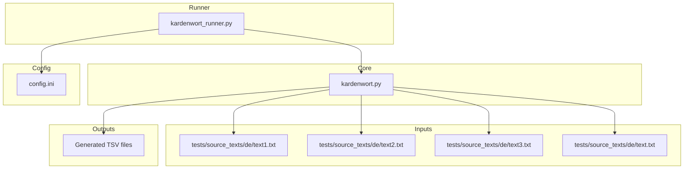
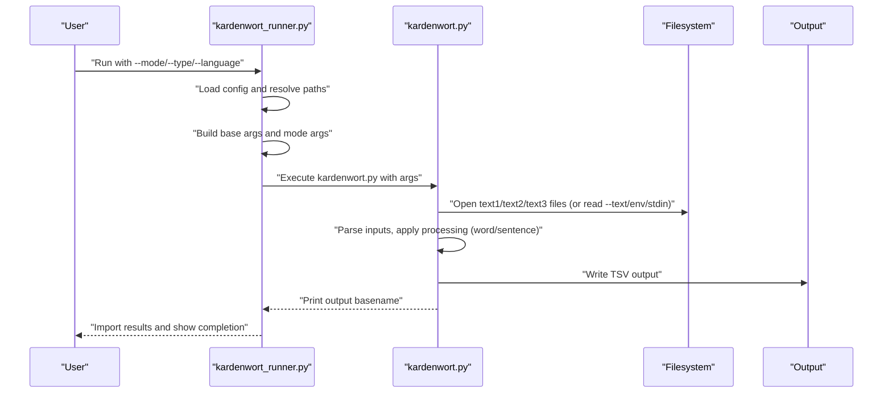
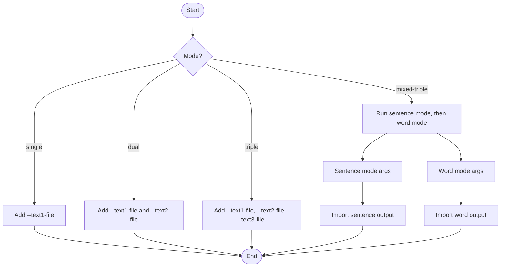
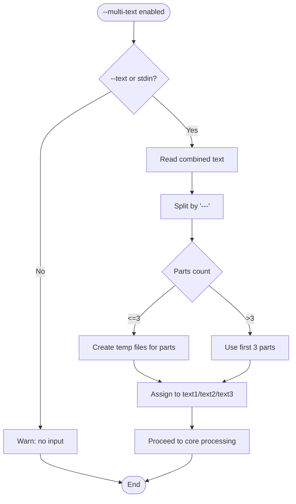
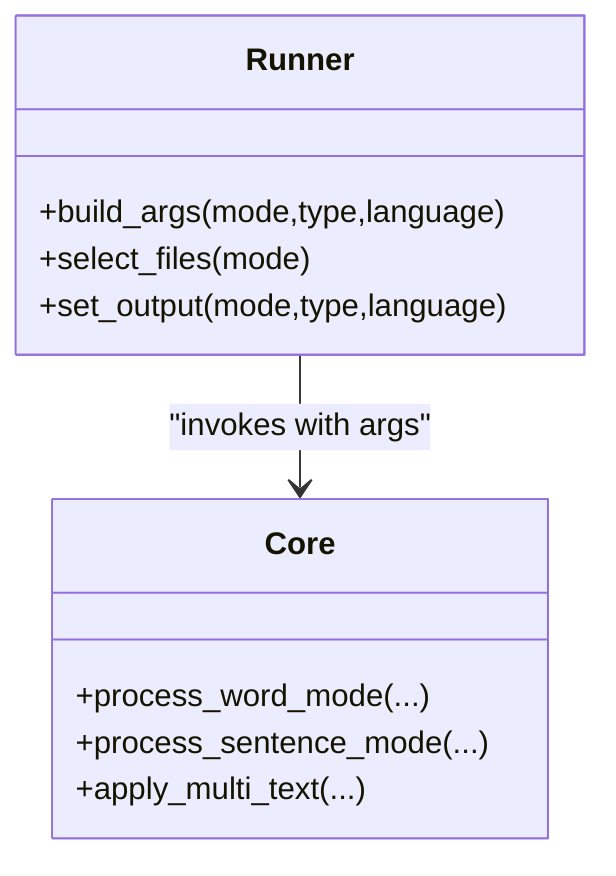
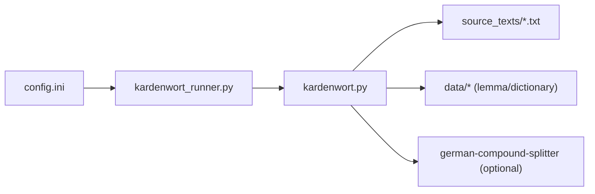

# Input Processing Modes

<cite>
**Referenced Files in This Document**
- [kardenwort_runner.py](file://src/kardenwort/core/kardenwort_runner.py)
- [kardenwort.py](file://src/kardenwort/core/kardenwort.py)
- [config.ini](file://config.ini)
- [text.txt](file://tests/source_texts/de/text.txt)
- [text1.txt](file://tests/source_texts/de/text1.txt)
- [text2.txt](file://tests/source_texts/de/text2.txt)
- [text3.txt](file://tests/source_texts/de/text3.txt)
- [README.md](file://README.md)
</cite>

## Table of Contents
1. [Introduction](#introduction)
2. [Project Structure](#project-structure)
3. [Core Components](#core-components)
4. [Architecture Overview](#architecture-overview)
5. [Detailed Component Analysis](#detailed-component-analysis)
6. [Dependency Analysis](#dependency-analysis)
7. [Performance Considerations](#performance-considerations)
8. [Troubleshooting Guide](#troubleshooting-guide)
9. [Conclusion](#conclusion)

## Introduction
This document explains Kardenwort’s input processing modes and how they integrate with output types. It covers:
- Single, dual, and triple text inputs
- File-based inputs from the configured source_texts directory
- Direct text input via command-line arguments or environment variables
- Multi-text parsing using the “---” separator and its integration with mixed-triple mode
- How input modes relate to output types (word vs sentence)
- Practical examples from the codebase and common pitfalls

## Project Structure
Kardenwort is organized around two main scripts:
- A runner that parses CLI arguments, resolves paths, and invokes the core extraction script
- The core extraction script that performs text processing, parsing, and output generation

Key locations:
- Runner: src/kardenwort/core/kardenwort_runner.py
- Core extraction: src/kardenwort/core/kardenwort.py
- Configuration: config.ini
- Test inputs: tests/source_texts/de/*.txt
- Documentation: README.md

**Diagram sources**
- [kardenwort_runner.py](file://src/kardenwort/core/kardenwort_runner.py#L56-L176)
- [kardenwort.py](file://src/kardenwort/core/kardenwort.py#L1914-L2029)
- [config.ini](file://config.ini#L33-L62)
- [text1.txt](file://tests/source_texts/de/text1.txt#L1-L14)
- [text2.txt](file://tests/source_texts/de/text2.txt#L1-L14)
- [text3.txt](file://tests/source_texts/de/text3.txt#L1-L14)
- [text.txt](file://tests/source_texts/de/text.txt#L1-L9)

**Section sources**
- [kardenwort_runner.py](file://src/kardenwort/core/kardenwort_runner.py#L56-L176)
- [kardenwort.py](file://src/kardenwort/core/kardenwort.py#L1914-L2029)
- [config.ini](file://config.ini#L33-L62)

## Core Components
- Input modes:
  - single: processes one primary text file
  - dual: processes a primary text plus a translation file
  - triple: processes a primary text plus two translation files
  - mixed-triple: runs sentence mode, then word mode, and imports both outputs under a shared parent deck
- Multi-text parsing: splits a single input into up to three blocks using “---”
- Output types:
  - word: produces word-level extractions and lemmas
  - sentence: produces parallel sentence pairs with optional translations

These behaviors are orchestrated by the runner and implemented in the core extraction script.

**Section sources**
- [kardenwort_runner.py](file://src/kardenwort/core/kardenwort_runner.py#L267-L340)
- [kardenwort.py](file://src/kardenwort/core/kardenwort.py#L1953-L2029)

## Architecture Overview
The runner constructs the final command for the core script, selects input files based on mode, and sets output filenames. The core script reads inputs, applies processing logic, and writes TSV output.

**Diagram sources**
- [kardenwort_runner.py](file://src/kardenwort/core/kardenwort_runner.py#L56-L176)
- [kardenwort.py](file://src/kardenwort/core/kardenwort.py#L1953-L2029)

## Detailed Component Analysis

### Input Modes: Single, Dual, Triple
- Mode selection and file assignment:
  - single: uses text1 file
  - dual: uses text1 and text2 files
  - triple: uses text1, text2, and text3 files
- Mixed-triple mode:
  - Runs sentence mode first, then word mode
  - Shares a parent deck name derived from the sentence output
  - Imports both outputs with appropriate deck metadata

**Diagram sources**
- [kardenwort_runner.py](file://src/kardenwort/core/kardenwort_runner.py#L163-L176)
- [kardenwort_runner.py](file://src/kardenwort/core/kardenwort_runner.py#L303-L340)

**Section sources**
- [kardenwort_runner.py](file://src/kardenwort/core/kardenwort_runner.py#L163-L176)
- [kardenwort_runner.py](file://src/kardenwort/core/kardenwort_runner.py#L303-L340)

### File-Based Inputs from source_texts Directory
- The runner resolves the source_texts directory from configuration and defaults to a relative path if not set.
- For each mode, it sets the corresponding file arguments pointing into the source_texts directory.
- The core script opens these files with UTF-8 encoding and processes line-by-line.

Practical notes:
- Ensure the source_texts directory exists and contains the expected files.
- Filenames are configurable via config.ini under [input_files].

**Section sources**
- [kardenwort_runner.py](file://src/kardenwort/core/kardenwort_runner.py#L56-L80)
- [kardenwort_runner.py](file://src/kardenwort/core/kardenwort_runner.py#L148-L171)
- [config.ini](file://config.ini#L33-L62)
- [kardenwort.py](file://src/kardenwort/core/kardenwort.py#L687-L714)

### Direct Text Input via Command-Line Arguments or Environment Variables
- Direct text input:
  - --text: passes a literal string for single mode
  - stdin: if not a TTY, reads all input
  - Environment variable: KARDENWORT_INPUT_TEXT
- The core script checks these sources in order and validates availability.

Common scenarios:
- Pipe text to the script for quick processing
- Set the environment variable for automation
- Use --text for short inline inputs

**Section sources**
- [kardenwort_runner.py](file://src/kardenwort/core/kardenwort_runner.py#L152-L161)
- [kardenwort.py](file://src/kardenwort/core/kardenwort.py#L1954-L1966)

### Multi-Text Parsing Using “---” Separators
- When --multi-text is enabled:
  - The runner detects mixed-triple mode with --text and auto-enables --multi-text
  - The core script splits combined input by “---” into up to three parts
  - It creates temporary files for each part and assigns them to text1_file, text2_file, text3_file
- This enables a single input stream to supply all three texts for triple or mixed-triple processing.

Example input:
- A single file or stdin containing lines separated by “---” acts as three separate texts.

**Diagram sources**
- [kardenwort_runner.py](file://src/kardenwort/core/kardenwort_runner.py#L297-L300)
- [kardenwort.py](file://src/kardenwort/core/kardenwort.py#L1832-L1860)

**Section sources**
- [kardenwort_runner.py](file://src/kardenwort/core/kardenwort_runner.py#L297-L300)
- [kardenwort.py](file://src/kardenwort/core/kardenwort.py#L1832-L1860)

### Relationship Between Input Modes and Output Types (Word vs Sentence)
- word mode:
  - Processes single or parallel texts
  - Produces word-level lemmas and optional sentence context
  - Supports German Compound Splitting (GCS) and related flags
- sentence mode:
  - Requires text1 and text2 files (and optionally text3)
  - Produces parallel sentence pairs with optional translations
  - Ignores GCS flags intended for word mode

Mixed-triple mode:
- Runs sentence mode first, then word mode, importing both outputs under a shared parent deck name.

**Diagram sources**
- [kardenwort_runner.py](file://src/kardenwort/core/kardenwort_runner.py#L56-L176)
- [kardenwort.py](file://src/kardenwort/core/kardenwort.py#L1953-L2029)

**Section sources**
- [kardenwort.py](file://src/kardenwort/core/kardenwort.py#L1999-L2029)
- [kardenwort.py](file://src/kardenwort/core/kardenwort.py#L1953-L1998)

### Concrete Examples from the Codebase
- Mixed-triple mode with multi-text:
  - Runner auto-enables --multi-text when mixed-triple is used with --text
  - Core splits input by “---” and assigns to text1/text2/text3
- File-based triple mode:
  - Runner sets --text1-file, --text2-file, --text3-file from source_texts directory
- Direct text input:
  - Runner passes --text if provided or falls back to environment variable
  - Core reads --text, environment variable, or stdin

**Section sources**
- [kardenwort_runner.py](file://src/kardenwort/core/kardenwort_runner.py#L152-L161)
- [kardenwort_runner.py](file://src/kardenwort/core/kardenwort_runner.py#L163-L176)
- [kardenwort_runner.py](file://src/kardenwort/core/kardenwort_runner.py#L297-L300)
- [kardenwort.py](file://src/kardenwort/core/kardenwort.py#L1832-L1860)

## Dependency Analysis
- Runner depends on:
  - Configuration for workspace and directory layout
  - Core script for actual processing
- Core depends on:
  - Input files or direct text sources
  - Language resources (lemma index, overrides, dictionary)
  - Optional German Compound Splitter (GCS) library

**Diagram sources**
- [config.ini](file://config.ini#L33-L62)
- [kardenwort_runner.py](file://src/kardenwort/core/kardenwort_runner.py#L56-L80)
- [kardenwort.py](file://src/kardenwort/core/kardenwort.py#L1886-L1910)

**Section sources**
- [config.ini](file://config.ini#L33-L62)
- [kardenwort.py](file://src/kardenwort/core/kardenwort.py#L1886-L1910)

## Performance Considerations
- Mixed-triple mode runs the extraction script twice; expect longer runtime
- GCS adds overhead; enable only when needed
- Large inputs processed via stdin are read entirely into memory; consider file-based inputs for very large corpora
- Temporary files created for multi-text parsing are cleaned up automatically

[No sources needed since this section provides general guidance]

## Troubleshooting Guide
Common issues and resolutions:
- Missing configuration file:
  - Ensure config.ini exists and is filled out; the runner exits early if missing
- Unknown mode:
  - The runner raises an error for unsupported modes
- Missing type for single/dual/triple:
  - The runner enforces --type for these modes
- Mixed-triple with explicit --type:
  - The runner warns that --type is ignored for mixed-triple
- Mixed-triple with --text but no --multi-text:
  - The runner auto-enables --multi-text
- File path resolution:
  - Verify source_texts_dir in config.ini points to the correct directory
  - Confirm filenames under [input_files] match actual files
- Text encoding:
  - All file reads use UTF-8; ensure source files are saved as UTF-8
- Empty or malformed input:
  - For lemma override rules, malformed lines are skipped with warnings
  - For sentence processing, empty lines are filtered out
- GCS prerequisites:
  - If GCS is enabled, ensure the library and dictionary are installed and configured

**Section sources**
- [kardenwort_runner.py](file://src/kardenwort/core/kardenwort_runner.py#L16-L21)
- [kardenwort_runner.py](file://src/kardenwort/core/kardenwort_runner.py#L292-L300)
- [kardenwort.py](file://src/kardenwort/core/kardenwort.py#L90-L110)
- [kardenwort.py](file://src/kardenwort/core/kardenwort.py#L687-L714)
- [kardenwort.py](file://src/kardenwort/core/kardenwort.py#L1899-L1909)

## Conclusion
Kardenwort’s input processing modes provide flexible ways to ingest text data:
- Choose single, dual, or triple based on your input sources
- Use file-based inputs from source_texts or direct text via CLI/environment
- Leverage multi-text parsing with “---” to unify multiple texts into one pipeline
- Select output type (word or sentence) to tailor the extraction to your needs
- Mixed-triple mode offers a streamlined workflow for sentence and word outputs with shared deck metadata

[No sources needed since this section summarizes without analyzing specific files]