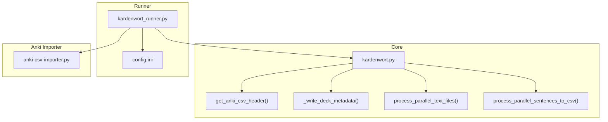
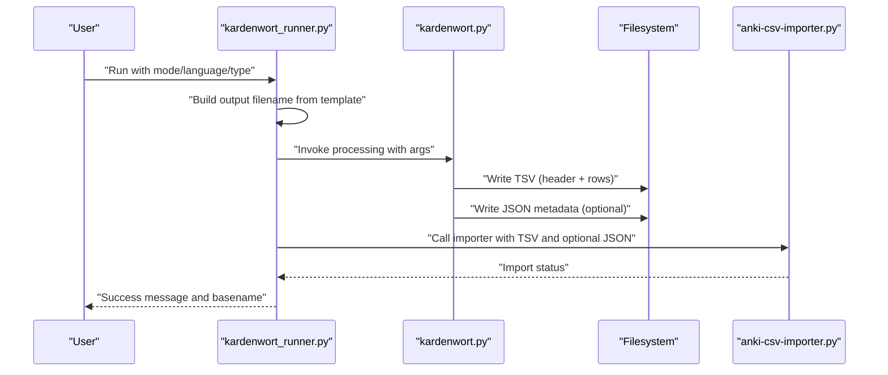
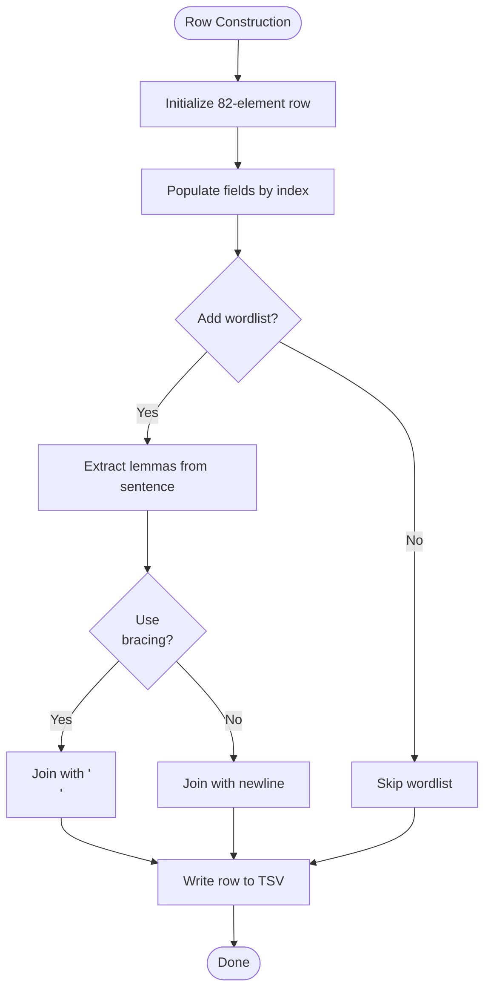
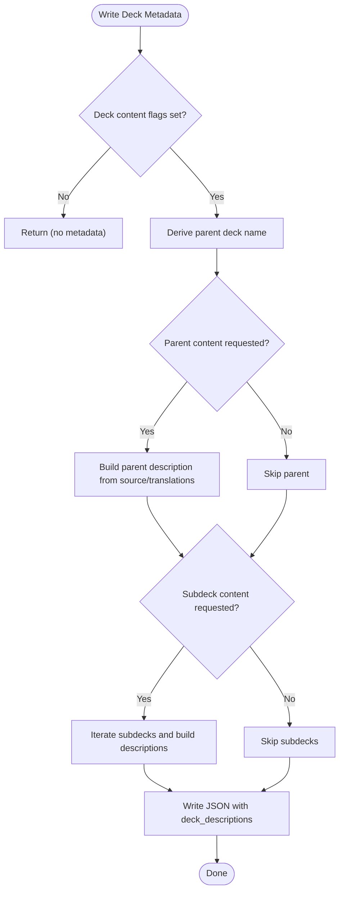
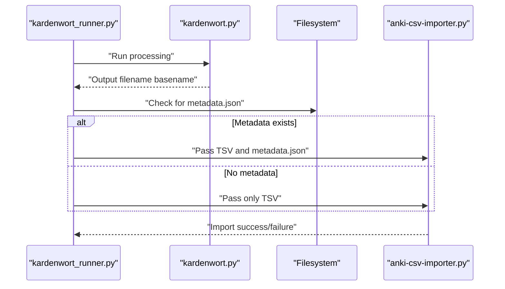
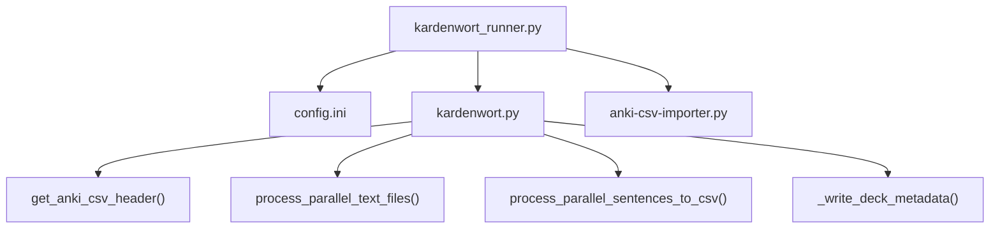

# Output Generation and Formatting

<cite>
**Referenced Files in This Document**
- [kardenwort.py](file://src/kardenwort/core/kardenwort.py)
- [kardenwort_runner.py](file://src/kardenwort/core/kardenwort_runner.py)
- [README.md](file://README.md)
- [config.ini](file://config.ini)
- [20250913172001-morgen-faehrt-der-neue.triple.sentence.de.tsv](file://tests/cases/text3-morgen-faehrt-der-neue/20250913172001-morgen-faehrt-der-neue.triple.sentence.de.tsv)
</cite>

## Table of Contents
1. [Introduction](#introduction)
2. [Project Structure](#project-structure)
3. [Core Components](#core-components)
4. [Architecture Overview](#architecture-overview)
5. [Detailed Component Analysis](#detailed-component-analysis)
6. [Dependency Analysis](#dependency-analysis)
7. [Performance Considerations](#performance-considerations)
8. [Troubleshooting Guide](#troubleshooting-guide)
9. [Conclusion](#conclusion)

## Introduction
This document explains how Kardenwort generates TSV and JSON outputs for Anki integration. It covers:
- The 82-column TSV structure and how it maps to Anki card fields
- Dynamic filename generation based on input text, processing mode, and language
- JSON metadata generation for Anki deck descriptions and how it synchronizes with the TSV
- Formatting options such as wordlist bracing and header inclusion
- Integration with the Anki importer and common issues around encoding, path resolution, and metadata synchronization

## Project Structure
Kardenwort’s output generation spans two main modules:
- Core processing and output generation: [kardenwort.py](file://src/kardenwort/core/kardenwort.py)
- Runner that orchestrates processing, filename templating, and importer invocation: [kardenwort_runner.py](file://src/kardenwort/core/kardenwort_runner.py)

**Diagram sources**
- [kardenwort.py](file://src/kardenwort/core/kardenwort.py#L320-L1459)
- [kardenwort_runner.py](file://src/kardenwort/core/kardenwort_runner.py#L1-L364)
- [config.ini](file://config.ini#L41-L65)

**Section sources**
- [kardenwort.py](file://src/kardenwort/core/kardenwort.py#L320-L1459)
- [kardenwort_runner.py](file://src/kardenwort/core/kardenwort_runner.py#L1-L364)
- [README.md](file://README.md#L262-L311)

## Core Components
- TSV header definition and field mapping: [get_anki_csv_header()](file://src/kardenwort/core/kardenwort.py#L320-L404)
- TSV writer and row construction for word/sentence modes: [process_parallel_text_files()](file://src/kardenwort/core/kardenwort.py#L672-L1459), [process_parallel_sentences_to_csv()](file://src/kardenwort/core/kardenwort.py#L1461-L1740)
- JSON metadata generation for Anki deck descriptions: [_write_deck_metadata()](file://src/kardenwort/core/kardenwort.py#L594-L671)
- Dynamic filename generation and template expansion: [kardenwort_runner.py](file://src/kardenwort/core/kardenwort_runner.py#L136-L176), [kardenwort.py](file://src/kardenwort/core/kardenwort.py#L1925-L1941)
- Anki importer integration and metadata synchronization: [kardenwort_runner.py](file://src/kardenwort/core/kardenwort_runner.py#L211-L260)

**Section sources**
- [kardenwort.py](file://src/kardenwort/core/kardenwort.py#L320-L1459)
- [kardenwort_runner.py](file://src/kardenwort/core/kardenwort_runner.py#L136-L260)
- [README.md](file://README.md#L262-L311)

## Architecture Overview
The output generation pipeline:
1. Runner builds the final output filename from a template and optional timestamp/prefix.
2. Core processing writes the TSV with the 82-column header and rows.
3. Core processing optionally writes a JSON metadata file for deck descriptions.
4. Runner invokes the Anki importer, passing the TSV and metadata file path if present.

**Diagram sources**
- [kardenwort_runner.py](file://src/kardenwort/core/kardenwort_runner.py#L136-L260)
- [kardenwort.py](file://src/kardenwort/core/kardenwort.py#L1380-L1459)

## Detailed Component Analysis

### 82-Column TSV Structure and Anki Field Mapping
The TSV uses a fixed 82-column header produced by [get_anki_csv_header()](file://src/kardenwort/core/kardenwort.py#L320-L404). The core writer populates rows in [process_parallel_text_files()](file://src/kardenwort/core/kardenwort.py#L1380-L1459) and [process_parallel_sentences_to_csv()](file://src/kardenwort/core/kardenwort.py#L1461-L1740).

Key mappings and roles:
- Columns 1–14: Sentence context and destinations (left/right contexts, destinations, and a second destination pair)
- Column 15: Sentence wordlist (unique lemmas extracted from the source sentence)
- Column 16: Cloze-style sentence field
- Columns 17–20: Language-specific word fields (Russian, Ukrainian, English, German)
- Columns 21–30: Morpheme fields and definitions
- Columns 31–40: IPA and audio fields
- Columns 41–50: Additional AI fields and definitions
- Columns 51–80: Additional fields for notes, URLs, and other metadata
- Column 81: Deck name (dynamic, used for hierarchical deck assignment)
- Column 82: Sentence index (when enabled)

Row construction highlights:
- Header row is written when requested via the “add header” option.
- The row is initialized as an 82-element list and populated by index.
- Deck name is placed in column 81 depending on processing mode and flags.
- Sentence index is placed in column 82 when enabled.

**Diagram sources**
- [kardenwort.py](file://src/kardenwort/core/kardenwort.py#L1380-L1459)

**Section sources**
- [kardenwort.py](file://src/kardenwort/core/kardenwort.py#L320-L404)
- [kardenwort.py](file://src/kardenwort/core/kardenwort.py#L1380-L1459)
- [kardenwort.py](file://src/kardenwort/core/kardenwort.py#L1461-L1740)
- [20250913172001-morgen-faehrt-der-neue.triple.sentence.de.tsv](file://tests/cases/text3-morgen-faehrt-der-neue/20250913172001-morgen-faehrt-der-neue.triple.sentence.de.tsv#L1-L3)

### Dynamic Filename Generation Based on Input Text, Mode, and Language
Filename generation is handled in two places:
- Template-driven naming in the runner: [get_script_args()](file://src/kardenwort/core/kardenwort_runner.py#L136-L176) uses a template from [config.ini](file://config.ini#L47-L50) with placeholders for mode, suffix, and language.
- Autonaming enhancement in the core: [main()](file://src/kardenwort/core/kardenwort.py#L1925-L1941) optionally prepends a timestamp and/or a slug derived from the first N words of the input text.

Slug generation:
- A prefix is derived from the first N words of the input text, normalized and converted to ASCII equivalents for diacritics.
- The slug is appended to the filename with a timestamp when enabled.

Mode and suffix mapping:
- Mode is derived from the CLI mode and adjusted for mixed-triple.
- Suffix is “sentence” for sentence mode and “word” for word mode.

**Section sources**
- [kardenwort_runner.py](file://src/kardenwort/core/kardenwort_runner.py#L136-L176)
- [config.ini](file://config.ini#L47-L50)
- [kardenwort.py](file://src/kardenwort/core/kardenwort.py#L1925-L1941)

### JSON Metadata Generation for Anki Deck Descriptions
When deck content flags are provided, the core writes a JSON file alongside the TSV with deck descriptions. The function [_write_deck_metadata()](file://src/kardenwort/core/kardenwort.py#L594-L671) constructs:
- Parent deck description from source and translation content (based on flags)
- Subdeck descriptions keyed by deck names, aggregating source and translation lines per subdeck

Deck naming and hierarchy:
- Parent deck name is derived from either the explicit parent deck or the output filename.
- Subdeck names are derived from the output filename and optional Markdown headers.
- When Markdown decks are enabled, deck names are built from header levels and sanitized titles.

Metadata file path:
- The JSON file shares the same base path as the TSV and uses the .json extension.

**Diagram sources**
- [kardenwort.py](file://src/kardenwort/core/kardenwort.py#L594-L671)

**Section sources**
- [kardenwort.py](file://src/kardenwort/core/kardenwort.py#L594-L671)
- [kardenwort.py](file://src/kardenwort/core/kardenwort.py#L1597-L1605)

### Formatting Options: Wordlist Bracing and Header Inclusion
- Wordlist bracing: When enabled, the wordlist uses HTML line breaks instead of newlines. This is controlled by the “wordlist use br” option and applied when building the wordlist column.
- Header inclusion: When enabled, the TSV header row is written before the data rows.

These options are enforced in the writer logic and are reflected in the test TSV header row.

**Section sources**
- [kardenwort.py](file://src/kardenwort/core/kardenwort.py#L1427-L1432)
- [kardenwort.py](file://src/kardenwort/core/kardenwort.py#L1396-L1397)
- [20250913172001-morgen-faehrt-der-neue.triple.sentence.de.tsv](file://tests/cases/text3-morgen-faehrt-der-neue/20250913172001-morgen-faehrt-der-neue.triple.sentence.de.tsv#L1-L3)

### Integration with the Anki Importer
The runner coordinates the Anki import:
- It executes the core script and captures the output filename basename.
- It invokes the importer with the TSV path and optional deck metadata file path.
- If the metadata JSON exists, it is passed to the importer to update deck descriptions.

**Diagram sources**
- [kardenwort_runner.py](file://src/kardenwort/core/kardenwort_runner.py#L211-L260)

**Section sources**
- [kardenwort_runner.py](file://src/kardenwort/core/kardenwort_runner.py#L211-L260)

## Dependency Analysis
- The runner depends on [config.ini](file://config.ini#L41-L65) for templates and paths.
- The core depends on the runner for argument composition and on the importer for post-processing.
- The TSV writer depends on the header function and the row construction logic.
- The metadata writer depends on deck naming logic and content aggregation.

**Diagram sources**
- [config.ini](file://config.ini#L41-L65)
- [kardenwort_runner.py](file://src/kardenwort/core/kardenwort_runner.py#L136-L260)
- [kardenwort.py](file://src/kardenwort/core/kardenwort.py#L320-L1459)

**Section sources**
- [config.ini](file://config.ini#L41-L65)
- [kardenwort_runner.py](file://src/kardenwort/core/kardenwort_runner.py#L136-L260)
- [kardenwort.py](file://src/kardenwort/core/kardenwort.py#L320-L1459)

## Performance Considerations
- TSV writing uses a buffered CSV writer with UTF-8 encoding and tab delimiters, minimizing overhead.
- Wordlist computation is cached per sentence to avoid repeated lemmatization.
- Metadata generation is conditional and only performed when deck content flags are set.

[No sources needed since this section provides general guidance]

## Troubleshooting Guide
Common issues and resolutions:
- File encoding problems
  - Ensure input files are UTF-8 encoded. The core reads and writes with UTF-8.
  - If you encounter garbled characters, verify the encoding of source and translation files.
  - The runner sets UTF-8 for subprocess output/error streams.
- Path resolution issues
  - Use absolute paths or ensure relative paths resolve from the project root as configured in [config.ini](file://config.ini#L1-L26).
  - Verify that the importer workspace path is correct so the importer can locate the TSV and metadata files.
- Metadata file synchronization
  - The metadata JSON is written adjacent to the TSV with the same base name. Confirm the JSON exists before importing.
  - If deck descriptions do not update, confirm you are using the modified AnkiConnect fork as described in [README.md](file://README.md#L143-L149).
- Missing deck descriptions
  - Deck descriptions are only generated when deck content flags are set. Verify flags like parent-source, parent-translations, subdeck-source, subdeck-translations.
- Mixed-triple mode deck naming
  - In mixed-triple mode, the runner derives a parent deck name from the sentence pass and reuses it for the word pass. Ensure the parent deck name is preserved across both runs.

**Section sources**
- [kardenwort.py](file://src/kardenwort/core/kardenwort.py#L1925-L1941)
- [kardenwort_runner.py](file://src/kardenwort/core/kardenwort_runner.py#L211-L260)
- [README.md](file://README.md#L143-L149)

## Conclusion
Kardenwort’s output generation is robust and configurable:
- The 82-column TSV follows a strict header and row construction scheme tailored for Anki templates.
- Dynamic filenames combine templates, timestamps, and slug-based prefixes for traceability.
- JSON metadata enables rich deck descriptions and integrates with the Anki importer.
- Formatting options like wordlist bracing and header inclusion provide flexibility for different workflows.
- Proper configuration and UTF-8 handling ensure reliable operation across platforms.