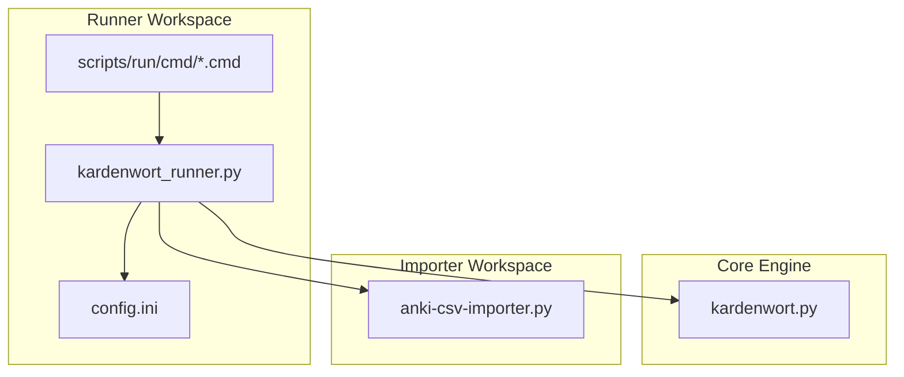
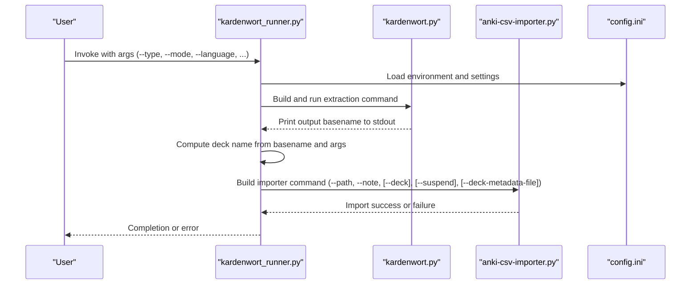
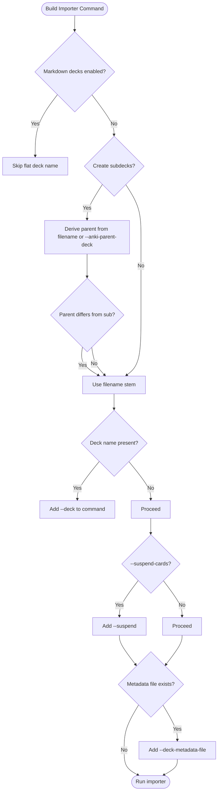
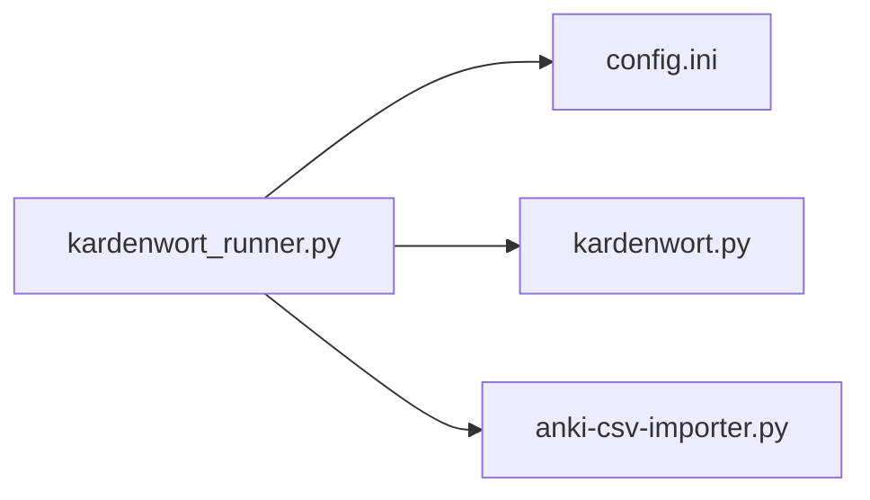

# Anki Import Orchestration

<cite>
**Referenced Files in This Document**
- [kardenwort_runner.py](file://src/kardenwort/core/kardenwort_runner.py)
- [config.ini](file://config.ini)
- [README.md](file://README.md)
- [kardenwort_run_de_ws_t3_s_anki_v3.cmd](file://scripts/run/cmd/kardenwort_run_de_ws_t3_s_anki_v3.cmd)
- [kardenwort_run_de_w_t_l_anki.cmd](file://scripts/run/cmd/kardenwort_run_de_w_t_l_anki.cmd)
- [kardenwort.py](file://src/kardenwort/core/kardenwort.py)
</cite>

## Table of Contents
1. [Introduction](#introduction)
2. [Project Structure](#project-structure)
3. [Core Components](#core-components)
4. [Architecture Overview](#architecture-overview)
5. [Detailed Component Analysis](#detailed-component-analysis)
6. [Dependency Analysis](#dependency-analysis)
7. [Performance Considerations](#performance-considerations)
8. [Troubleshooting Guide](#troubleshooting-guide)
9. [Conclusion](#conclusion)

## Introduction
This document explains how the Kardenwort runner orchestrates the end-to-end workflow for extracting vocabulary and sentence data from source texts and importing the resulting TSV files into Anki. The runner coordinates two stages:
- Extraction: Invokes the core processing script to produce a TSV file and optional JSON metadata.
- Import: Invokes the Anki CSV importer script to create/update decks and cards in Anki, building hierarchical deck names from filenames and configuration.

It focuses on how the runner constructs the importer command, how deck names are derived, and how errors are handled during extraction and import.

## Project Structure
The runner lives in the core module alongside the core processing script. Configuration is centralized in a configuration file that defines Python interpreter paths, workspace locations, and importer settings. Windows CMD scripts demonstrate typical invocation patterns and can be used to integrate with tools like GoldenDict.

**Diagram sources**
- [kardenwort_runner.py](file://src/kardenwort/core/kardenwort_runner.py#L1-L364)
- [config.ini](file://config.ini#L1-L65)
- [kardenwort_run_de_ws_t3_s_anki_v3.cmd](file://scripts/run/cmd/kardenwort_run_de_ws_t3_s_anki_v3.cmd#L1-L57)
- [kardenwort_run_de_w_t_l_anki.cmd](file://scripts/run/cmd/kardenwort_run_de_w_t_l_anki.cmd#L1-L48)

**Section sources**
- [kardenwort_runner.py](file://src/kardenwort/core/kardenwort_runner.py#L1-L364)
- [config.ini](file://config.ini#L1-L65)
- [README.md](file://README.md#L134-L207)

## Core Components
- Runner script: Loads configuration, builds extraction arguments, executes the extraction, and then invokes the importer with computed deck names and optional metadata.
- Configuration: Defines Python executable path, workspace roots, importer workspace, script names, project structure, and importer defaults.
- Importer workspace: Contains the Anki CSV importer script invoked by the runner.

Key responsibilities:
- Build extraction command from CLI args and configuration.
- Capture the output filename from extraction.
- Construct importer command with note type, deck hierarchy, suspend flag, and metadata file inclusion.
- Determine deck names based on processing mode, parent deck configuration, and filename patterns.
- Handle errors and logging for both extraction and import phases.

**Section sources**
- [kardenwort_runner.py](file://src/kardenwort/core/kardenwort_runner.py#L15-L115)
- [kardenwort_runner.py](file://src/kardenwort/core/kardenwort_runner.py#L178-L210)
- [kardenwort_runner.py](file://src/kardenwort/core/kardenwort_runner.py#L211-L260)
- [config.ini](file://config.ini#L1-L65)

## Architecture Overview
The runner composes a two-stage pipeline: extraction followed by import. It reads configuration to locate the importer script and workspace, then constructs the importer command with explicit deck naming and optional metadata.

**Diagram sources**
- [kardenwort_runner.py](file://src/kardenwort/core/kardenwort_runner.py#L178-L260)
- [config.ini](file://config.ini#L1-L65)

## Detailed Component Analysis

### Runner orchestration and argument composition
The runner loads configuration, composes extraction arguments from CLI and config, and executes the extraction process. It captures the output filename printed by the extractor and proceeds to import.

- Configuration loading validates presence of required keys and resolves absolute paths.
- Extraction argument builder adds language resources, deduplication scope, and mode-specific inputs.
- Extraction execution uses a subprocess with UTF-8 handling and captures stdout to determine the output filename.

Concrete example references:
- [load_config](file://src/kardenwort/core/kardenwort_runner.py#L15-L53)
- [get_script_args](file://src/kardenwort/core/kardenwort_runner.py#L56-L176)
- [run_extraction_script](file://src/kardenwort/core/kardenwort_runner.py#L178-L210)

**Section sources**
- [kardenwort_runner.py](file://src/kardenwort/core/kardenwort_runner.py#L15-L176)
- [kardenwort_runner.py](file://src/kardenwort/core/kardenwort_runner.py#L178-L210)

### Importer command construction and deck naming logic
The runner constructs the importer command with:
- Path to the TSV file.
- Note type from configuration.
- Optional deck name derived from the output filename and arguments.
- Optional suspend flag.
- Optional deck metadata file inclusion when present.

Deck naming rules:
- If Markdown-based decks are enabled, the runner does not compute a flat deck name for the importer.
- Otherwise:
  - If subdecks are enabled, derive a parent deck name from the output filename (removing the suffix indicating word/sentence) or use an explicit parent deck argument.
  - If subdecks are disabled, the deck name equals the output filename stem.
  - If a parent deck is defined and differs from the subdeck name, join them with a deck separator.

Metadata inclusion:
- If a JSON metadata file exists alongside the TSV, the runner passes it to the importer.

Concrete example references:
- [run_importer_script](file://src/kardenwort/core/kardenwort_runner.py#L211-L260)

**Diagram sources**
- [kardenwort_runner.py](file://src/kardenwort/core/kardenwort_runner.py#L211-L260)

**Section sources**
- [kardenwort_runner.py](file://src/kardenwort/core/kardenwort_runner.py#L211-L260)

### Mixed-triple mode orchestration
Mixed-triple mode runs sentence processing first, derives a shared parent deck name, then runs word processing with the same parent deck, and finally imports both files. It temporarily suppresses deck content injection for the word pass to avoid duplicating content.

Concrete example references:
- [main mixed-triple branch](file://src/kardenwort/core/kardenwort_runner.py#L301-L341)

**Section sources**
- [kardenwort_runner.py](file://src/kardenwort/core/kardenwort_runner.py#L301-L341)

### Error handling and logging
- Extraction phase:
  - On non-zero exit code, logs stderr and exits with failure.
  - On missing output filename, logs stderr and exits with failure.
- Import phase:
  - On non-zero exit code, logs the exit code and exits with failure.
- General:
  - Debug messages are printed to stderr.
  - Optional completion sound is played on success.

Concrete example references:
- [run_extraction_script error handling](file://src/kardenwort/core/kardenwort_runner.py#L178-L210)
- [run_importer_script error handling](file://src/kardenwort/core/kardenwort_runner.py#L211-L260)

**Section sources**
- [kardenwort_runner.py](file://src/kardenwort/core/kardenwort_runner.py#L178-L260)

### Configuration and environment
- The runner expects a configuration file with environment settings, script names, project structure, input files, output templates, language resources, and importer settings.
- The configuration file defines:
  - Python executable path.
  - Workspace roots for the core project and importer project.
  - Script filenames for the core and importer.
  - Project structure directories (source code, data, source texts, results).
  - Output filename template.
  - Language-specific resource files.
  - Default note type for the importer.

Concrete example references:
- [config.ini sections and keys](file://config.ini#L1-L65)

**Section sources**
- [config.ini](file://config.ini#L1-L65)

### Windows CMD integration
Windows CMD scripts demonstrate how to invoke the runner with typical arguments and environment variables. They change to the project root, load configuration, and pass arguments to the runner.

Concrete example references:
- [kardenwort_run_de_ws_t3_s_anki_v3.cmd](file://scripts/run/cmd/kardenwort_run_de_ws_t3_s_anki_v3.cmd#L1-L57)
- [kardenwort_run_de_w_t_l_anki.cmd](file://scripts/run/cmd/kardenwort_run_de_w_t_l_anki.cmd#L1-L48)

**Section sources**
- [kardenwort_run_de_ws_t3_s_anki_v3.cmd](file://scripts/run/cmd/kardenwort_run_de_ws_t3_s_anki_v3.cmd#L1-L57)
- [kardenwort_run_de_w_t_l_anki.cmd](file://scripts/run/cmd/kardenwort_run_de_w_t_l_anki.cmd#L1-L48)

### Deck naming logic in the core processing script
While the runner computes deck names for the importer, the core processing script also participates in deck naming and description generation. It supports:
- Markdown-based deck hierarchy from headers.
- Optional sentence-level subdecks.
- Optional parent deck prefix derived from the output filename or explicit parent deck argument.
- Optional deck content injection into JSON metadata.

This ensures consistency between the runner’s deck naming and the core’s deck naming behavior.

Concrete example references:
- [Deck naming and content generation in core](file://src/kardenwort/core/kardenwort.py#L598-L620)
- [Deck stack and subdeck content mapping](file://src/kardenwort/core/kardenwort.py#L1142-L1166)
- [Sentence subdecks and final deck assembly](file://src/kardenwort/core/kardenwort.py#L1509-L1568)

**Section sources**
- [kardenwort.py](file://src/kardenwort/core/kardenwort.py#L598-L620)
- [kardenwort.py](file://src/kardenwort/core/kardenwort.py#L1142-L1166)
- [kardenwort.py](file://src/kardenwort/core/kardenwort.py#L1509-L1568)

## Dependency Analysis
The runner depends on:
- Configuration for locating the importer workspace and script.
- The core processing script for producing the TSV and optional JSON metadata.
- The importer script for creating/updating decks and cards in Anki.

**Diagram sources**
- [kardenwort_runner.py](file://src/kardenwort/core/kardenwort_runner.py#L1-L364)
- [config.ini](file://config.ini#L1-L65)

**Section sources**
- [kardenwort_runner.py](file://src/kardenwort/core/kardenwort_runner.py#L1-L364)
- [config.ini](file://config.ini#L1-L65)

## Performance Considerations
- Batch processing multiple files:
  - The runner executes extraction and import sequentially per file. For large batches, consider invoking the runner multiple times or scripting around it to parallelize across independent files.
  - Ensure Anki is running with the required AnkiConnect add-on to avoid repeated connection overhead.
- Subprocess I/O:
  - Extraction uses UTF-8 decoding and error replacement; ensure consistent encoding in source files to minimize errors.
- Deck naming:
  - When using subdecks, the runner derives parent and child names from filenames. Keep filenames meaningful and consistent to simplify deck organization.
- Metadata inclusion:
  - Including deck metadata increases importer runtime slightly; disable if not needed for faster imports.

[No sources needed since this section provides general guidance]

## Troubleshooting Guide
Common issues and resolutions:

- Importer failures:
  - Symptom: Non-zero exit code from the importer.
  - Actions:
    - Verify the TSV path and note type in the importer command.
    - Confirm the importer workspace path in configuration.
    - Check that the JSON metadata file exists if included.
  - References:
    - [run_importer_script error handling](file://src/kardenwort/core/kardenwort_runner.py#L211-L260)

- AnkiConnect connectivity problems:
  - Symptom: Import completes but decks/cards not updated.
  - Actions:
    - Ensure Anki is running with the required AnkiConnect add-on.
    - Verify the importer script can reach AnkiConnect.
  - References:
    - [README prerequisites for AnkiConnect](file://README.md#L134-L150)

- Deck naming conflicts:
  - Symptom: Unexpected deck hierarchy or missing parent deck.
  - Actions:
    - Use explicit parent deck argument to unify naming across batch runs.
    - Disable subdecks if a flat deck is desired.
    - Review filename patterns and suffixes (word/sentence) used by the runner.
  - References:
    - [run_importer_script deck naming](file://src/kardenwort/core/kardenwort_runner.py#L211-L260)
    - [Core deck naming logic](file://src/kardenwort/core/kardenwort.py#L598-L620)

- Extraction failures:
  - Symptom: No output filename captured or non-zero exit code.
  - Actions:
    - Inspect stderr output from the extractor.
    - Validate input files and mode selection.
    - Ensure the Python environment and spaCy models are installed.
  - References:
    - [run_extraction_script error handling](file://src/kardenwort/core/kardenwort_runner.py#L178-L210)

- Mixed-triple mode issues:
  - Symptom: Incorrect parent deck or duplicated deck content.
  - Actions:
    - Confirm the runner derives the parent deck from the sentence pass and reuses it for the word pass.
    - Temporarily disable deck content injection for the word pass to avoid duplication.
  - References:
    - [main mixed-triple branch](file://src/kardenwort/core/kardenwort_runner.py#L301-L341)

**Section sources**
- [kardenwort_runner.py](file://src/kardenwort/core/kardenwort_runner.py#L178-L260)
- [README.md](file://README.md#L134-L150)
- [kardenwort.py](file://src/kardenwort/core/kardenwort.py#L598-L620)
- [kardenwort_runner.py](file://src/kardenwort/core/kardenwort_runner.py#L301-L341)

## Conclusion
The Kardenwort runner provides a robust, configurable orchestration layer that transforms raw text into Anki-ready TSV files and imports them with precise deck naming. It centralizes configuration, constructs importer commands with note type, deck hierarchy, suspend behavior, and metadata inclusion, and handles errors and logging across both extraction and import phases. For batch processing, combine the runner with Windows CMD scripts or shell wrappers, and leverage explicit parent deck arguments to maintain consistent deck structures across runs.

[No sources needed since this section summarizes without analyzing specific files]