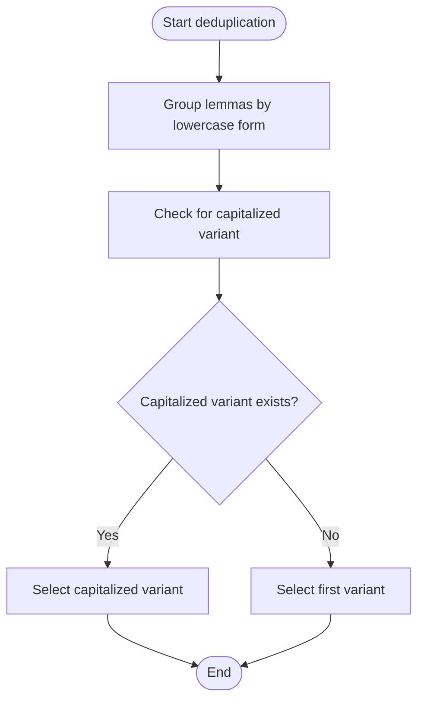
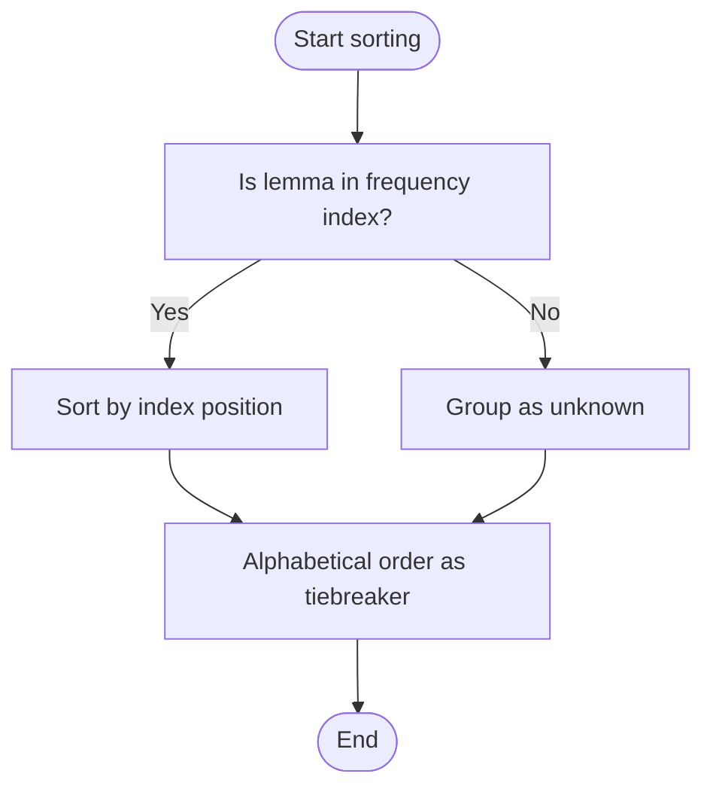

# Lemma Collection and Sorting

<cite>
**Referenced Files in This Document**   
- [kardenwort.py](file://src/kardenwort/core/kardenwort.py)
- [kardenwort_runner.py](file://src/kardenwort/core/kardenwort_runner.py)
- [config.ini](file://config.ini)
- [lemma_override_de.tsv](file://data/de/lemma_override_de.tsv)
- [lemma_override_en.tsv](file://data/en/lemma_override_en.tsv)
</cite>

## Table of Contents
1. [Introduction](#introduction)
2. [Deduplication Mechanisms](#deduplication-mechanisms)
3. [Case-Insensitive Grouping and Capitalization Preference](#case-insensitive-grouping-and-capitalization-preference)
4. [Sorting Algorithm](#sorting-algorithm)
5. [Frequency Index Loading and Usage](#frequency-index-loading-and-usage)
6. [Collection Process](#collection-process)
7. [Compound Word Handling](#compound-word-handling)
8. [Code Examples](#code-examples)
9. [Common Issues](#common-issues)
10. [Frequency Index Curation](#frequency-index-curation)

## Introduction
Kardenwort is a text processing tool designed to extract and sort lemmas from source texts for language learning purposes. The system implements sophisticated mechanisms for lemma collection, deduplication, and sorting based on configurable parameters. This document details the core functionality of lemma collection and sorting, focusing on the implementation of deduplication scopes, case-insensitive grouping, capitalization preferences, and the sorting algorithm that prioritizes known words from a frequency index.

## Deduplication Mechanisms
The deduplication process in Kardenwort is controlled by the `deduplication_scope` parameter, which can be set to one of three values: `global`, `sentence`, or `none`. Each scope determines how duplicate lemmas are handled during the extraction process.

When `deduplication_scope` is set to `global`, lemmas are made unique across the entire text. The system maintains a dictionary of lemmas that have already been processed, ensuring that each lemma appears only once in the final output. This is particularly useful for creating vocabulary lists where word repetition is not desired.

The `sentence` scope applies deduplication within individual sentences. This means that a lemma can appear multiple times across different sentences but will be unique within each sentence. This approach preserves the context of word usage while reducing redundancy within sentences.

With `deduplication_scope` set to `none`, no deduplication is performed. Every occurrence of a word is treated as a separate entry, which can be useful for frequency analysis or when tracking the exact usage of words in a text.

**Section sources**
- [kardenwort.py](file://src/kardenwort/core/kardenwort.py#L935-L948)
- [kardenwort.py](file://src/kardenwort/core/kardenwort.py#L1312-L1325)

## Case-Insensitive Grouping and Capitalization Preference
Kardenwort implements case-insensitive grouping of lemmas through the `deduplicate_lemmas` function. This function groups lemmas by their lowercase forms, ensuring that variations in capitalization do not result in duplicate entries. For example, "Haus", "haus", and "HAUS" would all be grouped together as the same lemma.

The capitalization preference logic prioritizes capitalized variants when multiple forms of a lemma are present. The system first checks for any variant that starts with an uppercase letter. If such a variant exists, it is selected as the representative form. This ensures that proper nouns and sentence-initial words maintain their appropriate capitalization in the output.

If no capitalized variant is found, the system selects the first available form from the group. This approach preserves the original form of the word while ensuring consistency in the output.

**Diagram sources**
- [kardenwort.py](file://src/kardenwort/core/kardenwort.py#L441-L459)

## Sorting Algorithm
The sorting algorithm in Kardenwort prioritizes known words from the frequency index over unknown words, followed by alphabetical ordering. This is achieved through a custom sorting key that evaluates each lemma in three stages.

First, the algorithm checks whether a lemma exists in the frequency index. Lemmas that are present in the index are considered "known" and are given priority over "unknown" lemmas. This ensures that more common words appear earlier in the sorted list.

Second, for known lemmas, the algorithm uses the position of the lemma in the frequency index as the primary sorting criterion. Lemmas that appear earlier in the index (indicating higher frequency) are sorted before those that appear later.

Finally, for lemmas that have the same status (both known or both unknown) and the same index position, the algorithm falls back to alphabetical ordering based on the lowercase form of the lemma. This ensures a consistent and predictable order for words that cannot be distinguished by frequency.

**Diagram sources**
- [kardenwort.py](file://src/kardenwort/core/kardenwort.py#L1331-L1334)

## Frequency Index Loading and Usage
The frequency index is loaded from a CSV file specified by the `lemma_index_file` parameter. The `load_lemma_frequency_index` function reads this file and creates a dictionary mapping each lemma to its line number in the file. This line number serves as a proxy for word frequency, with earlier lines representing more common words.

The frequency index is used to determine the familiarity of words during the sorting process. When a lemma is encountered, the system checks if it exists in the frequency index dictionary. If it does, the associated line number is used as the sorting key. If a lemma is not found in the index, it is treated as an unknown word and sorted after all known words.

The system handles missing or inaccessible frequency index files gracefully by returning an empty dictionary. This allows the processing to continue, albeit without frequency-based sorting. Users are notified of the error through stderr output, but the program does not terminate.

**Section sources**
- [kardenwort.py](file://src/kardenwort/core/kardenwort.py#L295-L309)
- [kardenwort.py](file://src/kardenwort/core/kardenwort.py#L1910-L1911)

## Collection Process
The lemma collection process in Kardenwort operates in two distinct modes: word extraction and sentence processing. In word extraction mode, the system processes individual words from the input text, extracting their lemmas and applying the configured deduplication and sorting rules.

In sentence processing mode, the system analyzes complete sentences, extracting lemmas from each word in the sentence. This mode preserves the context of word usage and allows for more sophisticated processing, such as handling compound words and applying context-specific overrides.

The collection process begins with tokenization using the spaCy library. Each token is analyzed to determine its part of speech, dependency relations, and lemma. The system then applies various transformations and overrides based on the configuration, including handling of separable verbs, compound words, and special cases like genitive forms in German.

**Section sources**
- [kardenwort.py](file://src/kardenwort/core/kardenwort.py#L476-L592)
- [kardenwort.py](file://src/kardenwort/core/kardenwort.py#L1193-L1303)

## Compound Word Handling
Kardenwort includes specialized handling for compound words, particularly in German where compounding is prevalent. The system can split compound words into their constituent parts using the German Compound Splitter (GCS) library when enabled.

When processing a compound word, the system first attempts to split it into its component parts. Each part is then lemmatized individually, and the resulting lemmas are added to the output. The original compound word can be preserved in the output alongside its parts if the `de_gcs_preserve_compound_word` option is enabled.

The system also handles hyphenated compounds by splitting them at the hyphen and processing each part separately. This ensures that multi-part words connected by hyphens are properly decomposed and their individual components are included in the lemma list.

**Section sources**
- [kardenwort.py](file://src/kardenwort/core/kardenwort.py#L516-L532)
- [kardenwort.py](file://src/kardenwort/core/kardenwort.py#L552-L582)

## Code Examples
The `deduplicate_lemmas` function demonstrates the core deduplication logic. It takes a list of candidate lemmas and returns a deduplicated list based on case-insensitive grouping and capitalization preference. The function first groups lemmas by their lowercase forms, then selects the most appropriate form from each group according to the capitalization rules.

The `extract_lemmas_from_sentence` function illustrates the complete lemma extraction process for a single sentence. It processes each token in the sentence, applies lemmatization, handles special cases like separable verbs and compound words, and applies any configured overrides. The function returns a sorted list of lemmas that have been deduplicated according to the specified scope.

**Section sources**
- [kardenwort.py](file://src/kardenwort/core/kardenwort.py#L441-L459)
- [kardenwort.py](file://src/kardenwort/core/kardenwort.py#L476-L592)

## Common Issues
Users may encounter several common issues when working with Kardenwort's lemma collection and sorting features. Unexpected lemma ordering can occur when the frequency index is missing, incorrectly formatted, or when lemmas are not found in the index. This results in alphabetical sorting instead of frequency-based sorting.

Duplicate entries may appear when the deduplication scope is set to `none` or `sentence`, which is expected behavior but may be surprising to users expecting global uniqueness. Performance bottlenecks can occur with large vocabulary sets, particularly when processing texts with many compound words or when the frequency index contains a large number of entries.

To address these issues, users should verify that the frequency index file is correctly specified and formatted, ensure that the deduplication scope matches their intended use case, and consider the performance implications of processing very large texts.

**Section sources**
- [kardenwort.py](file://src/kardenwort/core/kardenwort.py#L935-L948)
- [kardenwort.py](file://src/kardenwort/core/kardenwort.py#L1312-L1325)

## Frequency Index Curation
Curating an effective frequency index is crucial for optimal sorting results. The index should be ordered by word frequency, with the most common words appearing at the beginning of the file. This ensures that the sorting algorithm correctly prioritizes high-frequency words.

Users should ensure that the frequency index contains lemmas in their base forms and covers the vocabulary of the target language comprehensively. For German, this includes handling of noun capitalization and compound word decomposition. The index should be regularly updated to reflect changes in language usage and to include new vocabulary.

When creating a custom frequency index, users should consider the source of their frequency data, ensuring it is representative of the language as it is actually used. Corpora from news articles, books, or spoken language can provide reliable frequency data for building an effective index.

**Section sources**
- [kardenwort.py](file://src/kardenwort/core/kardenwort.py#L295-L309)
- [config.ini](file://config.ini#L55-L60)