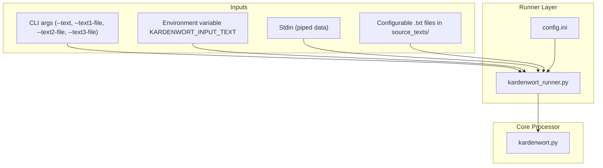
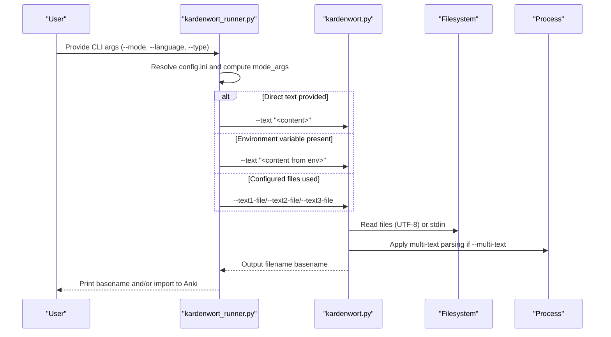
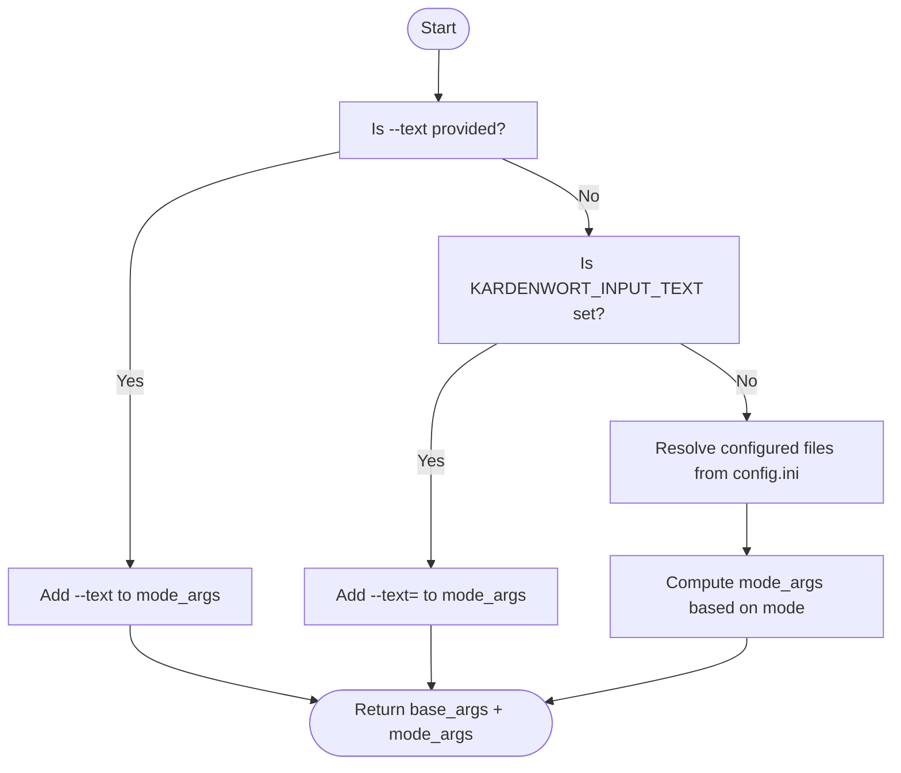
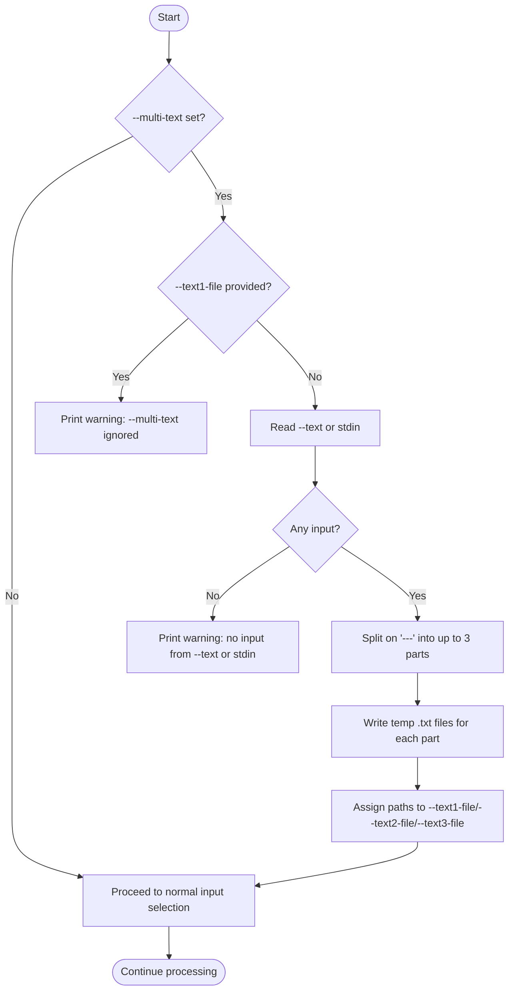
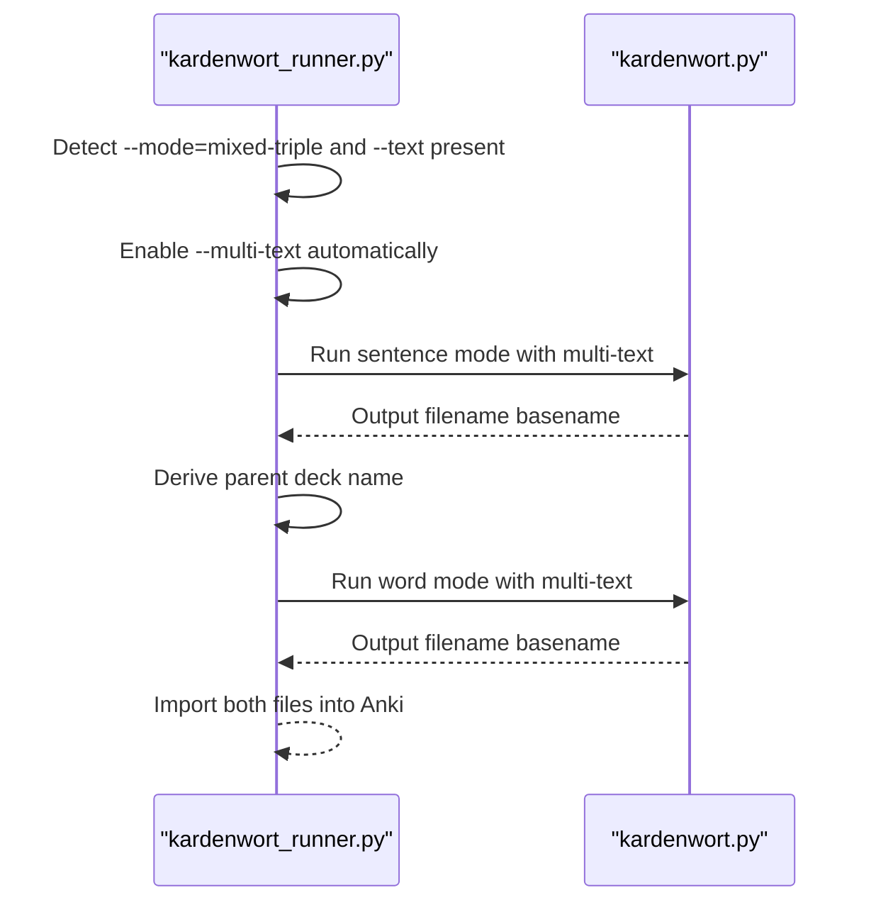
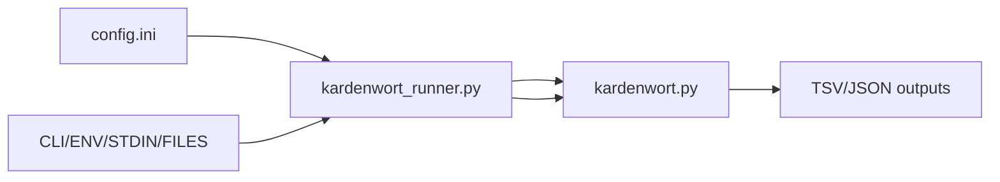

# Text Ingestion

<cite>
**Referenced Files in This Document**
- [kardenwort_runner.py](file://src/kardenwort/core/kardenwort_runner.py)
- [kardenwort.py](file://src/kardenwort/core/kardenwort.py)
- [config.ini](file://config.ini)
- [README.md](file://README.md)
- [kardenwort-goldendict-config.txt](file://docs/kardenwort-goldendict-config.txt)
- [kardenwort_run_de_w_t_s_anki.cmd](file://scripts/run/cmd/kardenwort_run_de_w_t_s_anki.cmd)
- [text.txt](file://tests/source_texts/de/text.txt)
- [text1.txt](file://tests/source_texts/en/text1.txt)
</cite>

## Table of Contents
1. [Introduction](#introduction)
2. [Project Structure](#project-structure)
3. [Core Components](#core-components)
4. [Architecture Overview](#architecture-overview)
5. [Detailed Component Analysis](#detailed-component-analysis)
6. [Dependency Analysis](#dependency-analysis)
7. [Performance Considerations](#performance-considerations)
8. [Troubleshooting Guide](#troubleshooting-guide)
9. [Conclusion](#conclusion)

## Introduction
This document explains how Kardenwort ingests text across multiple input sources and routes them to the processing pipeline. It covers:
- Direct text input via command-line arguments
- Environment variables (KARDENWORT_INPUT_TEXT)
- File input from configurable paths
- Standard input (stdin)
- Multi-text input using the “---” separator and its use in mixed-triple mode
- Role of config.ini in defining default input file locations and resolution
- Concrete examples from the codebase showing argument parsing and input routing logic
- Common issues: UTF-8 encoding, empty inputs, and line-ending compatibility
- Best practices and troubleshooting guidance

## Project Structure
Kardenwort’s text ingestion spans two layers:
- Runner layer: orchestrates configuration, selects input sources, and invokes the core processor
- Core processor: reads and validates inputs, applies multi-text parsing, and executes processing

**Diagram sources**
- [kardenwort_runner.py](file://src/kardenwort/core/kardenwort_runner.py#L147-L176)
- [config.ini](file://config.ini#L33-L46)
- [kardenwort.py](file://src/kardenwort/core/kardenwort.py#L1914-L2019)

**Section sources**
- [kardenwort_runner.py](file://src/kardenwort/core/kardenwort_runner.py#L147-L176)
- [config.ini](file://config.ini#L33-L46)

## Core Components
- Runner input selection: Determines whether to pass a direct text string, environment variable, or configured files to the core processor.
- Core input parsing: Reads from file, argument, environment variable, or stdin; supports multi-text parsing with “---” separator.
- Mixed-triple mode: Automatically enables multi-text when processing a single text argument in mixed-triple mode.

**Section sources**
- [kardenwort_runner.py](file://src/kardenwort/core/kardenwort_runner.py#L152-L176)
- [kardenwort.py](file://src/kardenwort/core/kardenwort.py#L1830-L1860)
- [kardenwort.py](file://src/kardenwort/core/kardenwort.py#L1954-L1997)

## Architecture Overview
The ingestion flow is driven by the runner and core scripts. The runner resolves configuration and constructs the core command, while the core script performs the actual reading and parsing.

**Diagram sources**
- [kardenwort_runner.py](file://src/kardenwort/core/kardenwort_runner.py#L147-L176)
- [kardenwort.py](file://src/kardenwort/core/kardenwort.py#L1914-L2019)
- [kardenwort.py](file://src/kardenwort/core/kardenwort.py#L1830-L1860)

## Detailed Component Analysis

### Runner Input Selection Logic
The runner decides the input source based on provided arguments and configuration:
- If a direct text argument is provided, it is passed to the core.
- Otherwise, if the environment variable KARDENWORT_INPUT_TEXT is set, its value is used.
- If neither is present, the runner uses configured input files resolved from the workspace.

**Diagram sources**
- [kardenwort_runner.py](file://src/kardenwort/core/kardenwort_runner.py#L152-L176)
- [config.ini](file://config.ini#L33-L46)

**Section sources**
- [kardenwort_runner.py](file://src/kardenwort/core/kardenwort_runner.py#L152-L176)
- [config.ini](file://config.ini#L33-L46)

### Core Input Parsing and Multi-Text Handling
The core script reads inputs from file, argument, environment variable, or stdin. It also supports multi-text parsing when the “---” separator is used:
- If --multi-text is set and no --text1-file is provided, the script reads either --text or stdin, splits on “---”, writes temporary files, and assigns them to --text1-file, --text2-file, and --text3-file.
- If no input is available from --text or stdin, a warning is printed.

**Diagram sources**
- [kardenwort.py](file://src/kardenwort/core/kardenwort.py#L1830-L1860)
- [kardenwort.py](file://src/kardenwort/core/kardenwort.py#L1842-L1859)

**Section sources**
- [kardenwort.py](file://src/kardenwort/core/kardenwort.py#L1830-L1860)
- [kardenwort.py](file://src/kardenwort/core/kardenwort.py#L1842-L1859)

### Mixed-Double Mode Behavior
Mixed-triple mode runs sentence and word modes sequentially for a shared deck. When a single text argument is provided in mixed-triple mode, the runner automatically enables multi-text to support multi-paragraph/multi-language inputs.

**Diagram sources**
- [kardenwort_runner.py](file://src/kardenwort/core/kardenwort_runner.py#L297-L300)
- [kardenwort_runner.py](file://src/kardenwort/core/kardenwort_runner.py#L303-L339)

**Section sources**
- [kardenwort_runner.py](file://src/kardenwort/core/kardenwort_runner.py#L297-L300)
- [kardenwort_runner.py](file://src/kardenwort/core/kardenwort_runner.py#L303-L339)

### Configuring Default Input Files
The runner resolves default input file names from config.ini and places them under the configured source_texts directory. These defaults are used when no explicit file arguments are provided.

- [input_files] section defines text1_file, text2_file, text3_file
- The runner resolves these relative to the configured source_texts_dir

**Section sources**
- [config.ini](file://config.ini#L41-L46)
- [kardenwort_runner.py](file://src/kardenwort/core/kardenwort_runner.py#L147-L176)

### Examples from the Codebase
- Direct text input via CLI: The runner adds --text to mode_args when provided.
- Environment variable usage: The runner checks KARDENWORT_INPUT_TEXT and uses it if present.
- File-based input: The runner computes --text1-file/--text2-file/--text3-file based on mode and config.
- Multi-text separator: The core script splits on “---” and writes temp files when --multi-text is used.
- Mixed-triple mode: The runner enables --multi-text automatically when --text is provided in mixed-triple mode.

**Section sources**
- [kardenwort_runner.py](file://src/kardenwort/core/kardenwort_runner.py#L152-L176)
- [kardenwort.py](file://src/kardenwort/core/kardenwort.py#L1830-L1860)
- [kardenwort.py](file://src/kardenwort/core/kardenwort.py#L1954-L1997)

## Dependency Analysis
- Runner depends on config.ini for resolving workspace paths and default filenames.
- Runner constructs the core command with appropriate mode_args based on mode and input sources.
- Core depends on the presence of UTF-8 encoded files and stdin data; it validates inputs and warns on missing data.

**Diagram sources**
- [config.ini](file://config.ini#L33-L46)
- [kardenwort_runner.py](file://src/kardenwort/core/kardenwort_runner.py#L147-L176)
- [kardenwort.py](file://src/kardenwort/core/kardenwort.py#L1914-L2019)

**Section sources**
- [config.ini](file://config.ini#L33-L46)
- [kardenwort_runner.py](file://src/kardenwort/core/kardenwort_runner.py#L147-L176)
- [kardenwort.py](file://src/kardenwort/core/kardenwort.py#L1914-L2019)

## Performance Considerations
- Multi-text parsing writes temporary files; ensure adequate disk space and fast local storage.
- Mixed-triple mode runs the pipeline twice; batching multiple invocations can reduce overhead.
- Avoid extremely large stdin streams; prefer file-based inputs for stability.

## Troubleshooting Guide
Common issues and resolutions:
- UTF-8 encoding requirement
  - All input files must be UTF-8 encoded. The core script opens files with UTF-8 and the runner passes UTF-8 to the subprocess.
  - Verify file encoding and convert if necessary.
  - References: [kardenwort.py](file://src/kardenwort/core/kardenwort.py#L1914-L1923), [kardenwort.py](file://src/kardenwort/core/kardenwort.py#L1954-L1966), [README.md](file://README.md#L279-L285)

- Empty inputs
  - If no input is provided (no --text, no environment variable, no stdin, and no configured files), the core script reports an error and exits.
  - Ensure at least one input source is available.
  - References: [kardenwort.py](file://src/kardenwort/core/kardenwort.py#L1964-L1966)

- Line-ending compatibility
  - The core script reads entire files; line endings are normalized by the underlying filesystem and Python file APIs.
  - For mixed-triple mode with stdin, use multi-line input; single-line stdin is limited by the provided scripts.
  - References: [README.md](file://README.md#L237-L244), [kardenwort.py](file://src/kardenwort/core/kardenwort.py#L1954-L1966)

- Multi-text separator usage
  - Ensure “---” separates up to three texts (source, translation 1, translation 2). Extra content beyond the third part is ignored.
  - References: [kardenwort.py](file://src/kardenwort/core/kardenwort.py#L1842-L1859), [README.md](file://README.md#L294-L301)

- Environment variable integration
  - On Windows, the provided cmd scripts set KARDENWORT_INPUT_TEXT from the first argument and call the runner.
  - References: [kardenwort_run_de_w_t_s_anki.cmd](file://scripts/run/cmd/kardenwort_run_de_w_t_s_anki.cmd#L36-L38), [kardenwort_runner.py](file://src/kardenwort/core/kardenwort_runner.py#L155-L156)

- Mixed-triple mode with single text
  - The runner automatically enables multi-text when --text is provided in mixed-triple mode.
  - References: [kardenwort_runner.py](file://src/kardenwort/core/kardenwort_runner.py#L297-L300)

- Best practices for preparing input texts
  - Place default files in source_texts/ and update config.ini if needed.
  - Use UTF-8 encoding and consistent line endings.
  - For multi-language parallel texts, ensure line-by-line correspondence.
  - References: [config.ini](file://config.ini#L33-L46), [README.md](file://README.md#L279-L285)

**Section sources**
- [kardenwort.py](file://src/kardenwort/core/kardenwort.py#L1914-L1966)
- [README.md](file://README.md#L279-L285)
- [README.md](file://README.md#L237-L244)
- [kardenwort_run_de_w_t_s_anki.cmd](file://scripts/run/cmd/kardenwort_run_de_w_t_s_anki.cmd#L36-L38)
- [kardenwort_runner.py](file://src/kardenwort/core/kardenwort_runner.py#L297-L300)

## Conclusion
Kardenwort’s text ingestion is flexible and robust:
- Direct text, environment variables, configured files, and stdin are all supported.
- Multi-text parsing with “---” enables mixed-language and multi-paragraph workflows.
- Mixed-triple mode streamlines sentence and word processing with shared deck structures.
- Proper configuration and UTF-8 encoding are essential for reliable operation.