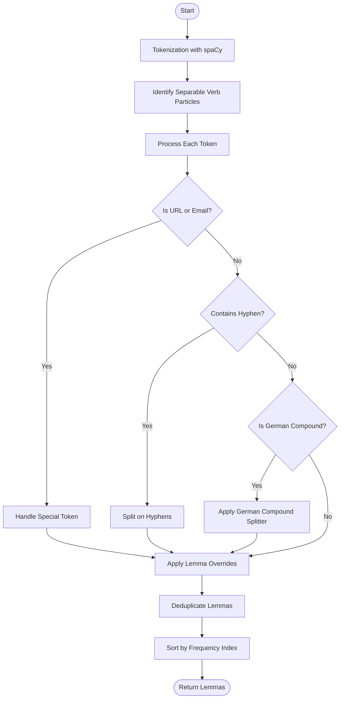
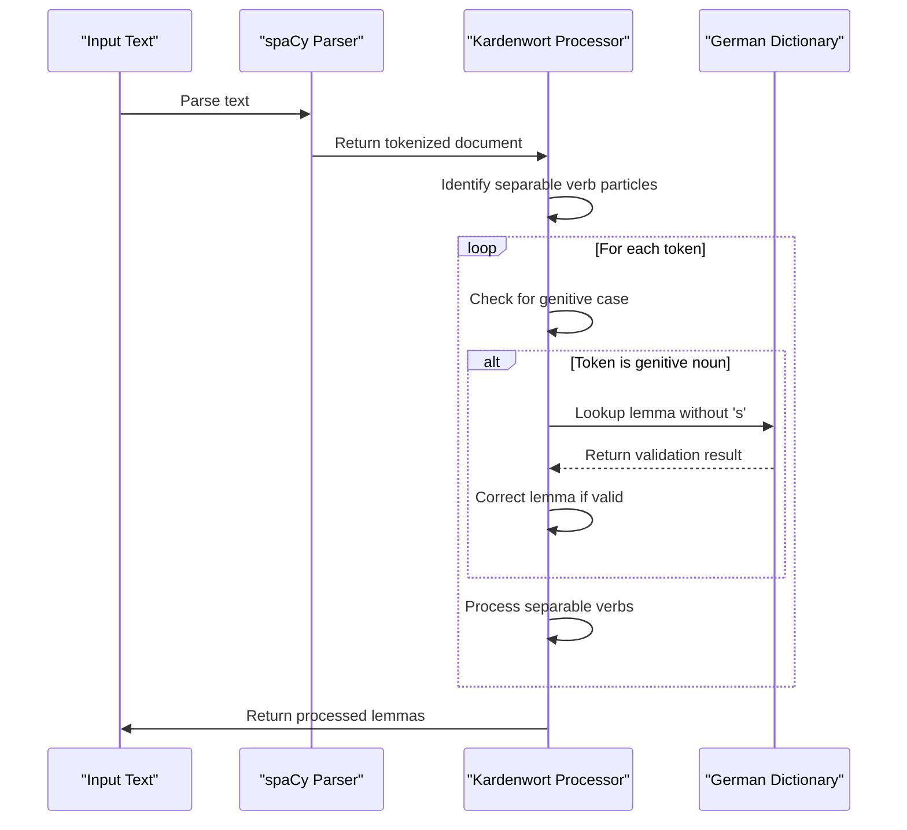

# Tokenization and Lemmatization

<cite>
**Referenced Files in This Document**   
- [kardenwort.py](file://src/kardenwort/core/kardenwort.py)
- [lemma_override_de.tsv](file://data/de/lemma_override_de.tsv)
- [config.ini](file://config.ini)
</cite>

## Table of Contents
1. [Introduction](#introduction)
2. [Core Processing Pipeline](#core-processing-pipeline)
3. [spaCy Integration and Special Token Handling](#spacy-integration-and-special-token-handling)
4. [Advanced German Language Processing](#advanced-german-language-processing)
5. [Lemma Override System](#lemma-override-system)
6. [German Compound Splitter Integration](#german-compound-splitter-integration)
7. [Capitalization Logic](#capitalization-logic)
8. [Common Issues and Troubleshooting](#common-issues-and-troubleshooting)
9. [Performance Optimization](#performance-optimization)

## Introduction
The tokenization and lemmatization phase of Kardenwort represents a sophisticated multi-stage natural language processing pipeline designed to accurately extract and normalize vocabulary from German and English texts. This system combines the power of spaCy for foundational NLP tasks with custom logic for handling the unique challenges of the German language, particularly compound word decomposition and context-sensitive lemmatization. The process transforms raw text into a structured vocabulary list suitable for language learning applications, with a focus on accuracy and user control.

**Section sources**
- [kardenwort.py](file://src/kardenwort/core/kardenwort.py#L476-L592)

## Core Processing Pipeline
The core of Kardenwort's tokenization and lemmatization functionality is implemented in the `extract_lemmas_from_sentence` function, which orchestrates a series of processing steps to transform raw text into normalized lemmas. The pipeline begins with spaCy's tokenization and initial lemmatization, followed by specialized processing for German language features. The function accepts a sentence text and returns a sorted list of unique lemmas, applying various user-configurable enhancements and corrections.

The processing flow follows a systematic approach: first, the text is parsed into a spaCy document; then, separable verb particles are identified and mapped; finally, each token is processed through a series of conditional checks and transformations. The pipeline is designed to handle both simple tokens and complex linguistic constructs, with special attention to German compound words and genitive forms. The result is a comprehensive set of lemmas that accurately represent the vocabulary of the input text.

**Diagram sources **
- [kardenwort.py](file://src/kardenwort/core/kardenwort.py#L476-L592)

**Section sources**
- [kardenwort.py](file://src/kardenwort/core/kardenwort.py#L476-L592)

## spaCy Integration and Special Token Handling
Kardenwort leverages spaCy as its primary NLP engine for tokenization and initial lemmatization. The system loads language-specific models (de_core_news_lg for German and en_core_web_lg for English) to provide accurate linguistic analysis. During tokenization, spaCy identifies word boundaries, assigns part-of-speech tags, and provides initial lemma forms. The integration is designed to handle various text elements, including special tokens like URLs and email addresses.

For special tokens such as URLs and email addresses, Kardenwort applies specific processing rules to ensure appropriate handling. When such tokens are detected (using spaCy's `like_url` and `like_email` properties), they are processed differently from regular words. The system converts these special tokens to lowercase to maintain consistency and avoid creating unnecessary lemma variations. This approach prevents the creation of multiple lemma entries for the same URL or email address that might differ only in capitalization.

**Section sources**
- [kardenwort.py](file://src/kardenwort/core/kardenwort.py#L417-L439)
- [kardenwort.py](file://src/kardenwort/core/kardenwort.py#L514-L515)

## Advanced German Language Processing
Kardenwort implements several advanced processing steps specifically designed to handle the complexities of the German language. These include correction of German genitive forms, handling of separable verb particles through dependency parsing, and specialized processing for compound words. These features address common challenges in German NLP that standard lemmatization tools often fail to handle correctly.

The correction of German genitive forms is implemented in the `correct_spacy_lemma` function, which checks for nouns and proper nouns in the genitive case and attempts to remove the genitive 's' suffix when appropriate. This correction uses a dictionary lookup to validate that the resulting lemma exists in the German dictionary, ensuring accuracy. For separable verbs, the system uses dependency parsing to identify verb-particle constructions and combines them into their base form, such as transforming "anfangen" from "fangen" + "an".

**Diagram sources **
- [kardenwort.py](file://src/kardenwort/core/kardenwort.py#L274-L286)
- [kardenwort.py](file://src/kardenwort/core/kardenwort.py#L288-L293)

**Section sources**
- [kardenwort.py](file://src/kardenwort/core/kardenwort.py#L274-L293)

## Lemma Override System
Kardenwort features a sophisticated lemma override system that allows users to customize lemmatization results through a three-tier priority system with context and regex conditions. This system is implemented through the `load_lemma_override_rules` and `get_overridden_lemma_for_word` functions, which process a TSV file containing user-defined rules. The override system provides granular control over lemmatization, enabling users to correct inaccuracies and tailor the output to specific texts or domains.

The three priority levels are processed in order, with higher priority rules taking precedence:
1. **Priority 1**: Rules that match both the spaCy lemma and the original word form
2. **Priority 2**: Rules that match only the original word form 
3. **Priority 3**: Rules that match only the spaCy lemma

Each rule can include an optional context condition, which can be either a literal string or a regex pattern prefixed with "regex:". The system evaluates context conditions to determine if a rule should be applied, allowing for context-sensitive overrides. For example, a rule might specify that "Ihr" should be lemmatized as "ihr" only when it doesn't appear at the beginning of a sentence, using the regex condition `regex:(?<!^)Ihr`.

**Section sources**
- [kardenwort.py](file://src/kardenwort/core/kardenwort.py#L74-L242)
- [lemma_override_de.tsv](file://data/de/lemma_override_de.tsv)

## German Compound Splitter Integration
Kardenwort integrates the german-compound-splitter library to decompose German compound words into their constituent parts, a critical feature for effective vocabulary learning in German. This integration is controlled by the `--de-gcs` command-line argument and related configuration options. The system uses the compound splitter to break down complex words like "Donaudampfschifffahrtsgesellschaftskapitän" into meaningful components, making vocabulary acquisition more manageable.

The integration offers several configuration options to control the splitting behavior:
- **POS tagging**: Users can specify which parts of speech should be split using the `--de-gcs-pos-tags` parameter
- **Singularization**: The system can apply singularization to compound parts based on configuration
- **Masking**: Unknown parts of compounds can be masked to avoid creating invalid lemmas
- **Preservation**: The original compound word can be preserved alongside its split components

The compound splitting process is applied only to words that meet specific criteria, such as minimum length and part-of-speech type. The system uses an automaton-based approach for efficient splitting and includes error handling to ensure robustness. Split components are individually lemmatized and processed through the override system, ensuring consistent treatment of all vocabulary elements.

**Section sources**
- [kardenwort.py](file://src/kardenwort/core/kardenwort.py#L516-L584)
- [config.ini](file://config.ini#L389-L394)

## Capitalization Logic
Kardenwort implements specific capitalization rules for German nouns and proper nouns to ensure correct lemma representation. The capitalization logic is handled by the `format_lemma_capitalization` function, which applies different rules based on token type and user configuration. This system addresses the fundamental difference between German and English capitalization rules, where all nouns are capitalized in German.

The capitalization rules are applied as follows:
- URLs and email addresses are converted to lowercase
- Tokens with all uppercase letters or internal capitalization are preserved as-is
- German nouns and proper nouns are capitalized when the `--de_force_noun_capitalization` option is enabled
- Proper nouns are capitalized when the `--force_proper_noun_capitalization` option is enabled
- Sentence-initial tokens that are not nouns or proper nouns retain their original case

This logic ensures that lemmas are presented in their correct German orthographic form while preserving special cases like acronyms and technical terms. The system balances automated capitalization with user control, allowing customization through command-line arguments.

**Section sources**
- [kardenwort.py](file://src/kardenwort/core/kardenwort.py#L417-L439)

## Common Issues and Troubleshooting
Several common issues can arise during the tokenization and lemmatization process, primarily related to inaccurate lemmatization, compound splitting errors, and override rule conflicts. Inaccurate lemmatization often occurs with irregular verbs, proper nouns, or words not present in the reference dictionary. Compound splitting errors can result from ambiguous word boundaries or unrecognized compound structures. Override rule conflicts may occur when multiple rules match the same token, potentially leading to unexpected results.

To address these issues, users should:
1. Verify that the correct language model and dictionary files are being used
2. Check the lemma override file for conflicting rules and ensure proper formatting
3. Adjust compound splitting parameters for better results with specific text types
4. Use context conditions in override rules to prevent over-application
5. Validate results with sample texts before processing large documents

The system includes diagnostic output to help identify processing issues, and users can enable detailed output to examine the intermediate steps of the pipeline. Regular maintenance of the lemma override file based on observed errors is recommended to continuously improve processing accuracy.

**Section sources**
- [kardenwort.py](file://src/kardenwort/core/kardenwort.py#L146-L168)
- [kardenwort.py](file://src/kardenwort/core/kardenwort.py#L207-L242)

## Performance Optimization
For processing large texts efficiently, several performance optimization strategies can be applied. The most effective approach is to optimize the NLP pipeline configuration by disabling unnecessary features for specific use cases. For example, compound splitting can be disabled when processing texts with few compound words, significantly reducing processing time. Similarly, the lemma override system can be bypassed for texts that don't require custom rules.

Additional optimization tips include:
- Using appropriate sentence context sizes to minimize redundant processing
- Processing texts in batches rather than individual sentences when possible
- Ensuring the spaCy model is loaded only once for multiple processing tasks
- Using efficient data structures for lemma storage and deduplication
- Configuring the compound splitter with appropriate parameters to balance accuracy and speed

The system's modular design allows users to enable only the features needed for their specific use case, providing a balance between processing accuracy and performance. For very large texts, consider processing in smaller chunks to manage memory usage effectively.

**Section sources**
- [kardenwort.py](file://src/kardenwort/core/kardenwort.py#L441-L459)
- [config.ini](file://config.ini)