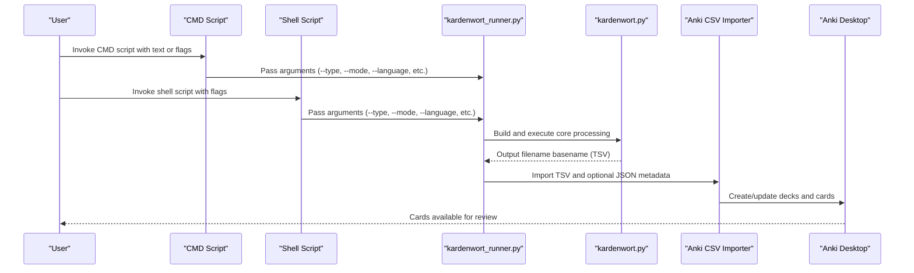
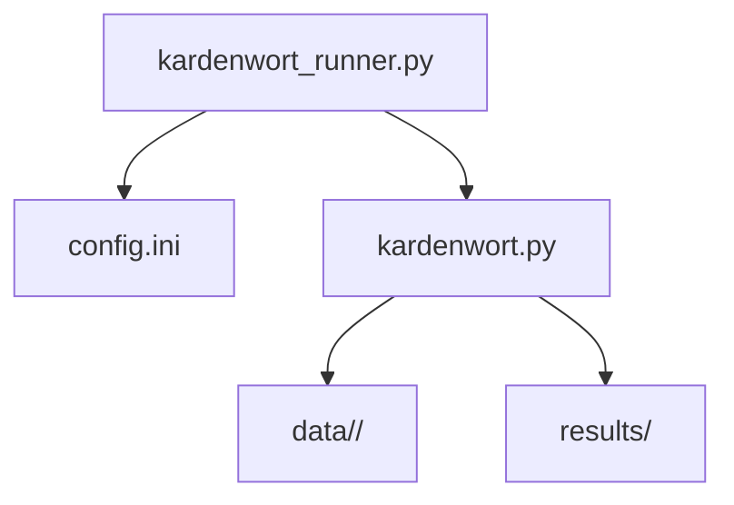

# Common User Workflows

<cite>
**Referenced Files in This Document**
- [README.md](file://README.md)
- [config.ini](file://config.ini)
- [src/kardenwort/core/kardenwort.py](file://src/kardenwort/core/kardenwort.py)
- [src/kardenwort/core/kardenwort_runner.py](file://src/kardenwort/core/kardenwort_runner.py)
- [docs/kardenwort-goldendict-config.txt](file://docs/kardenwort-goldendict-config.txt)
- [scripts/run/cmd/kardenwort_run_de_w_t_l_anki.cmd](file://scripts/run/cmd/kardenwort_run_de_w_t_l_anki.cmd)
- [scripts/run/cmd/kardenwort_run_de_ws_t3_s_anki.cmd](file://scripts/run/cmd/kardenwort_run_de_ws_t3_s_anki.cmd)
- [a/sh/kardenwort-run-de-single.sh](file://a/sh/kardenwort-run-de-single.sh)
- [a/mix-sentences.py](file://a/mix-sentences.py)
- [data/de/lemma_override_de.tsv.template](file://data/de/lemma_override_de.tsv.template)
- [tests/source_texts/de/text.txt](file://tests/source_texts/de/text.txt)
- [tests/cases/text3-morgen-faehrt-der-neue/20250913172001-morgen-faehrt-der-neue.triple.sentence.de.tsv](file://tests/cases/text3-morgen-faehrt-der-neue/20250913172001-morgen-faehrt-der-neue.triple.sentence.de.tsv)
</cite>

## Table of Contents
1. [Introduction](#introduction)
2. [Project Structure](#project-structure)
3. [Core Components](#core-components)
4. [Architecture Overview](#architecture-overview)
5. [Detailed Component Analysis](#detailed-component-analysis)
6. [Dependency Analysis](#dependency-analysis)
7. [Performance Considerations](#performance-considerations)
8. [Troubleshooting Guide](#troubleshooting-guide)
9. [Conclusion](#conclusion)
10. [Appendices](#appendices)

## Introduction
This section describes common user workflows for Kardenwort, focusing on practical, step-by-step processes for typical use cases. It covers:
- Processing a single text file into Anki flashcards using either CMD scripts or direct Python invocation
- Creating vocabulary lists from AI-generated content by copying text into a file or using stdin
- Building comprehensive vocabulary decks from books or articles, including text preparation and leveraging Markdown headers for hierarchical deck creation
- Using GoldenDict integration to create flashcards during reading
- Processing multi-text inputs with translations using the --multi-text flag and the --- delimiter
- Training the system with custom lemma overrides by editing the TSV files in the data/ directory
- Organizing source texts and managing generated TSV files in the results/ directory
- Best practices such as using mixed-triple mode for comprehensive coverage and suspending cards with --suspend-cards for review before studying
- References to shell scripts in the a/sh/ directory and CMD scripts as entry points for different operating systems

## Project Structure
Kardenwort’s repository is organized around a core processing module, runner scripts, configuration, language resources, and example test data. The key directories and files relevant to workflows are:
- src/kardenwort/core: core processing logic and runner
- scripts/run/cmd: Windows CMD entry points for common workflows
- a/sh: Unix-like shell scripts for quick invocation
- data/: language-specific resources and lemma override templates
- tests/source_texts/: example source texts for testing
- results/: generated TSV and JSON outputs
- docs/: GoldenDict configuration and ecosystem documentation

```mermaid
graph TB
subgraph "Entry Points"
CMD["Windows CMD Scripts<br/>scripts/run/cmd/*"]
SH["Shell Scripts<br/>a/sh/*"]
end
subgraph "Core"
Runner["kardenwort_runner.py"]
Core["kardenwort.py"]
end
subgraph "Resources"
Config["config.ini"]
Data["data/<lang>/"]
Results["results/"]
Tests["tests/source_texts/<lang>/"]
end
subgraph "Integration"
GD["GoldenDict-ng Config<br/>docs/kardenwort-goldendict-config.txt"]
end
CMD --> Runner
SH --> Runner
Runner --> Core
Runner --> Config
Core --> Data
Core --> Results
Tests --> Core
GD --> Runner
```

**Diagram sources**
- [src/kardenwort/core/kardenwort_runner.py](file://src/kardenwort/core/kardenwort_runner.py#L1-L364)
- [src/kardenwort/core/kardenwort.py](file://src/kardenwort/core/kardenwort.py#L1-L800)
- [config.ini](file://config.ini#L1-L65)
- [docs/kardenwort-goldendict-config.txt](file://docs/kardenwort-goldendict-config.txt#L1-L229)

**Section sources**
- [README.md](file://README.md#L92-L131)
- [config.ini](file://config.ini#L33-L65)

## Core Components
- kardenwort_runner.py: Orchestrates processing and import. It reads configuration, builds arguments, invokes the core processor, and triggers the Anki importer. It supports mixed-triple mode to run sentence and word passes sequentially with shared deck control.
- kardenwort.py: Implements the core NLP pipeline, including sentence splitting, tokenization, lemmatization, German compound splitting (GCS), lemma overrides, deduplication, and TSV/JSON generation.
- config.ini: Centralizes environment paths and defaults for Python interpreter, workspace, importer workspace, script names, and resource locations.
- GoldenDict integration: The docs file provides ready-to-use command-line examples for invoking Kardenwort from GoldenDict, including mixed-triple mode and multi-text processing.

**Section sources**
- [src/kardenwort/core/kardenwort_runner.py](file://src/kardenwort/core/kardenwort_runner.py#L1-L364)
- [src/kardenwort/core/kardenwort.py](file://src/kardenwort/core/kardenwort.py#L1-L800)
- [config.ini](file://config.ini#L1-L65)
- [README.md](file://README.md#L208-L261)

## Architecture Overview
The end-to-end workflow integrates user input, configuration-driven argument construction, core processing, and Anki import.



**Diagram sources**
- [scripts/run/cmd/kardenwort_run_de_w_t_l_anki.cmd](file://scripts/run/cmd/kardenwort_run_de_w_t_l_anki.cmd#L1-L48)
- [a/sh/kardenwort-run-de-single.sh](file://a/sh/kardenwort-run-de-single.sh#L1-L31)
- [src/kardenwort/core/kardenwort_runner.py](file://src/kardenwort/core/kardenwort_runner.py#L178-L261)
- [src/kardenwort/core/kardenwort.py](file://src/kardenwort/core/kardenwort.py#L672-L800)

## Detailed Component Analysis

### Workflow 1: Process a Single Text File into Anki Flashcards (Windows CMD)
- Use a pre-configured CMD script to run the runner with a single German text file.
- The script sets the project root, loads configuration, and executes the runner with appropriate flags for German processing and GCS.
- The runner writes a TSV file to results/ and imports it into Anki.

Steps:
1. Prepare a UTF-8 encoded text file in source_texts/ (e.g., text1.txt).
2. Open a terminal in the project root and run the CMD script:
   - Example invocation path: scripts/run/cmd/kardenwort_run_de_w_t_l_anki.cmd
3. The script constructs arguments (type word, language de, de-gcs, mode single) and passes them to the runner.
4. The runner executes the core processor and imports the resulting TSV into Anki.

Best practices:
- Ensure Anki is running with the required AnkiConnect fork for deck descriptions.
- Keep the virtual environment active and configured in config.ini.

**Section sources**
- [scripts/run/cmd/kardenwort_run_de_w_t_l_anki.cmd](file://scripts/run/cmd/kardenwort_run_de_w_t_l_anki.cmd#L1-L48)
- [src/kardenwort/core/kardenwort_runner.py](file://src/kardenwort/core/kardenwort_runner.py#L178-L261)
- [README.md](file://README.md#L134-L207)

### Workflow 2: Process a Single Text File into Anki Flashcards (Unix Shell)
- Use the shell script to quickly run the runner with a single German text file.
- The script resolves the Python path from config.ini and executes the runner with German word extraction and GCS enabled.

Steps:
1. Ensure the shell script has execute permissions and Python 3 is available.
2. Run the shell script:
   - Example path: a/sh/kardenwort-run-de-single.sh
3. The script locates the Python interpreter via the runner’s --get-python-path option, then invokes the runner with German word extraction and GCS.

Best practices:
- Verify the Python interpreter path in config.ini is correct.
- Keep the virtual environment activated.

**Section sources**
- [a/sh/kardenwort-run-de-single.sh](file://a/sh/kardenwort-run-de-single.sh#L1-L31)
- [src/kardenwort/core/kardenwort_runner.py](file://src/kardenwort/core/kardenwort_runner.py#L262-L364)

### Workflow 3: Create Vocabulary Lists from AI-Generated Content (File or Stdin)
- For file-based input, place the AI-generated text in source_texts/ and run the runner with mode single.
- For stdin-based input, pass text directly to the runner or configure GoldenDict to pipe text via the --text argument.

Steps:
1. Place AI-generated text in source_texts/<lang>/text1.txt.
2. Run the runner with:
   - --type word
   - --mode single
   - --language de or en
3. Alternatively, configure GoldenDict to call the runner with --text "%GDWORD%" and --stdout-format html for immediate display.

Best practices:
- Ensure UTF-8 encoding for input files.
- Use --sentence-context-size to adjust context window.
- For immediate display, use --stdout-format html with the core script.

**Section sources**
- [README.md](file://README.md#L208-L261)
- [docs/kardenwort-goldendict-config.txt](file://docs/kardenwort-goldendict-config.txt#L1-L229)

### Workflow 4: Build Comprehensive Vocabulary Decks from Books or Articles
- Prepare UTF-8 encoded text files with Markdown headers to drive hierarchical deck creation.
- Use mixed-triple mode to generate both sentence and word cards in a shared deck structure.
- Enable deck descriptions and sentence subdecks for richer organization.

Steps:
1. Prepare UTF-8 text files in source_texts/<lang>/ with Markdown headers (#, ##).
2. Run the runner with:
   - --mode mixed-triple
   - --language de or en
   - --anki-create-subdecks
   - --anki-markdown-decks
   - --anki-sentence-subdecks
   - --anki-deck-content parent-source parent-translations subdeck-source subdeck-translations
   - --suspend-cards
3. The runner performs a sentence pass, derives a parent deck name, then runs a word pass sharing the same parent deck.

Best practices:
- Use --strip-headers to remove Markdown markers from output text fields.
- Use --deduplication-scope global for comprehensive coverage.
- Use --prefer-shortest-form to prefer shorter forms when deduplicating.

**Section sources**
- [README.md](file://README.md#L262-L311)
- [src/kardenwort/core/kardenwort_runner.py](file://src/kardenwort/core/kardenwort_runner.py#L301-L341)

### Workflow 5: GoldenDict Integration During Reading
- Configure GoldenDict programs to call Kardenwort directly for on-the-fly vocabulary extraction.
- Use mixed-triple mode with deck descriptions and suspend cards for review before studying.

Steps:
1. In GoldenDict, add Program dictionaries pointing to:
   - The runner script for mixed-triple mode with deck creation and suspension
   - Or the core script for HTML output to display results inline
2. For multi-line processing, use the core script with --multi-text and the --- delimiter to pass source and translations.

Best practices:
- For multi-line input, bypass CMD scripts and call the core script directly with --multi-text.
- Use --show-success-message and --play-sound-on-completion for feedback.

**Section sources**
- [README.md](file://README.md#L232-L261)
- [docs/kardenwort-goldendict-config.txt](file://docs/kardenwort-goldendict-config.txt#L1-L229)

### Workflow 6: Process Multi-Text Inputs with Translations (--- Delimiter)
- Use the --multi-text flag to parse up to three parallel texts from a single source (e.g., stdin or --text).
- Separate texts with the --- delimiter.

Steps:
1. Prepare source text and translations (e.g., German and Russian).
2. Pipe or pass the combined text with --- separators to the runner or core script with --multi-text.
3. The system treats each segment as a parallel text stream for sentence-level processing.

Best practices:
- Ensure consistent line counts across segments when using line-by-line mode.
- Use --strip-headers to remove Markdown markers from translated fields.

**Section sources**
- [README.md](file://README.md#L286-L301)
- [docs/kardenwort-goldendict-config.txt](file://docs/kardenwort-goldendict-config.txt#L205-L229)

### Workflow 7: Train the System with Custom Lemma Overrides
- Edit the language-specific TSV override files in data/<lang>/ to refine lemmatization for domain-specific texts.
- The override file supports:
  - Whole-word rules (Priority 2)
  - Lemma-part rules (Priority 1)
  - Contextual rules (apply only when a substring is present)
  - Regex-based matching for Original_Word and Context

Steps:
1. Copy the template to the active override file:
   - data/de/lemma_override_de.tsv.template -> data/de/lemma_override_de.tsv
2. Add or uncomment rules to correct lemmas for your texts.
3. Re-run processing; overrides are applied during lemmatization.

Best practices:
- Prefer contextual rules to minimize unintended side effects.
- Use regex patterns for safe, targeted corrections (e.g., correcting components inside compounds).

**Section sources**
- [data/de/lemma_override_de.tsv.template](file://data/de/lemma_override_de.tsv.template#L1-L227)
- [src/kardenwort/core/kardenwort.py](file://src/kardenwort/core/kardenwort.py#L74-L144)

### Workflow 8: Organize Source Texts and Manage Generated TSV Files
- Place source texts in source_texts/<lang>/ with UTF-8 encoding.
- Results are written to results/ with filenames derived from mode, suffix, and language.
- TSV files persist for manual inspection or re-import.

Steps:
1. Put UTF-8 text files in source_texts/<lang>/.
2. Run the runner; outputs appear in results/ with timestamps and descriptive basenames.
3. Review and manage TSV files as needed; JSON metadata is generated alongside TSV when deck descriptions are enabled.

Best practices:
- Keep source files UTF-8 encoded and free of extraneous headers.
- Use --basename-add-timestamp and --basename-add-first-words for clear filenames.

**Section sources**
- [README.md](file://README.md#L427-L431)
- [src/kardenwort/core/kardenwort.py](file://src/kardenwort/core/kardenwort.py#L594-L671)

### Workflow 9: Mixed-Double vs Mixed-Triple Mode
- Mixed-double mode (sentence or word) is straightforward.
- Mixed-triple mode runs sentence and word passes sequentially with a shared parent deck and optional deck descriptions.

Steps:
1. Use --mode mixed-triple to generate both sentence and word cards.
2. The runner:
   - Runs sentence mode first, captures the output filename, derives the parent deck name, and imports the sentence file.
   - Runs word mode with the same parent deck name and imports the word file.
3. Optionally enable --anki-deck-content to populate deck descriptions.

Best practices:
- Use --suspend-cards to review before studying.
- Use --deduplication-scope global for comprehensive coverage.

**Section sources**
- [src/kardenwort/core/kardenwort_runner.py](file://src/kardenwort/core/kardenwort_runner.py#L301-L341)
- [README.md](file://README.md#L262-L311)

### Workflow 10: Building Sentence-Level Subdecks
- Enable --anki-sentence-subdecks to create a final subdeck level for each sentence.
- Combine with --anki-markdown-decks to derive hierarchical deck names from Markdown headers.

Steps:
1. Prepare source texts with Markdown headers.
2. Run the runner with:
   - --anki-markdown-decks
   - --anki-sentence-subdecks
3. The system parses headers and creates nested decks accordingly.

Best practices:
- Keep header levels consistent to avoid unexpected deck structures.
- Use --strip-headers to clean output text fields.

**Section sources**
- [src/kardenwort/core/kardenwort.py](file://src/kardenwort/core/kardenwort.py#L672-L800)
- [README.md](file://README.md#L303-L311)

### Workflow 11: Using the Token-Mix Utility for Parallel Alignments
- The a/mix-sentences.py utility generates sentence-aligned TSVs from parallel texts with optional lemma lists.

Steps:
1. Prepare aligned text files (e.g., German and Russian).
2. Run the utility with:
   - --text1 and --text2
   - --out for output TSV
   - --sentence-context-size
   - --include-simple-list (optional)
3. Use the resulting TSV as input for Kardenwort processing.

Best practices:
- Ensure equal line counts across aligned files.
- Use --timestamp to prepend timestamps to output filenames.

**Section sources**
- [a/mix-sentences.py](file://a/mix-sentences.py#L1-L339)

## Dependency Analysis
The runner depends on configuration for environment paths and script names, and on the core processor for text analysis and output generation. The core processor depends on language resources and optional GCS support.



**Diagram sources**
- [src/kardenwort/core/kardenwort_runner.py](file://src/kardenwort/core/kardenwort_runner.py#L1-L177)
- [src/kardenwort/core/kardenwort.py](file://src/kardenwort/core/kardenwort.py#L1-L120)
- [config.ini](file://config.ini#L1-L65)

**Section sources**
- [src/kardenwort/core/kardenwort_runner.py](file://src/kardenwort/core/kardenwort_runner.py#L1-L177)
- [src/kardenwort/core/kardenwort.py](file://src/kardenwort/core/kardenwort.py#L1-L120)
- [config.ini](file://config.ini#L1-L65)

## Performance Considerations
- Mixed-triple mode performs two passes; expect longer runtime but comprehensive coverage.
- GCS adds computational overhead; tune --de-gcs-pos-tags and --de-gcs-split-mode for balance.
- Deduplication scope affects processing time; global scope is more thorough but slower.
- Using --prefer-shortest-form may slightly increase processing time due to additional sorting.

[No sources needed since this section provides general guidance]

## Troubleshooting Guide
- CMD scripts limitation: Single-line processing when using --text or stdin. For multi-line GoldenDict integration, call the core script directly with --multi-text and the --- delimiter.
- Deck descriptions require the modified AnkiConnect add-on; otherwise deck descriptions will not update.
- Ensure UTF-8 encoding for input files; non-UTF-8 inputs cause errors.
- Verify Python interpreter path in config.ini; missing or incorrect paths prevent execution.
- If TSV files are not imported, confirm Anki is running and the importer workspace path is correct.

**Section sources**
- [README.md](file://README.md#L232-L261)
- [README.md](file://README.md#L134-L207)
- [config.ini](file://config.ini#L1-L65)

## Conclusion
Kardenwort supports flexible, repeatable workflows for turning texts into Anki flashcards. Whether processing a single file, integrating with GoldenDict, or building comprehensive decks from books, the system provides robust controls for language processing, deck organization, and customization via lemma overrides. Following the best practices outlined here will help you achieve accurate, high-quality vocabulary lists tailored to your reading materials.

[No sources needed since this section summarizes without analyzing specific files]

## Appendices

### Appendix A: Example Workflows with Flags
- Single German text to vocabulary cards with GCS:
  - Runner: --type word --mode single --language de --de-gcs
  - Core: --type word --language de --de-gcs --sentence-context-size 4
- Mixed-triple German with deck descriptions and suspended cards:
  - Runner: --mode mixed-triple --language de --anki-create-subdecks --anki-markdown-decks --anki-sentence-subdecks --anki-deck-content parent-source parent-translations subdeck-source subdeck-translations --suspend-cards
- GoldenDict integration (HTML output):
  - Core: --type word --language de --text "%GDWORD%" --stdout-format html
- GoldenDict integration (mixed-triple with multi-text):
  - Runner: --mode mixed-triple --language de --text "<Markdown> --- <Translation>" --multi-text --anki-create-subdecks --anki-markdown-decks --suspend-cards

**Section sources**
- [README.md](file://README.md#L208-L261)
- [docs/kardenwort-goldendict-config.txt](file://docs/kardenwort-goldendict-config.txt#L1-L229)

### Appendix B: Example Output Basename and Filename Patterns
- Mixed-triple mode produces filenames with mode, suffix, and language (e.g., triple.sentence.de.tsv, triple.word.de.tsv).
- The runner appends timestamps and first words to basenames by default.

**Section sources**
- [src/kardenwort/core/kardenwort_runner.py](file://src/kardenwort/core/kardenwort_runner.py#L136-L176)
- [README.md](file://README.md#L427-L431)