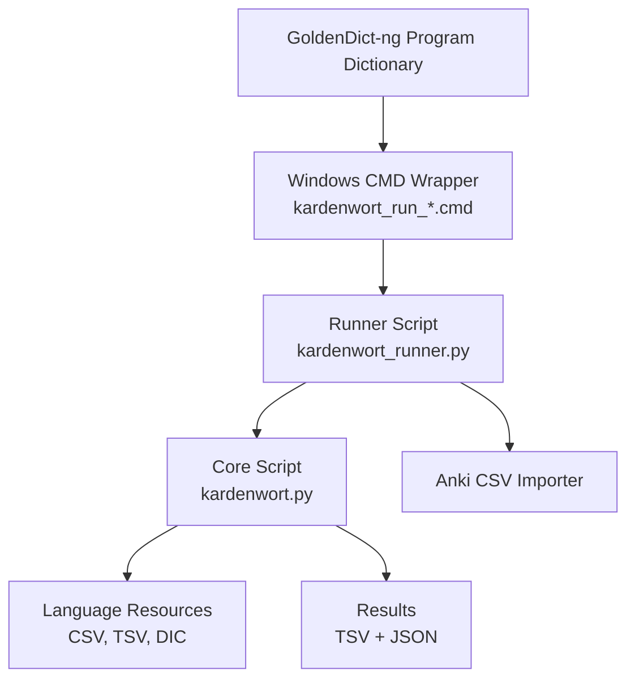
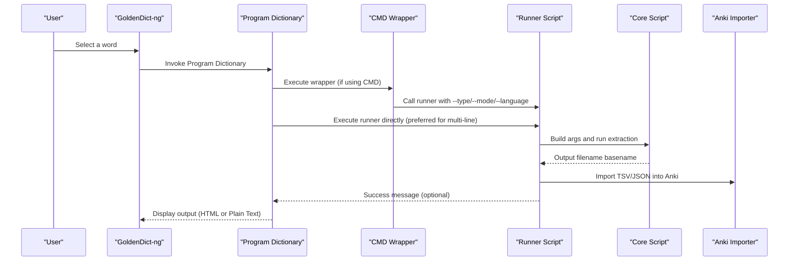
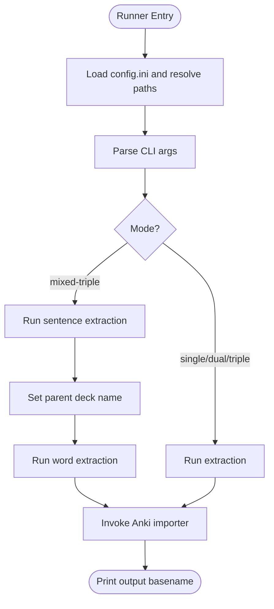
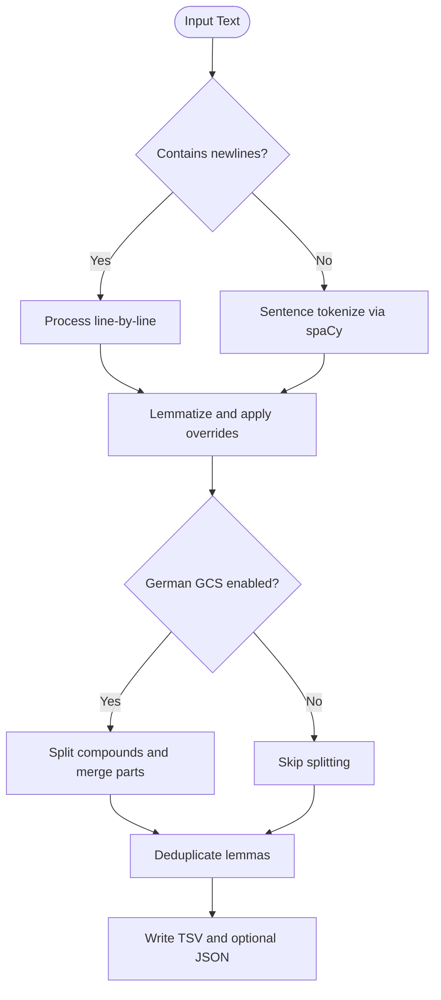
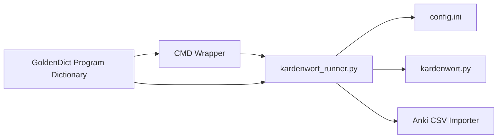

# GoldenDict Integration

<cite>
**Referenced Files in This Document**
- [kardenwort-goldendict-config.txt](file://docs/kardenwort-goldendict-config.txt)
- [kardenwort_runner.py](file://src/kardenwort/core/kardenwort_runner.py)
- [kardenwort.py](file://src/kardenwort/core/kardenwort.py)
- [kardenwort_run_de_w_t_s_anki.cmd](file://scripts/run/cmd/kardenwort_run_de_w_t_s_anki.cmd)
- [kardenwort_run_en_w_t_s_console.cmd](file://scripts/run/cmd/kardenwort_run_en_w_t_s_console.cmd)
- [kardenwort-run-de-single.sh](file://a/sh/kardenwort-run-de-single.sh)
- [config.ini.template](file://config.ini.template)
- [README.md](file://README.md)
- [20250913172001-morgen-faehrt-der-neue.triple.sentence.de.tsv](file://tests/cases/text3-morgen-faehrt-der-neue/20250913172001-morgen-faehrt-der-neue.triple.sentence.de.tsv)
</cite>

## Table of Contents
1. [Introduction](#introduction)
2. [Project Structure](#project-structure)
3. [Core Components](#core-components)
4. [Architecture Overview](#architecture-overview)
5. [Detailed Component Analysis](#detailed-component-analysis)
6. [Dependency Analysis](#dependency-analysis)
7. [Performance Considerations](#performance-considerations)
8. [Troubleshooting Guide](#troubleshooting-guide)
9. [Conclusion](#conclusion)
10. [Appendices](#appendices)

## Introduction
This document explains how to integrate Kardenwort with GoldenDict-ng so that word lookups trigger on-the-fly vocabulary extraction and flashcard creation. It focuses on configuring GoldenDict’s Program Dictionaries to invoke Kardenwort directly, covering the three primary German processing modes (Simple, Medium, Large) and their command-line equivalents for both HTML and Plain Text outputs. It also provides the critical workaround for multi-line text processing using the runner script with the --multi-text flag and direct invocation of kardenwort_runner.py, since standard CMD scripts cannot handle multi-line input. Finally, it outlines best practices for organizing multiple Program Dictionaries, common issues, and how this integration transforms passive dictionary lookups into active vocabulary acquisition.

## Project Structure
At a high level, GoldenDict-ng invokes a configured Program Dictionary which runs either:
- A CMD wrapper script that passes the selected word via an environment variable and calls the core Python script directly, or
- The runner script that orchestrates extraction and Anki import.

The configuration file defines ready-to-copy command templates for English and German, including both HTML and Plain Text outputs. The runner script centralizes argument handling, path resolution, and import orchestration.

**Diagram sources**
- [kardenwort_run_de_w_t_s_anki.cmd](file://scripts/run/cmd/kardenwort_run_de_w_t_s_anki.cmd#L1-L46)
- [kardenwort_runner.py](file://src/kardenwort/core/kardenwort_runner.py#L1-L364)
- [kardenwort.py](file://src/kardenwort/core/kardenwort.py#L1-L800)

**Section sources**
- [README.md](file://README.md#L245-L261)
- [kardenwort-goldendict-config.txt](file://docs/kardenwort-goldendict-config.txt#L1-L229)

## Core Components
- GoldenDict Program Dictionary: A GoldenDict “Program” dictionary configured to run a command template when a word is looked up. The configuration file provides exact command templates for English and German, including both HTML and Plain Text outputs.
- Runner Script (kardenwort_runner.py): Centralizes argument parsing, path resolution via config.ini, mode selection, and import orchestration. It also handles multi-text processing and mixed-triple mode.
- Core Script (kardenwort.py): Performs the actual NLP processing, lemmatization, German compound splitting, and TSV/HTML output generation.
- CMD Wrappers (scripts/run/cmd/*.cmd): Provide convenient Windows launchers for common scenarios. They set the working directory, load configuration, and pass the selected word via an environment variable. These wrappers cannot handle multi-line input for GoldenDict integration.
- Configuration (config.ini.template): Defines Python interpreter path, workspace locations, script names, and resource paths used by the runner.

**Section sources**
- [kardenwort-goldendict-config.txt](file://docs/kardenwort-goldendict-config.txt#L1-L229)
- [kardenwort_runner.py](file://src/kardenwort/core/kardenwort_runner.py#L1-L364)
- [kardenwort.py](file://src/kardenwort/core/kardenwort.py#L1-L800)
- [kardenwort_run_de_w_t_s_anki.cmd](file://scripts/run/cmd/kardenwort_run_de_w_t_s_anki.cmd#L1-L46)
- [kardenwort_run_en_w_t_s_console.cmd](file://scripts/run/cmd/kardenwort_run_en_w_t_s_console.cmd#L1-L56)
- [config.ini.template](file://config.ini.template#L1-L65)

## Architecture Overview
The GoldenDict integration follows a deterministic flow: GoldenDict executes a configured command template, which either:
- Calls the runner script directly (recommended for multi-line input), or
- Calls a CMD wrapper that forwards the selected word to the runner.

**Diagram sources**
- [kardenwort-goldendict-config.txt](file://docs/kardenwort-goldendict-config.txt#L1-L229)
- [kardenwort_runner.py](file://src/kardenwort/core/kardenwort_runner.py#L261-L364)
- [kardenwort.py](file://src/kardenwort/core/kardenwort.py#L1-L800)
- [kardenwort_run_de_w_t_s_anki.cmd](file://scripts/run/cmd/kardenwort_run_de_w_t_s_anki.cmd#L1-L46)

## Detailed Component Analysis

### GoldenDict Program Dictionary Setup
- Open GoldenDict’s Dictionaries window, go to Sources → Programs, and add a new Program Dictionary.
- For each desired mode/language, paste the exact command template from the configuration file. The configuration file provides:
  - English HTML output
  - English Plain Text with Anki import
  - German Simple (S) HTML output
  - German Simple (S) Plain Text with Anki import
  - German Medium (M) HTML output
  - German Medium (M) Plain Text with Anki import
  - German Large (L) HTML output
  - German Large (L) Plain Text with Anki import
- The placeholder %GDWORD% represents the selected word or phrase. GoldenDict replaces it with the lookup term before invoking the command.

Best practices:
- Use separate Program Dictionaries for each mode/language to quickly switch between Simple/Medium/Large processing.
- Prefer direct runner invocation for multi-line input (see the “Critical Workaround” section).

**Section sources**
- [kardenwort-goldendict-config.txt](file://docs/kardenwort-goldendict-config.txt#L1-L229)

### Three German Processing Modes (Simple, Medium, Large)
- Simple (S): Fast processing without German compound splitting. Suitable for quick lookups.
- Medium (M): Enables German compound splitting for common word types (e.g., NOUN/PROPN/ADV/ADJ), with options to preserve compound words and skip merging fractions.
- Large (L): Aggressive splitting with constraints (e.g., excluding VERBs), preserving compound words and skipping merges.

Each mode has both HTML and Plain Text variants. The configuration file includes the exact command-line templates for both.

**Section sources**
- [kardenwort-goldendict-config.txt](file://docs/kardenwort-goldendict-config.txt#L57-L190)

### Practical Examples: Commands for German and English
- English HTML: Use the template that calls the core script with --type word, --language en, --text %GDWORD%, and --stdout-format html.
- English Plain Text with Anki: Use the template that calls the runner script with --language en, --mode mixed-triple, --text %GDWORD%, and Anki-related flags.
- German Simple (S) HTML: Use the template that calls the core script with --type word, --language de, --text %GDWORD%, and --stdout-format html.
- German Simple (S) Plain Text with Anki: Use the template that calls the runner script with --language de, --mode mixed-triple, --text %GDWORD%, and Anki-related flags.
- German Medium (M) and Large (L): Use the templates that enable German compound splitting with appropriate POS tag filters and other GCS options.

Note: Replace %GDWORD% with the selected word. The configuration file provides the exact command templates to copy into GoldenDict.

**Section sources**
- [kardenwort-goldendict-config.txt](file://docs/kardenwort-goldendict-config.txt#L16-L56)
- [kardenwort-goldendict-config.txt](file://docs/kardenwort-goldendict-config.txt#L57-L190)

### Critical Workaround: Multi-line Text Processing
- Limitation: The provided Windows CMD wrapper scripts can only handle a single line of input. This is unsuitable for multi-line text processing in GoldenDict.
- Solution: Configure GoldenDict to call the runner script directly with the --multi-text flag. The runner script detects multi-text input when mixed-triple mode is used with --text and enables --multi-text automatically. It also orchestrates sentence and word extraction in a single run with shared deck naming.

Why this matters:
- Mixed-triple mode runs sentence extraction first, then word extraction, sharing a parent deck name.
- The runner script prints the final output filename basename to stdout, which GoldenDict can capture and display.

**Section sources**
- [README.md](file://README.md#L233-L244)
- [kardenwort_runner.py](file://src/kardenwort/core/kardenwort_runner.py#L297-L300)
- [kardenwort_runner.py](file://src/kardenwort/core/kardenwort_runner.py#L301-L364)

### Runner Script Behavior and Arguments
- Path resolution: The runner reads config.ini to resolve Python executable, workspace, and script paths.
- Mode selection: single/dual/triple/mixed-triple. mixed-triple runs sentence mode, then word mode, sharing a parent deck name.
- Multi-text: When --multi-text is enabled, the runner accepts up to three texts separated by a specific marker and processes them accordingly.
- Anki integration: The runner invokes the Anki CSV importer with deck metadata and optional subdeck creation.

**Diagram sources**
- [kardenwort_runner.py](file://src/kardenwort/core/kardenwort_runner.py#L1-L364)

**Section sources**
- [kardenwort_runner.py](file://src/kardenwort/core/kardenwort_runner.py#L1-L364)

### Core Script Processing Logic
- NLP pipeline: spaCy model loading, sentence/tokenization, lemmatization, German compound splitting (when enabled), and lemma override rules.
- Output: TSV file with headers and optional JSON metadata for deck descriptions. For HTML output, the core script can render HTML when invoked directly.

**Diagram sources**
- [kardenwort.py](file://src/kardenwort/core/kardenwort.py#L1-L800)

**Section sources**
- [kardenwort.py](file://src/kardenwort/core/kardenwort.py#L1-L800)

### Example Output
- The tests directory includes a sample TSV file demonstrating the header and content structure for sentence-mode output. This illustrates the fields included in the generated TSV, which the Anki importer consumes.

**Section sources**
- [20250913172001-morgen-faehrt-der-neue.triple.sentence.de.tsv](file://tests/cases/text3-morgen-faehrt-der-neue/20250913172001-morgen-faehrt-der-neue.triple.sentence.de.tsv#L1-L3)

## Dependency Analysis
- GoldenDict invokes either:
  - A CMD wrapper that sets the working directory and environment, then calls the runner script, or
  - The runner script directly with --multi-text for multi-line input.
- The runner depends on:
  - config.ini for environment and paths
  - kardenwort.py for core processing
  - Anki CSV importer for deck/card creation

**Diagram sources**
- [kardenwort_run_de_w_t_s_anki.cmd](file://scripts/run/cmd/kardenwort_run_de_w_t_s_anki.cmd#L1-L46)
- [kardenwort_runner.py](file://src/kardenwort/core/kardenwort_runner.py#L1-L364)
- [config.ini.template](file://config.ini.template#L1-L65)

**Section sources**
- [kardenwort_run_de_w_t_s_anki.cmd](file://scripts/run/cmd/kardenwort_run_de_w_t_s_anki.cmd#L1-L46)
- [kardenwort_runner.py](file://src/kardenwort/core/kardenwort_runner.py#L1-L364)
- [config.ini.template](file://config.ini.template#L1-L65)

## Performance Considerations
- Prefer the runner script for multi-line input to avoid the single-line limitation of CMD wrappers.
- Use Simple mode for quick lookups; Medium/Large modes provide richer splits at the cost of additional processing.
- Mixed-triple mode performs two passes (sentence then word) but shares a parent deck name, reducing deck clutter.
- Ensure UTF-8 encoding for input files and correct locale settings to avoid encoding issues.

[No sources needed since this section provides general guidance]

## Troubleshooting Guide
Common issues and solutions:
- Path errors
  - Symptom: The runner cannot locate Python or workspace paths.
  - Fix: Copy config.ini.template to config.ini and update [environment] paths to match your system. The runner reads these paths to resolve the Python executable and workspace.
- Python environment activation
  - Symptom: The runner fails to import dependencies or cannot find the Python executable.
  - Fix: Ensure the Python executable path in config.ini points to a valid interpreter in your virtual environment. On Windows, the CMD wrappers also rely on this path.
- Text encoding problems
  - Symptom: Garbled output or errors when processing non-ASCII characters.
  - Fix: Ensure input files are UTF-8 encoded. The runner and core script explicitly handle UTF-8 decoding and printing.
- Multi-line input not working
  - Symptom: GoldenDict passes multi-line text, but the CMD wrapper ignores everything after the first line.
  - Fix: Configure GoldenDict to call the runner script directly with --multi-text. The runner detects multi-text mode and processes all provided texts.

**Section sources**
- [config.ini.template](file://config.ini.template#L1-L65)
- [kardenwort_runner.py](file://src/kardenwort/core/kardenwort_runner.py#L1-L120)
- [README.md](file://README.md#L233-L244)

## Conclusion
By configuring GoldenDict Program Dictionaries with the exact command templates from the configuration file, you can transform passive dictionary lookups into active vocabulary acquisition. Use separate Program Dictionaries for German Simple, Medium, and Large modes, and prefer direct runner invocation with --multi-text for multi-line text processing. The runner script centralizes path resolution, mode selection, and Anki import, while the core script delivers robust NLP processing with German compound splitting and lemma overrides. Proper configuration of config.ini and attention to encoding and environment activation will ensure reliable operation.

[No sources needed since this section summarizes without analyzing specific files]

## Appendices

### Step-by-Step Setup Instructions
1. Prepare config.ini
   - Copy config.ini.template to config.ini.
   - Edit [environment] to point to your Python interpreter and workspace.
2. Configure GoldenDict Program Dictionaries
   - Open GoldenDict → Dictionaries → Sources → Programs.
   - Add a new Program Dictionary for each mode/language you want:
     - English HTML: Use the template that calls the core script with --type word, --language en, --text %GDWORD%, and --stdout-format html.
     - English Plain Text with Anki: Use the template that calls the runner script with --language en, --mode mixed-triple, --text %GDWORD%, and Anki flags.
     - German Simple (S) HTML: Use the template that calls the core script with --type word, --language de, --text %GDWORD%, and --stdout-format html.
     - German Simple (S) Plain Text with Anki: Use the template that calls the runner script with --language de, --mode mixed-triple, --text %GDWORD%, and Anki flags.
     - German Medium (M) and Large (L): Use the templates that enable German compound splitting with appropriate POS tag filters.
   - Paste the exact command templates from docs/kardenwort-goldendict-config.txt.
3. Multi-line text processing
   - For multi-line input, configure GoldenDict to call the runner script directly with --multi-text. The runner will detect multi-text mode and process all provided texts.
4. Verify output
   - HTML mode displays output directly in GoldenDict.
   - Plain Text with Anki mode imports cards into Anki and may show a success message depending on runner flags.

**Section sources**
- [kardenwort-goldendict-config.txt](file://docs/kardenwort-goldendict-config.txt#L1-L229)
- [README.md](file://README.md#L245-L261)

### Best Practices for Organizing Program Dictionaries
- Create separate Program Dictionaries for each mode/language combination (e.g., “De kW S”, “De kW M”, “De kW L”, “En kW”).
- Use descriptive names and icons to distinguish Simple vs. Medium vs. Large processing.
- Keep one dictionary per use case (e.g., quick review vs. deep analysis) to avoid confusion.

[No sources needed since this section provides general guidance]