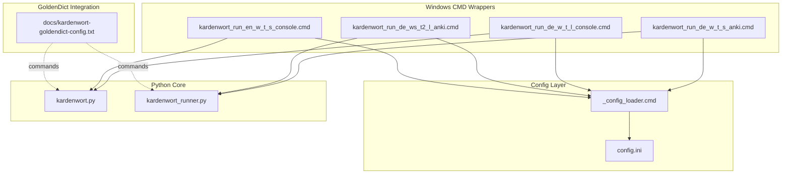
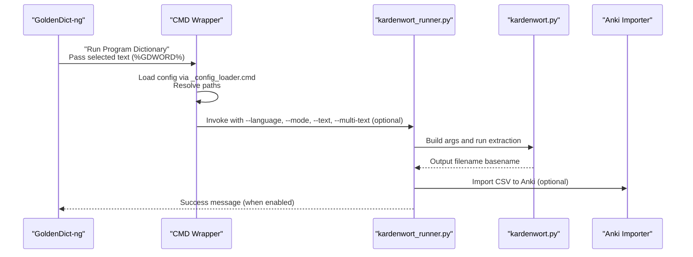
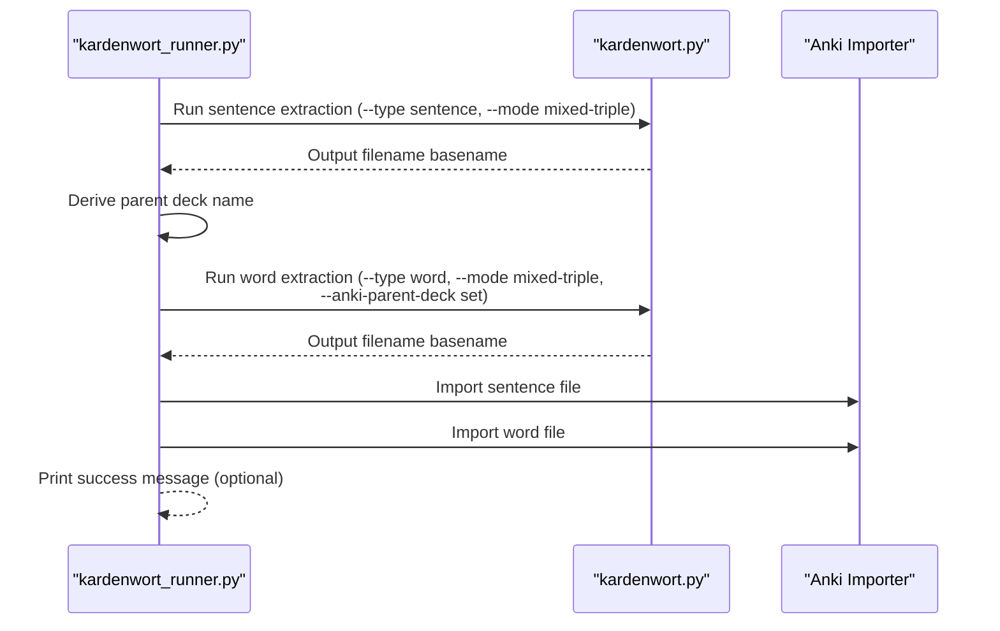
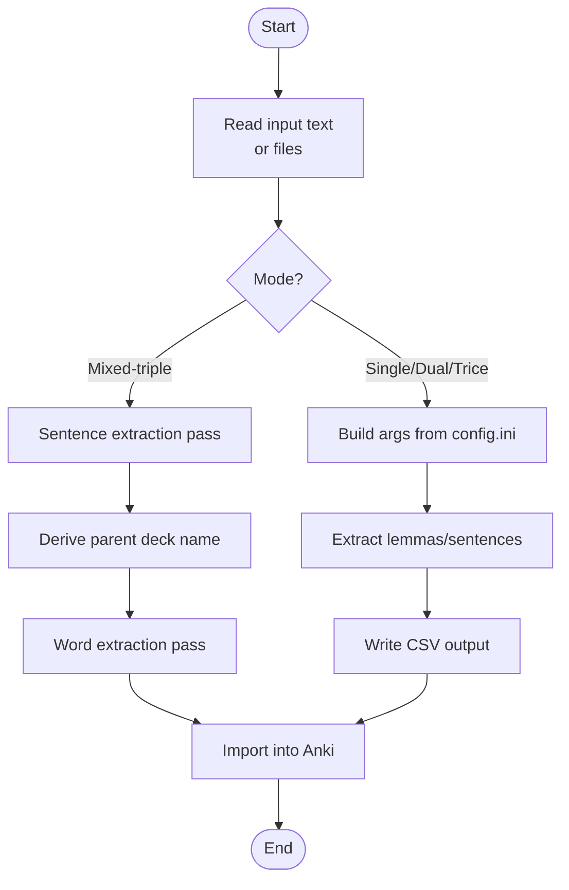
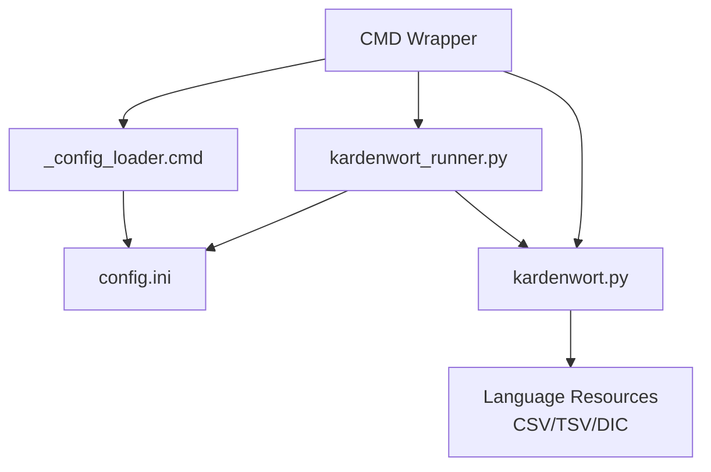

# Integration and Workflows

<cite>
**Referenced Files in This Document**
- [kardenwort-goldendict-config.txt](file://docs/kardenwort-goldendict-config.txt)
- [README.md](file://README.md)
- [config.ini](file://config.ini)
- [scripts/_config_loader.cmd](file://scripts/_config_loader.cmd)
- [scripts/run/cmd/kardenwort_run_de_w_t_s_anki.cmd](file://scripts/run/cmd/kardenwort_run_de_w_t_s_anki.cmd)
- [scripts/run/cmd/kardenwort_run_de_w_t_l_console.cmd](file://scripts/run/cmd/kardenwort_run_de_w_t_l_console.cmd)
- [scripts/run/cmd/kardenwort_run_de_ws_t2_l_anki.cmd](file://scripts/run/cmd/kardenwort_run_de_ws_t2_l_anki.cmd)
- [scripts/run/cmd/kardenwort_run_en_w_t_s_console.cmd](file://scripts/run/cmd/kardenwort_run_en_w_t_s_console.cmd)
- [src/kardenwort/core/kardenwort.py](file://src/kardenwort/core/kardenwort.py)
- [src/kardenwort/core/kardenwort_runner.py](file://src/kardenwort/core/kardenwort_runner.py)
- [tests/source_texts/de/text.txt](file://tests/source_texts/de/text.txt)
- [tests/source_texts/en/text1.txt](file://tests/source_texts/en/text1.txt)
</cite>

## Table of Contents
1. [Introduction](#introduction)
2. [Project Structure](#project-structure)
3. [Core Components](#core-components)
4. [Architecture Overview](#architecture-overview)
5. [Detailed Component Analysis](#detailed-component-analysis)
6. [Dependency Analysis](#dependency-analysis)
7. [Performance Considerations](#performance-considerations)
8. [Troubleshooting Guide](#troubleshooting-guide)
9. [Conclusion](#conclusion)
10. [Appendices](#appendices)

## Introduction
This section explains how to integrate Kardenwort with external tools and outlines common user workflows. It focuses on:
- Pre-configured Windows CMD scripts in the scripts/run/cmd/ directory, including their naming conventions and processing scenarios.
- GoldenDict-ng integration for on-the-fly vocabulary extraction with three processing modes: Simple, Medium, and Large.
- The critical limitation of CMD scripts with single-line processing and the correct workaround using the --multi-text flag with direct Python script invocation.
- Practical GoldenDict configuration commands from the provided kardenwort-goldendict-config.txt file.
- Typical workflows such as processing a single text file, creating flashcards from AI-generated content, and building vocabulary lists from books or articles.
- Common issues such as text encoding problems in GoldenDict integration and solutions.
- Best practices for organizing source texts and managing generated flashcards.

## Project Structure
Kardenwort provides:
- Windows CMD wrappers under scripts/run/cmd/ that delegate to either the core Python script (kardenwort.py) or the runner (kardenwort_runner.py).
- A configuration loader script (scripts/_config_loader.cmd) that reads config.ini sections and exposes values as environment variables for CMD scripts.
- A central configuration file (config.ini) that defines Python interpreter paths, workspace locations, script filenames, resource locations, and defaults.
- GoldenDict-ng integration instructions and example commands in docs/kardenwort-goldendict-config.txt.
- Core Python modules under src/kardenwort/core/, including kardenwort.py (main processing) and kardenwort_runner.py (CLI wrapper and Anki importer orchestration).

**Diagram sources**
- [scripts/run/cmd/kardenwort_run_de_w_t_s_anki.cmd](file://scripts/run/cmd/kardenwort_run_de_w_t_s_anki.cmd#L1-L46)
- [scripts/run/cmd/kardenwort_run_de_w_t_l_console.cmd](file://scripts/run/cmd/kardenwort_run_de_w_t_l_console.cmd#L1-L64)
- [scripts/run/cmd/kardenwort_run_de_ws_t2_l_anki.cmd](file://scripts/run/cmd/kardenwort_run_de_ws_t2_l_anki.cmd#L1-L58)
- [scripts/run/cmd/kardenwort_run_en_w_t_s_console.cmd](file://scripts/run/cmd/kardenwort_run_en_w_t_s_console.cmd#L1-L56)
- [scripts/_config_loader.cmd](file://scripts/_config_loader.cmd#L1-L54)
- [config.ini](file://config.ini#L1-L65)
- [src/kardenwort/core/kardenwort.py](file://src/kardenwort/core/kardenwort.py#L1-L120)
- [src/kardenwort/core/kardenwort_runner.py](file://src/kardenwort/core/kardenwort_runner.py#L1-L120)
- [kardenwort-goldendict-config.txt](file://docs/kardenwort-goldendict-config.txt#L1-L229)

**Section sources**
- [README.md](file://README.md#L238-L260)
- [config.ini](file://config.ini#L1-L65)
- [scripts/_config_loader.cmd](file://scripts/_config_loader.cmd#L1-L54)

## Core Components
- CMD wrappers: Each script changes to the project root, loads configuration via _config_loader.cmd, validates required keys, sets environment variables for input text, and invokes either kardenwort.py or kardenwort_runner.py with appropriate flags.
- Configuration loader: Parses config.ini sections and emits CFG_* variables for consumption by CMD scripts.
- Runner (kardenwort_runner.py): Central CLI orchestrator that builds argument lists, runs extraction, and optionally imports results into Anki. It supports mixed-triple mode, multi-text parsing, and Anki deck metadata generation.
- Core processor (kardenwort.py): Implements text processing, lemma extraction, sentence handling, and output generation. It reads UTF-8 files and supports German compound splitting and lemma override rules.

Key capabilities relevant to integrations:
- Single-line vs multi-line input handling and the --multi-text flag.
- Anki deck creation and metadata injection.
- German-specific enhancements (compound splitting, genitive fixes, dictionary-based checks).
- GoldenDict-ng integration via program dictionaries.

**Section sources**
- [scripts/run/cmd/kardenwort_run_de_w_t_s_anki.cmd](file://scripts/run/cmd/kardenwort_run_de_w_t_s_anki.cmd#L1-L46)
- [scripts/run/cmd/kardenwort_run_de_w_t_l_console.cmd](file://scripts/run/cmd/kardenwort_run_de_w_t_l_console.cmd#L1-L64)
- [scripts/run/cmd/kardenwort_run_de_ws_t2_l_anki.cmd](file://scripts/run/cmd/kardenwort_run_de_ws_t2_l_anki.cmd#L1-L58)
- [scripts/run/cmd/kardenwort_run_en_w_t_s_console.cmd](file://scripts/run/cmd/kardenwort_run_en_w_t_s_console.cmd#L1-L56)
- [scripts/_config_loader.cmd](file://scripts/_config_loader.cmd#L1-L54)
- [src/kardenwort/core/kardenwort_runner.py](file://src/kardenwort/core/kardenwort_runner.py#L1-L364)
- [src/kardenwort/core/kardenwort.py](file://src/kardenwort/core/kardenwort.py#L1-L200)

## Architecture Overview
The integration architecture connects GoldenDict-ng to Kardenwort via program dictionaries. Two primary paths exist:
- CMD wrapper path: GoldenDict invokes a CMD script that calls kardenwort.py or kardenwort_runner.py with flags configured in config.ini.
- Direct runner path: GoldenDict invokes kardenwort_runner.py directly with --multi-text for multi-line inputs.

**Diagram sources**
- [scripts/run/cmd/kardenwort_run_de_w_t_s_anki.cmd](file://scripts/run/cmd/kardenwort_run_de_w_t_s_anki.cmd#L1-L46)
- [scripts/run/cmd/kardenwort_run_de_w_t_l_console.cmd](file://scripts/run/cmd/kardenwort_run_de_w_t_l_console.cmd#L1-L64)
- [scripts/run/cmd/kardenwort_run_de_ws_t2_l_anki.cmd](file://scripts/run/cmd/kardenwort_run_de_ws_t2_l_anki.cmd#L1-L58)
- [scripts/run/cmd/kardenwort_run_en_w_t_s_console.cmd](file://scripts/run/cmd/kardenwort_run_en_w_t_s_console.cmd#L1-L56)
- [src/kardenwort/core/kardenwort_runner.py](file://src/kardenwort/core/kardenwort_runner.py#L1-L364)
- [src/kardenwort/core/kardenwort.py](file://src/kardenwort/core/kardenwort.py#L1-L200)

## Detailed Component Analysis

### CMD Script Naming Convention and Processing Scenarios
Naming convention highlights:
- Language: de or en
- Type: w (word) or s (sentence) or l (large/medium depending on variant)
- Mode: t1, t2, t3 indicate single/dual/triple modes; m indicates medium-like processing; l indicates large-like processing
- Destination: anki or console
- Variants: v1, v2, v3, v3.1 indicate minor variants of the same scenario

Processing scenarios covered:
- Word extraction with Anki output (e.g., kardenwort_run_de_w_t_s_anki.cmd)
- Sentence extraction with Anki output (e.g., kardenwort_run_de_ws_t2_l_anki.cmd)
- Console HTML output for quick preview (e.g., kardenwort_run_de_w_t_l_console.cmd)
- English console HTML output (e.g., kardenwort_run_en_w_t_s_console.cmd)

These scripts:
- Change to the project root to resolve relative paths consistently.
- Load configuration via _config_loader.cmd and validate required keys.
- Pass input text via an environment variable and invoke the appropriate Python script with language and mode flags.

**Section sources**
- [scripts/run/cmd/kardenwort_run_de_w_t_s_anki.cmd](file://scripts/run/cmd/kardenwort_run_de_w_t_s_anki.cmd#L1-L46)
- [scripts/run/cmd/kardenwort_run_de_w_t_l_console.cmd](file://scripts/run/cmd/kardenwort_run_de_w_t_l_console.cmd#L1-L64)
- [scripts/run/cmd/kardenwort_run_de_ws_t2_l_anki.cmd](file://scripts/run/cmd/kardenwort_run_de_ws_t2_l_anki.cmd#L1-L58)
- [scripts/run/cmd/kardenwort_run_en_w_t_s_console.cmd](file://scripts/run/cmd/kardenwort_run_en_w_t_s_console.cmd#L1-L56)
- [scripts/_config_loader.cmd](file://scripts/_config_loader.cmd#L1-L54)

### GoldenDict-ng Integration and Processing Modes
GoldenDict-ng integration allows on-the-fly vocabulary extraction and Anki card creation. Three processing modes are commonly used:
- Simple (S): Fast analysis without compound splitting.
- Medium (M): Analysis with compound splitting for common word types.
- Large (L): Deeper analysis, splitting compounds for almost all word types.

Practical configuration commands:
- English HTML mode: See commands in docs/kardenwort-goldendict-config.txt.
- English Anki mixed-triple mode: See commands in docs/kardenwort-goldendict-config.txt.
- German HTML modes (S, M, L): See commands in docs/kardenwort-goldendict-config.txt.
- German Anki modes: See commands in docs/kardenwort-goldendict-config.txt.

Limitation and workaround:
- CMD scripts can only handle a single line of input.
- To process multi-line text in GoldenDict, bypass CMD wrappers and call kardenwort_runner.py directly with --multi-text.

**Section sources**
- [README.md](file://README.md#L238-L260)
- [kardenwort-goldendict-config.txt](file://docs/kardenwort-goldendict-config.txt#L1-L229)

### Runner Orchestration and Mixed-Mode Workflows
The runner (kardenwort_runner.py) builds argument lists from config.ini and supports:
- Mixed-triple mode: Runs sentence extraction, derives a parent deck name, then runs word extraction with the same parent deck context, importing both into Anki.
- Multi-text parsing: Enables processing of multi-line inputs using a separator.
- Anki deck metadata: Generates JSON metadata for decks and subdecks based on Markdown headers and content.

**Diagram sources**
- [src/kardenwort/core/kardenwort_runner.py](file://src/kardenwort/core/kardenwort_runner.py#L260-L364)
- [src/kardenwort/core/kardenwort.py](file://src/kardenwort/core/kardenwort.py#L672-L1062)

**Section sources**
- [src/kardenwort/core/kardenwort_runner.py](file://src/kardenwort/core/kardenwort_runner.py#L1-L364)

### CMD Scripts Limitation and Correct Workaround
- Limitation: CMD scripts accept only a single line of input because they pass the selected text via an environment variable and invoke the Python script with flags that expect a single text unit.
- Workaround: Configure GoldenDict to call kardenwort_runner.py directly with --multi-text to enable multi-line parsing.

**Section sources**
- [README.md](file://README.md#L238-L244)
- [src/kardenwort/core/kardenwort_runner.py](file://src/kardenwort/core/kardenwort_runner.py#L270-L300)

### Practical GoldenDict Configuration Commands
Examples from docs/kardenwort-goldendict-config.txt:
- English HTML mode: Program dictionary invoking kardenwort.py with language, text, lemma index, override file, and HTML output.
- English Anki mixed-triple mode: Program dictionary invoking kardenwort_runner.py with language, mode, text, TTS destination, deduplication scope, Anki deck creation flags, suspend cards, success message, and completion sound.
- German HTML modes (S, M, L): Program dictionaries invoking kardenwort.py with language, text, lemma index, override file, dictionary file, sentence context size, HTML output, and German-specific flags (genitive fix, compound splitting).
- German Anki modes: Program dictionaries invoking kardenwort_runner.py with language, mode, text, TTS destination, deduplication scope, Anki deck creation flags, and suspend cards.

**Section sources**
- [kardenwort-goldendict-config.txt](file://docs/kardenwort-goldendict-config.txt#L1-L229)

### Common User Workflows
- Processing a single text file:
  - Use kardenwort_runner.py with --mode single and --type word or sentence.
  - Optionally enable --multi-text for multi-line content.
  - Import the resulting CSV into Anki.
- Creating flashcards from AI-generated content:
  - Use mixed-triple mode to generate both sentence and word outputs, then import both into Anki with shared parent decks.
  - Enable Anki deck metadata and subdecks to organize content hierarchically.
- Building vocabulary lists from books or articles:
  - Prepare source texts in UTF-8.
  - Use German-specific processing (compound splitting, genitive fixes) when applicable.
  - Export to CSV and import into Anki.

**Section sources**
- [src/kardenwort/core/kardenwort_runner.py](file://src/kardenwort/core/kardenwort_runner.py#L120-L220)
- [src/kardenwort/core/kardenwort.py](file://src/kardenwort/core/kardenwort.py#L672-L1062)

### Data Flow and Processing Logic
- Input text is read from either stdin/environment variable or specified files.
- Lemmatization and compound splitting are applied according to language and flags.
- Outputs are written to CSV with optional sentence context and wordlists.
- For Anki, deck metadata is generated and importers are invoked.

**Diagram sources**
- [src/kardenwort/core/kardenwort_runner.py](file://src/kardenwort/core/kardenwort_runner.py#L120-L220)
- [src/kardenwort/core/kardenwort.py](file://src/kardenwort/core/kardenwort.py#L672-L1062)

## Dependency Analysis
- CMD wrappers depend on _config_loader.cmd and config.ini for resolving paths and validating required keys.
- Runner depends on config.ini for locating Python interpreter, workspace, source code, data, and input/output directories.
- Core processor depends on language resources (lemma index, override rules, dictionary) and German compound splitting library availability.

**Diagram sources**
- [scripts/_config_loader.cmd](file://scripts/_config_loader.cmd#L1-L54)
- [config.ini](file://config.ini#L1-L65)
- [src/kardenwort/core/kardenwort_runner.py](file://src/kardenwort/core/kardenwort_runner.py#L1-L120)
- [src/kardenwort/core/kardenwort.py](file://src/kardenwort/core/kardenwort.py#L1-L120)

**Section sources**
- [scripts/_config_loader.cmd](file://scripts/_config_loader.cmd#L1-L54)
- [config.ini](file://config.ini#L1-L65)
- [src/kardenwort/core/kardenwort_runner.py](file://src/kardenwort/core/kardenwort_runner.py#L1-L120)
- [src/kardenwort/core/kardenwort.py](file://src/kardenwort/core/kardenwort.py#L1-L120)

## Performance Considerations
- Mixed-triple mode performs two passes (sentence and word), increasing runtime. Use it when you need both outputs and shared deck structure.
- German compound splitting adds overhead; enable only when beneficial for the target content.
- Deduplication scope affects processing time; global deduplication scans across the entire text.
- Using --multi-text avoids repeated invocations for multi-line content, streamlining workflows.

[No sources needed since this section provides general guidance]

## Troubleshooting Guide
Common issues and solutions:
- Text encoding problems in GoldenDict integration:
  - Ensure source texts are saved in UTF-8.
  - Verify that config.ini paths and resource files are accessible and readable in UTF-8.
  - Confirm that CMD wrappers set code page to UTF-8 (chcp 65001) before execution.
- CMD scripts only accept single-line input:
  - Configure GoldenDict to call kardenwort_runner.py directly with --multi-text for multi-line processing.
- Missing configuration keys:
  - Validate that config.ini contains required sections and keys (environment, scripts, project_structure, language_resources).
  - Ensure relative paths resolve correctly from the project root.
- German compound splitting not available:
  - Install the required library if GCS support is desired; otherwise, disable --de-gcs flags.

**Section sources**
- [README.md](file://README.md#L238-L244)
- [scripts/run/cmd/kardenwort_run_de_w_t_l_console.cmd](file://scripts/run/cmd/kardenwort_run_de_w_t_l_console.cmd#L1-L64)
- [config.ini](file://config.ini#L1-L65)
- [src/kardenwort/core/kardenwort_runner.py](file://src/kardenwort/core/kardenwort_runner.py#L1-L120)

## Conclusion
Kardenwort integrates smoothly with GoldenDict-ng through both CMD wrappers and direct runner invocation. CMD wrappers simplify common scenarios but are limited to single-line inputs. For multi-line content, use kardenwort_runner.py with --multi-text. The runner’s mixed-triple mode and Anki deck metadata generation streamline creating organized flashcard decks from books, articles, and AI-generated content. Proper configuration and UTF-8 handling ensure reliable integration across languages and workflows.

[No sources needed since this section summarizes without analyzing specific files]

## Appendices

### Appendix A: CMD Script Naming Convention Reference
- Language: de or en
- Type: w (word), s (sentence), l (large/medium depending on variant)
- Mode: t1 (single), t2 (dual), t3 (triple), m (medium-like), l (large-like)
- Destination: anki (Anki import) or console (HTML output)
- Variants: v1, v2, v3, v3.1

Examples:
- kardenwort_run_de_w_t_s_anki.cmd: German word extraction with Anki output.
- kardenwort_run_de_w_t_l_console.cmd: German word extraction with console HTML output.
- kardenwort_run_de_ws_t2_l_anki.cmd: German dual sentence and word extraction with Anki output.
- kardenwort_run_en_w_t_s_console.cmd: English word extraction with console HTML output.

**Section sources**
- [scripts/run/cmd/kardenwort_run_de_w_t_s_anki.cmd](file://scripts/run/cmd/kardenwort_run_de_w_t_s_anki.cmd#L1-L46)
- [scripts/run/cmd/kardenwort_run_de_w_t_l_console.cmd](file://scripts/run/cmd/kardenwort_run_de_w_t_l_console.cmd#L1-L64)
- [scripts/run/cmd/kardenwort_run_de_ws_t2_l_anki.cmd](file://scripts/run/cmd/kardenwort_run_de_ws_t2_l_anki.cmd#L1-L58)
- [scripts/run/cmd/kardenwort_run_en_w_t_s_console.cmd](file://scripts/run/cmd/kardenwort_run_en_w_t_s_console.cmd#L1-L56)

### Appendix B: GoldenDict Configuration Commands Reference
- English HTML mode: See commands in docs/kardenwort-goldendict-config.txt.
- English Anki mixed-triple mode: See commands in docs/kardenwort-goldendict-config.txt.
- German HTML modes (S, M, L): See commands in docs/kardenwort-goldendict-config.txt.
- German Anki modes: See commands in docs/kardenwort-goldendict-config.txt.

**Section sources**
- [kardenwort-goldendict-config.txt](file://docs/kardenwort-goldendict-config.txt#L1-L229)

### Appendix C: Example Source Texts
- German example with Markdown headers and separators: tests/source_texts/de/text.txt
- English example: tests/source_texts/en/text1.txt

**Section sources**
- [tests/source_texts/de/text.txt](file://tests/source_texts/de/text.txt#L1-L9)
- [tests/source_texts/en/text1.txt](file://tests/source_texts/en/text1.txt#L1-L15)