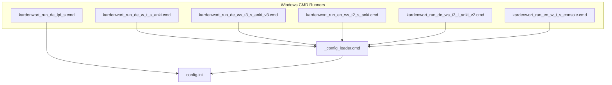
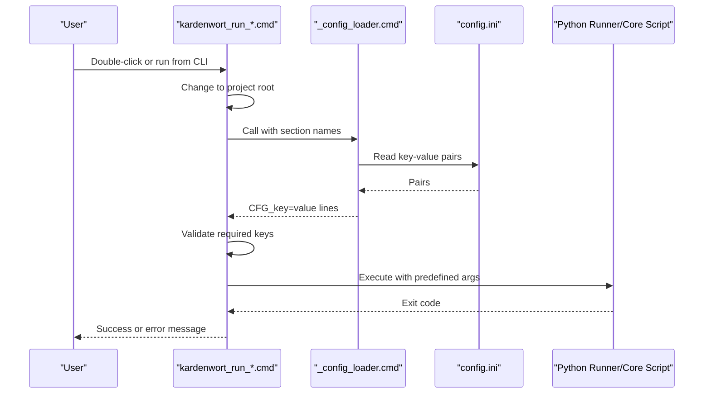
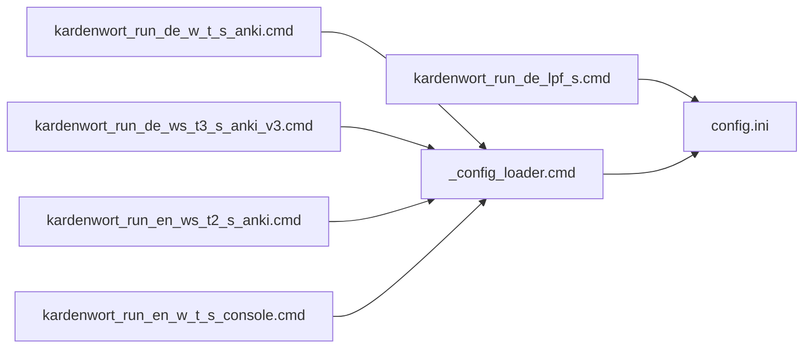
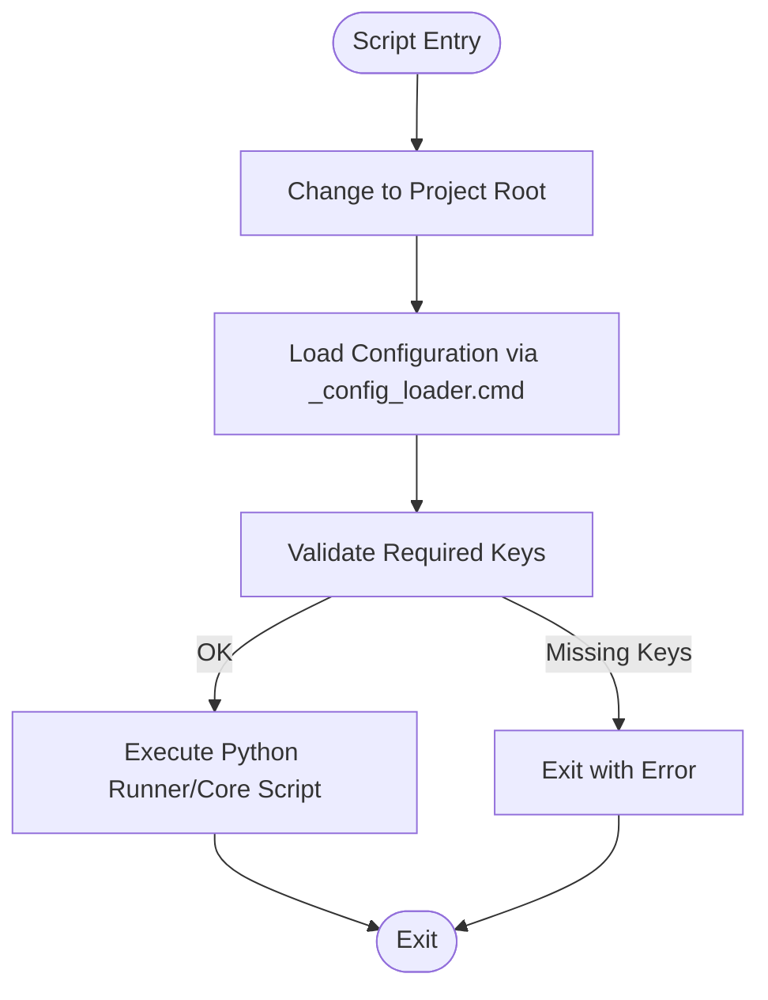

# Windows CMD Scripts

<cite>
**Referenced Files in This Document**
- [scripts/_config_loader.cmd](file://scripts/_config_loader.cmd)
- [scripts/run/cmd/kardenwort_run_de_w_t_s_anki.cmd](file://scripts/run/cmd/kardenwort_run_de_w_t_s_anki.cmd)
- [scripts/run/cmd/kardenwort_run_de_ws_t3_s_anki_v3.cmd](file://scripts/run/cmd/kardenwort_run_de_ws_t3_s_anki_v3.cmd)
- [scripts/run/cmd/kardenwort_run_en_ws_t2_s_anki.cmd](file://scripts/run/cmd/kardenwort_run_en_ws_t2_s_anki.cmd)
- [scripts/run/cmd/kardenwort_run_de_ws_t3_l_anki_v2.cmd](file://scripts/run/cmd/kardenwort_run_de_ws_t3_l_anki_v2.cmd)
- [scripts/run/cmd/kardenwort_run_en_w_t_s_console.cmd](file://scripts/run/cmd/kardenwort_run_en_w_t_s_console.cmd)
- [scripts/run/cmd/kardenwort_run_de_lpf_s.cmd](file://scripts/run/cmd/kardenwort_run_de_lpf_s.cmd)
- [config.ini](file://config.ini)
- [README.md](file://README.md)
</cite>

## Table of Contents
1. [Introduction](#introduction)
2. [Project Structure](#project-structure)
3. [Core Components](#core-components)
4. [Architecture Overview](#architecture-overview)
5. [Detailed Component Analysis](#detailed-component-analysis)
6. [Dependency Analysis](#dependency-analysis)
7. [Performance Considerations](#performance-considerations)
8. [Troubleshooting Guide](#troubleshooting-guide)
9. [Conclusion](#conclusion)
10. [Appendices](#appendices)

## Introduction
This section documents the pre-configured Windows CMD scripts located in the scripts/run/cmd/ directory. These scripts serve as convenient entry points for Windows users to execute Kardenwort with specific processing configurations without manually typing complex command-line arguments. They encapsulate typical workflows such as generating vocabulary cards with Anki import, producing sentence cards with console output, or running mixed modes that combine sentence and word processing into a shared deck.

The scripts rely on a shared configuration loader to read settings from config.ini, ensuring consistent paths and environment configuration across all Windows runners. They support both file-based and stdin-based input modes, with important limitations when processing multi-line text via stdin.

## Project Structure
The Windows CMD scripts are organized under scripts/run/cmd/. Each script follows a naming convention that encodes:
- Language: de or en
- Input mode: w=with file, ws=with stdin
- Processing type: t=token (word), s=sentence
- Mode: s=single, m=medium, l=large, t1/t2/t3 (variations)
- Output target: anki or console
- Versioning: v1/v2/v3 (for newer variants)

**Diagram sources**
- [scripts/run/cmd/kardenwort_run_de_w_t_s_anki.cmd](file://scripts/run/cmd/kardenwort_run_de_w_t_s_anki.cmd#L1-L46)
- [scripts/run/cmd/kardenwort_run_de_ws_t3_s_anki_v3.cmd](file://scripts/run/cmd/kardenwort_run_de_ws_t3_s_anki_v3.cmd#L1-L58)
- [scripts/run/cmd/kardenwort_run_en_ws_t2_s_anki.cmd](file://scripts/run/cmd/kardenwort_run_en_ws_t2_s_anki.cmd#L1-L58)
- [scripts/run/cmd/kardenwort_run_de_ws_t3_l_anki_v2.cmd](file://scripts/run/cmd/kardenwort_run_de_ws_t3_l_anki_v2.cmd#L1-L63)
- [scripts/run/cmd/kardenwort_run_en_w_t_s_console.cmd](file://scripts/run/cmd/kardenwort_run_en_w_t_s_console.cmd#L1-L56)
- [scripts/run/cmd/kardenwort_run_de_lpf_s.cmd](file://scripts/run/cmd/kardenwort_run_de_lpf_s.cmd#L1-L37)
- [scripts/_config_loader.cmd](file://scripts/_config_loader.cmd#L1-L54)
- [config.ini](file://config.ini#L1-L65)

**Section sources**
- [scripts/run/cmd/kardenwort_run_de_w_t_s_anki.cmd](file://scripts/run/cmd/kardenwort_run_de_w_t_s_anki.cmd#L1-L46)
- [scripts/run/cmd/kardenwort_run_de_ws_t3_s_anki_v3.cmd](file://scripts/run/cmd/kardenwort_run_de_ws_t3_s_anki_v3.cmd#L1-L58)
- [scripts/run/cmd/kardenwort_run_en_ws_t2_s_anki.cmd](file://scripts/run/cmd/kardenwort_run_en_ws_t2_s_anki.cmd#L1-L58)
- [scripts/run/cmd/kardenwort_run_de_ws_t3_l_anki_v2.cmd](file://scripts/run/cmd/kardenwort_run_de_ws_t3_l_anki_v2.cmd#L1-L63)
- [scripts/run/cmd/kardenwort_run_en_w_t_s_console.cmd](file://scripts/run/cmd/kardenwort_run_en_w_t_s_console.cmd#L1-L56)
- [scripts/run/cmd/kardenwort_run_de_lpf_s.cmd](file://scripts/run/cmd/kardenwort_run_de_lpf_s.cmd#L1-L37)
- [scripts/_config_loader.cmd](file://scripts/_config_loader.cmd#L1-L54)
- [config.ini](file://config.ini#L1-L65)

## Core Components
- Configuration Loader (_config_loader.cmd): Reads key-value pairs from config.ini for a given section and emits them prefixed with CFG_. The Windows runners call this loader for environment, scripts, project_structure, and language_resources sections.
- Runner Scripts (kardenwort_run_*.cmd): Encapsulate a specific processing scenario. They:
  - Change to the project root to resolve relative paths consistently
  - Load configuration via _config_loader.cmd
  - Validate required configuration keys
  - Determine the Python executable and runner/script path
  - Optionally pass input text via an environment variable
  - Invoke the Python runner or core script with predefined arguments
- config.ini: Central configuration providing paths and resource locations for the runners.

Key behaviors:
- Mixed modes: Some scripts orchestrate sentence and word processing in a single run, often creating a shared parent deck and enabling subdecks.
- Console vs Anki: Scripts target either console output or Anki import depending on the scenario.
- Versioned runners: Newer scripts include additional flags and deck controls (e.g., mixed-triple, markdown decks, suspend-cards).

**Section sources**
- [scripts/_config_loader.cmd](file://scripts/_config_loader.cmd#L1-L54)
- [config.ini](file://config.ini#L1-L65)
- [scripts/run/cmd/kardenwort_run_de_ws_t3_s_anki_v3.cmd](file://scripts/run/cmd/kardenwort_run_de_ws_t3_s_anki_v3.cmd#L1-L58)
- [scripts/run/cmd/kardenwort_run_en_ws_t2_s_anki.cmd](file://scripts/run/cmd/kardenwort_run_en_ws_t2_s_anki.cmd#L1-L58)
- [scripts/run/cmd/kardenwort_run_de_w_t_s_anki.cmd](file://scripts/run/cmd/kardenwort_run_de_w_t_s_anki.cmd#L1-L46)
- [scripts/run/cmd/kardenwort_run_en_w_t_s_console.cmd](file://scripts/run/cmd/kardenwort_run_en_w_t_s_console.cmd#L1-L56)

## Architecture Overview
The Windows runners follow a consistent flow: resolve project root, load configuration, validate paths, pass input if applicable, and execute the Python runner or core script.

**Diagram sources**
- [scripts/run/cmd/kardenwort_run_de_w_t_s_anki.cmd](file://scripts/run/cmd/kardenwort_run_de_w_t_s_anki.cmd#L1-L46)
- [scripts/_config_loader.cmd](file://scripts/_config_loader.cmd#L1-L54)
- [config.ini](file://config.ini#L1-L65)

## Detailed Component Analysis

### Naming Convention Breakdown
Each script name encodes processing intent. The naming pattern is:
- kardenwort_run_<language>_<input_mode>_<processing_type>_<mode>_<output_target>.cmd
- Optional version suffix: _v1/_v2/_v3(.1)

Decoding examples:
- de: language German
- en: language English
- w: with file input (via text file arguments)
- ws: with stdin input (via environment variable or stdin)
- t: token/word processing (--type word)
- s: sentence processing (--type sentence)
- l: lemma-per-line mode (specialized)
- s/m/l: processing intensity or mode variants
- t1/t2/t3: mode variations (e.g., mixed modes)
- anki: output/import to Anki
- console: output to stdout

Practical examples:
- kardenwort_run_de_w_t_s_anki.cmd: German word cards from file, Anki import, single mode
- kardenwort_run_de_ws_t3_s_anki_v3.cmd: German sentence+word mixed-triple via stdin, Anki import, with deck controls and suspend-cards
- kardenwort_run_en_ws_t2_s_anki.cmd: English dual mode sentence+word via stdin, Anki import
- kardenwort_run_en_w_t_s_console.cmd: English word cards from file, console output
- kardenwort_run_de_lpf_s.cmd: German lemmas-per-line from file, console output

**Section sources**
- [scripts/run/cmd/kardenwort_run_de_w_t_s_anki.cmd](file://scripts/run/cmd/kardenwort_run_de_w_t_s_anki.cmd#L1-L46)
- [scripts/run/cmd/kardenwort_run_de_ws_t3_s_anki_v3.cmd](file://scripts/run/cmd/kardenwort_run_de_ws_t3_s_anki_v3.cmd#L1-L58)
- [scripts/run/cmd/kardenwort_run_en_ws_t2_s_anki.cmd](file://scripts/run/cmd/kardenwort_run_en_ws_t2_s_anki.cmd#L1-L58)
- [scripts/run/cmd/kardenwort_run_en_w_t_s_console.cmd](file://scripts/run/cmd/kardenwort_run_en_w_t_s_console.cmd#L1-L56)
- [scripts/run/cmd/kardenwort_run_de_lpf_s.cmd](file://scripts/run/cmd/kardenwort_run_de_lpf_s.cmd#L1-L37)

### Specific Processing Scenarios
- German word cards with Anki import (file-based):
  - Script: kardenwort_run_de_w_t_s_anki.cmd
  - Purpose: Single-mode German word processing from a file, importing results into Anki
  - Input: Text file argument
  - Output: Anki import

- German sentence+word mixed-triple via stdin (versioned):
  - Script: kardenwort_run_de_ws_t3_s_anki_v3.cmd
  - Purpose: Runs sentence and word processing in a single pass with a shared parent deck, enabling subdecks and suspend-cards
  - Input: Text via stdin/environment variable
  - Output: Anki import with deck hierarchy

- English dual mode sentence+word via stdin:
  - Script: kardenwort_run_en_ws_t2_s_anki.cmd
  - Purpose: Executes sentence and word processing in sequence for English, sharing deck structure
  - Input: Text via stdin/environment variable
  - Output: Anki import

- English word cards to console:
  - Script: kardenwort_run_en_w_t_s_console.cmd
  - Purpose: Single-mode English word processing with console HTML output and lemma override files
  - Input: Text file argument
  - Output: stdout (HTML)

- German lemmas-per-line from file:
  - Script: kardenwort_run_de_lpf_s.cmd
  - Purpose: Lemmas-per-line mode for German, writing output to a derived filename
  - Input: Text file argument
  - Output: console output and file

**Section sources**
- [scripts/run/cmd/kardenwort_run_de_w_t_s_anki.cmd](file://scripts/run/cmd/kardenwort_run_de_w_t_s_anki.cmd#L1-L46)
- [scripts/run/cmd/kardenwort_run_de_ws_t3_s_anki_v3.cmd](file://scripts/run/cmd/kardenwort_run_de_ws_t3_s_anki_v3.cmd#L1-L58)
- [scripts/run/cmd/kardenwort_run_en_ws_t2_s_anki.cmd](file://scripts/run/cmd/kardenwort_run_en_ws_t2_s_anki.cmd#L1-L58)
- [scripts/run/cmd/kardenwort_run_en_w_t_s_console.cmd](file://scripts/run/cmd/kardenwort_run_en_w_t_s_console.cmd#L1-L56)
- [scripts/run/cmd/kardenwort_run_de_lpf_s.cmd](file://scripts/run/cmd/kardenwort_run_de_lpf_s.cmd#L1-L37)

### Dependency on _config_loader.cmd
- The runners call _config_loader.cmd with section names to populate environment variables (CFG_*) used later in the script.
- Sections commonly accessed:
  - environment: python_executable, kardenwort_workspace, importer_workspace
  - scripts: kardenwort_script_filename, kardenwort_runner_filename, importer_script_filename
  - project_structure: source_code_dir, data_dir, source_texts_dir, generated_results_dir
  - language_resources: language-specific lemma and override files

Validation:
- The runners check for required CFG_* variables and exit with an error if missing.

**Section sources**
- [scripts/_config_loader.cmd](file://scripts/_config_loader.cmd#L1-L54)
- [scripts/run/cmd/kardenwort_run_de_w_t_s_anki.cmd](file://scripts/run/cmd/kardenwort_run_de_w_t_s_anki.cmd#L25-L46)
- [scripts/run/cmd/kardenwort_run_en_w_t_s_console.cmd](file://scripts/run/cmd/kardenwort_run_en_w_t_s_console.cmd#L27-L41)
- [config.ini](file://config.ini#L1-L65)

### Practical Invocation Examples
- From Windows Explorer:
  - Double-click a runner script to execute the predefined scenario.
- From Command Prompt:
  - Navigate to the project root and run the script directly.
  - For stdin-based scripts, pipe text into the script or pass text via the environment variable used by the runner.

Notes:
- For stdin-based processing, the runner passes the input text to the Python script via an environment variable or stdin.
- When integrating with tools like GoldenDict, prefer the runner scripts for convenience, but be mindful of the single-line limitation.

**Section sources**
- [scripts/run/cmd/kardenwort_run_de_w_t_s_anki.cmd](file://scripts/run/cmd/kardenwort_run_de_w_t_s_anki.cmd#L36-L38)
- [scripts/run/cmd/kardenwort_run_en_w_t_s_console.cmd](file://scripts/run/cmd/kardenwort_run_en_w_t_s_console.cmd#L42-L44)
- [README.md](file://README.md#L232-L244)

### Single-Line Processing Limitation
- The Windows CMD runners are designed to process a single line of input when using stdin or the --text argument.
- For multi-line text processing in GoldenDict, use the runner script directly with the --multi-text flag as documented in the project’s GoldenDict configuration file.

Guidance:
- Use runner scripts for quick, double-click workflows and file association integration.
- For multi-line text in GoldenDict, configure GoldenDict to call the runner script directly with --multi-text.

**Section sources**
- [README.md](file://README.md#L232-L244)

### When to Use These Scripts vs Direct Python Invocation
- Use runner scripts when:
  - You want a quick, pre-configured workflow
  - You prefer double-click execution or file associations
  - You want consistent configuration via config.ini
- Use direct Python invocation when:
  - You need advanced control (e.g., multi-text input, custom flags)
  - You are integrating with tools like GoldenDict and require multi-line processing

**Section sources**
- [README.md](file://README.md#L208-L231)

## Dependency Analysis
The Windows runners depend on:
- _config_loader.cmd for parsing config.ini sections
- config.ini for environment, script, and project structure settings
- Python executable path and script filenames defined in config.ini
- Optional language resources (lemma and override files) for console output scenarios

**Diagram sources**
- [scripts/run/cmd/kardenwort_run_de_w_t_s_anki.cmd](file://scripts/run/cmd/kardenwort_run_de_w_t_s_anki.cmd#L1-L46)
- [scripts/run/cmd/kardenwort_run_de_ws_t3_s_anki_v3.cmd](file://scripts/run/cmd/kardenwort_run_de_ws_t3_s_anki_v3.cmd#L1-L58)
- [scripts/run/cmd/kardenwort_run_en_ws_t2_s_anki.cmd](file://scripts/run/cmd/kardenwort_run_en_ws_t2_s_anki.cmd#L1-L58)
- [scripts/run/cmd/kardenwort_run_en_w_t_s_console.cmd](file://scripts/run/cmd/kardenwort_run_en_w_t_s_console.cmd#L1-L56)
- [scripts/run/cmd/kardenwort_run_de_lpf_s.cmd](file://scripts/run/cmd/kardenwort_run_de_lpf_s.cmd#L1-L37)
- [scripts/_config_loader.cmd](file://scripts/_config_loader.cmd#L1-L54)
- [config.ini](file://config.ini#L1-L65)

**Section sources**
- [scripts/_config_loader.cmd](file://scripts/_config_loader.cmd#L1-L54)
- [config.ini](file://config.ini#L1-L65)
- [scripts/run/cmd/kardenwort_run_de_w_t_s_anki.cmd](file://scripts/run/cmd/kardenwort_run_de_w_t_s_anki.cmd#L1-L46)
- [scripts/run/cmd/kardenwort_run_de_ws_t3_s_anki_v3.cmd](file://scripts/run/cmd/kardenwort_run_de_ws_t3_s_anki_v3.cmd#L1-L58)
- [scripts/run/cmd/kardenwort_run_en_ws_t2_s_anki.cmd](file://scripts/run/cmd/kardenwort_run_en_ws_t2_s_anki.cmd#L1-L58)
- [scripts/run/cmd/kardenwort_run_en_w_t_s_console.cmd](file://scripts/run/cmd/kardenwort_run_en_w_t_s_console.cmd#L1-L56)
- [scripts/run/cmd/kardenwort_run_de_lpf_s.cmd](file://scripts/run/cmd/kardenwort_run_de_lpf_s.cmd#L1-L37)

## Performance Considerations
- Mixed modes (e.g., mixed-triple) run sentence and word processing in sequence, which increases total runtime compared to single-mode runs.
- Enabling additional deck features (markdown decks, sentence subdecks, suspend-cards) adds overhead during import but improves organization and study workflow.
- Using stdin-based runners limits processing to a single line, avoiding multi-line tokenization complexities but restricting use cases.

[No sources needed since this section provides general guidance]

## Troubleshooting Guide
Common issues and resolutions:
- Missing configuration keys:
  - Symptom: Script exits with an error indicating a missing CFG_* variable
  - Resolution: Verify the [environment], [scripts], and [project_structure] sections in config.ini
- Incorrect Python executable path:
  - Symptom: Execution fails due to invalid interpreter path
  - Resolution: Update python_executable in [environment] to point to your activated virtual environment’s Python
- Missing language resource files:
  - Symptom: Console output runner fails to locate lemma or override files
  - Resolution: Ensure [language_resources] entries are correct and files exist under the configured data_dir
- Mixed mode deck creation failures:
  - Symptom: Subdecks not created or parent deck not recognized
  - Resolution: Confirm AnkiConnect fork installation and deck content flags are set appropriately

**Section sources**
- [scripts/run/cmd/kardenwort_run_de_w_t_s_anki.cmd](file://scripts/run/cmd/kardenwort_run_de_w_t_s_anki.cmd#L25-L46)
- [scripts/run/cmd/kardenwort_run_en_w_t_s_console.cmd](file://scripts/run/cmd/kardenwort_run_en_w_t_s_console.cmd#L27-L41)
- [README.md](file://README.md#L134-L207)

## Conclusion
The Windows CMD scripts in scripts/run/cmd/ provide streamlined, pre-configured entry points for common Kardenwort workflows on Windows. They leverage _config_loader.cmd and config.ini to ensure consistent paths and settings, while offering convenient double-click execution and file association integration. Users should be aware of the single-line processing limitation when using stdin and opt for direct Python invocation when multi-line processing is required, especially for GoldenDict integration.

[No sources needed since this section summarizes without analyzing specific files]

## Appendices

### Appendix A: Representative Script Flows

**Diagram sources**
- [scripts/run/cmd/kardenwort_run_de_w_t_s_anki.cmd](file://scripts/run/cmd/kardenwort_run_de_w_t_s_anki.cmd#L1-L46)
- [scripts/_config_loader.cmd](file://scripts/_config_loader.cmd#L1-L54)