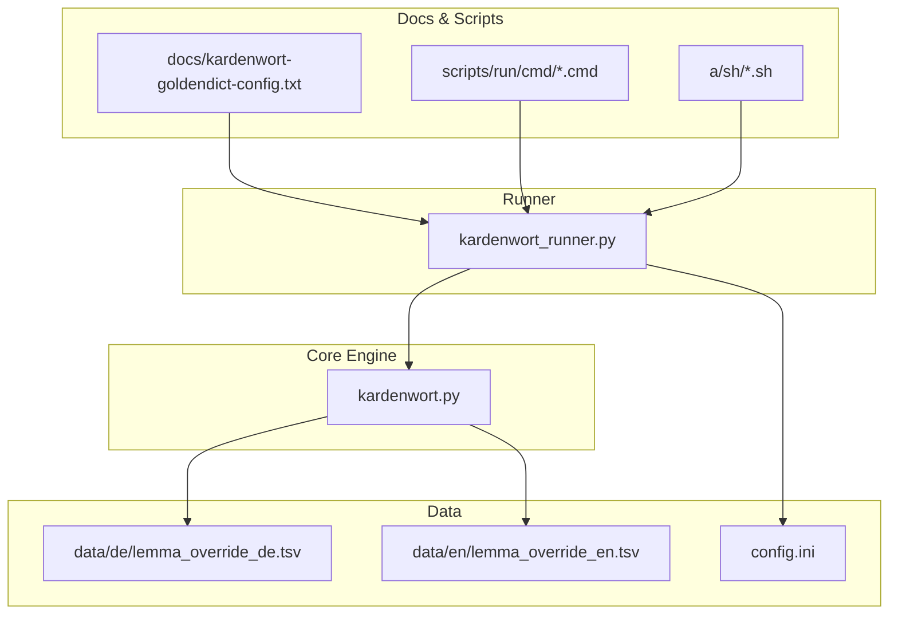
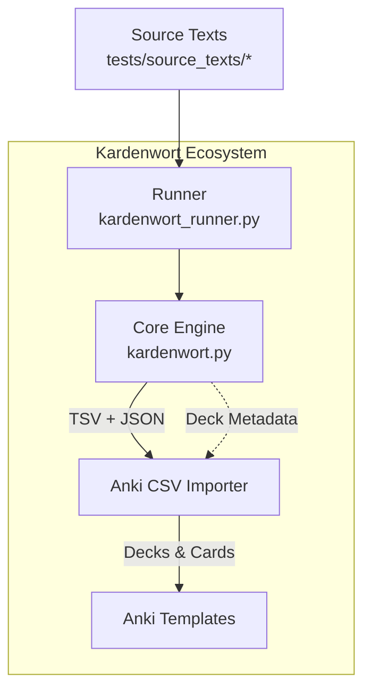
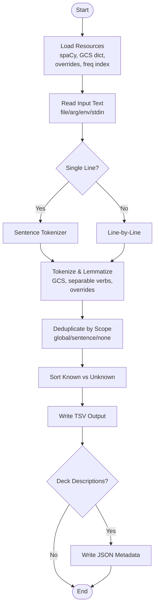
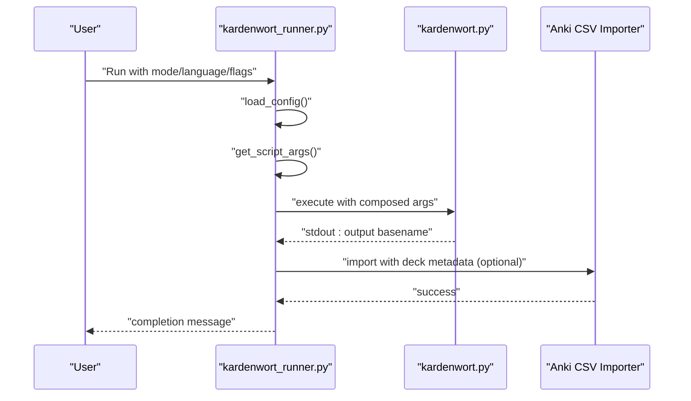
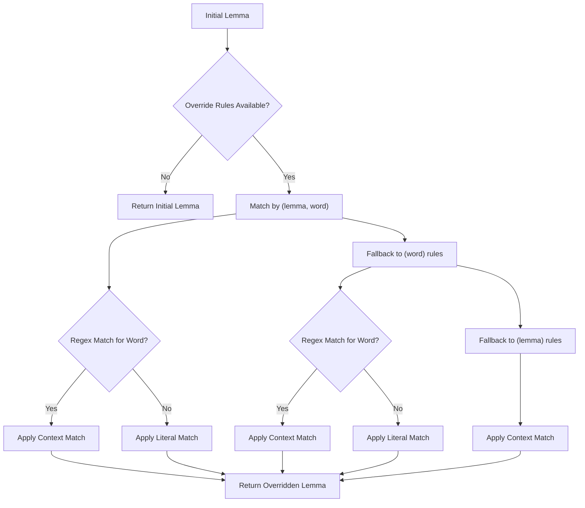
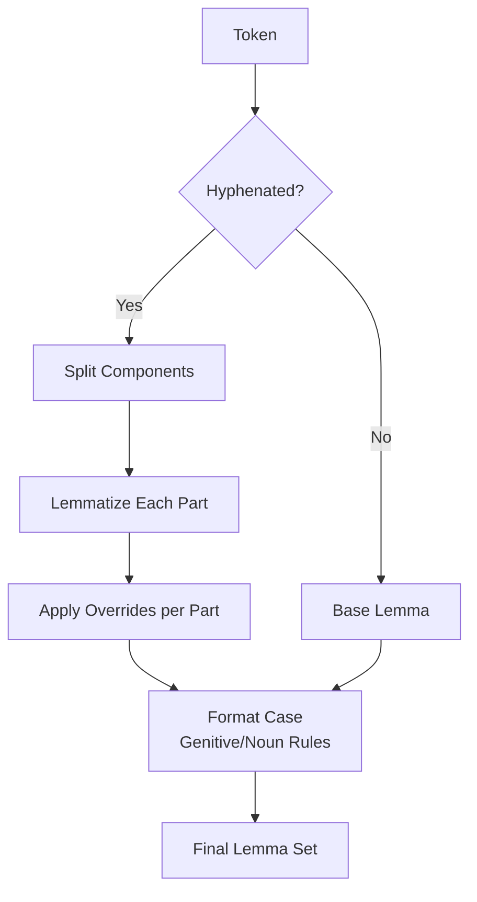
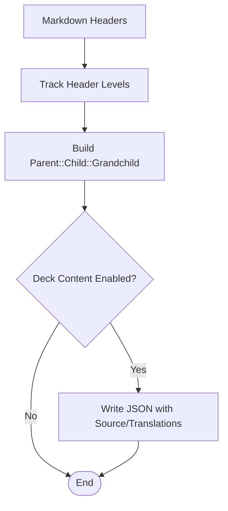
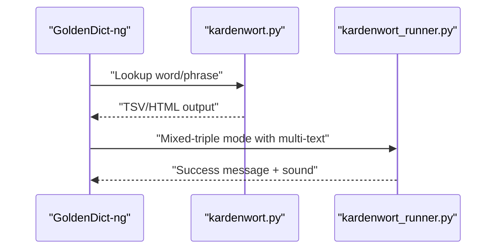
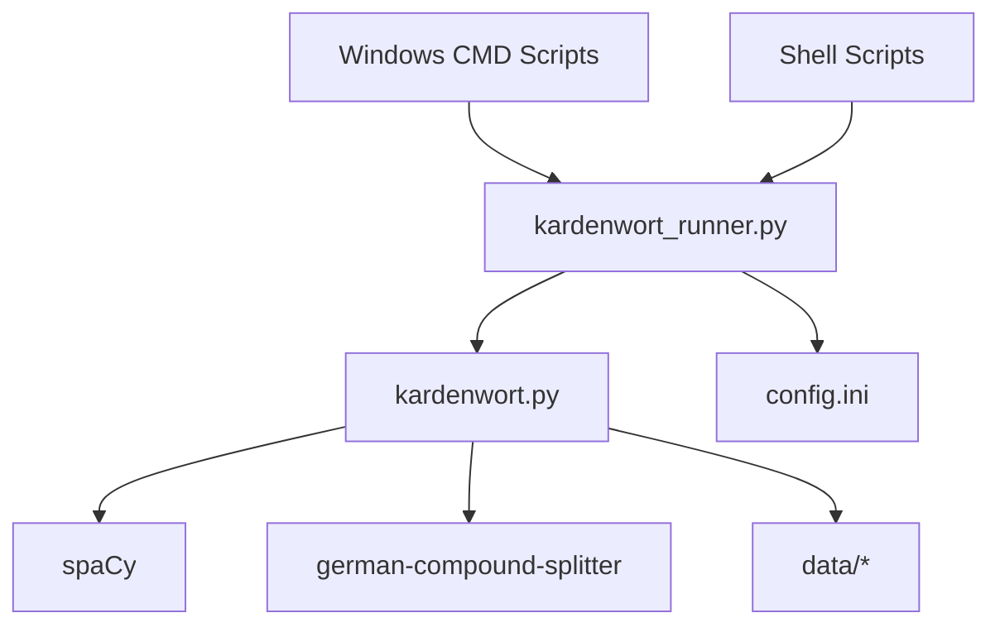

# Project Overview

<cite>
**Referenced Files in This Document**
- [README.md](file://README.md)
- [config.ini](file://config.ini)
- [src/kardenwort/core/kardenwort.py](file://src/kardenwort/core/kardenwort.py)
- [src/kardenwort/core/kardenwort_runner.py](file://src/kardenwort/core/kardenwort_runner.py)
- [data/de/lemma_override_de.tsv](file://data/de/lemma_override_de.tsv)
- [data/en/lemma_override_en.tsv](file://data/en/lemma_override_en.tsv)
- [docs/kardenwort-goldendict-config.txt](file://docs/kardenwort-goldendict-config.txt)
- [scripts/run/cmd/kardenwort_run_de_ws_t3_s_anki_v3.cmd](file://scripts/run/cmd/kardenwort_run_de_ws_t3_s_anki_v3.cmd)
- [a/sh/kardenwort-run-de-dual.sh](file://a/sh/kardenwort-run-de-dual.sh)
- [tests/source_texts/de/text.txt](file://tests/source_texts/de/text.txt)
- [tests/source_texts/en/text1.txt](file://tests/source_texts/en/text1.txt)
</cite>

## Table of Contents
1. [Introduction](#introduction)
2. [Project Structure](#project-structure)
3. [Core Components](#core-components)
4. [Architecture Overview](#architecture-overview)
5. [Detailed Component Analysis](#detailed-component-analysis)
6. [Dependency Analysis](#dependency-analysis)
7. [Performance Considerations](#performance-considerations)
8. [Troubleshooting Guide](#troubleshooting-guide)
9. [Conclusion](#conclusion)
10. [Appendices](#appendices)

## Introduction
Kardenwort is an intelligent command-line utility designed to accelerate language learning by transforming authentic texts into context-rich flashcards for Anki. Its philosophy centers on separating reading from study, maintaining medium independence, adopting an offline-first approach, and simplifying complex linguistic analysis so learners can focus on meaningful vocabulary acquisition.

Key goals:
- Reduce cognitive load by decoupling content consumption from vocabulary study.
- Preserve original media and formatting while building vocabulary lists.
- Run entirely offline to protect privacy and ensure reliability.
- Deliver simple, actionable results by doing the heavy lifting of lemmatization and deconstruction.

**Section sources**
- [README.md](file://README.md#L54-L63)

## Project Structure
At a high level, the project is organized around:
- Core engine: text processing, NLP, and vocabulary extraction.
- Runner: orchestrates processing and imports into Anki.
- Data: language resources, lemma overrides, and source texts.
- Docs and scripts: configuration, usage examples, and platform-specific runners.

**Diagram sources**
- [src/kardenwort/core/kardenwort.py](file://src/kardenwort/core/kardenwort.py#L1-L120)
- [src/kardenwort/core/kardenwort_runner.py](file://src/kardenwort/core/kardenwort_runner.py#L1-L120)
- [data/de/lemma_override_de.tsv](file://data/de/lemma_override_de.tsv#L1-L40)
- [data/en/lemma_override_en.tsv](file://data/en/lemma_override_en.tsv#L1-L1)
- [config.ini](file://config.ini#L1-L65)
- [docs/kardenwort-goldendict-config.txt](file://docs/kardenwort-goldendict-config.txt#L1-L60)
- [scripts/run/cmd/kardenwort_run_de_ws_t3_s_anki_v3.cmd](file://scripts/run/cmd/kardenwort_run_de_ws_t3_s_anki_v3.cmd#L1-L57)
- [a/sh/kardenwort-run-de-dual.sh](file://a/sh/kardenwort-run-de-dual.sh#L1-L35)

**Section sources**
- [README.md](file://README.md#L92-L131)

## Core Components
- Core engine (kardenwort.py): Implements intelligent lemmatization, German compound splitting, user-trainable lemma overrides, sentence processing, and deck metadata generation. It produces TSV outputs and optional JSON metadata for Anki deck descriptions.
- Runner (kardenwort_runner.py): Loads configuration, composes arguments, executes the core engine, and invokes the Anki CSV importer to import results into Anki.
- Data and overrides: Language-specific lemma frequency indices and override rules enable domain-specific corrections and improvements.
- Configuration (config.ini): Centralizes environment paths, script names, and resource locations for portability across platforms.
- GoldenDict-ng integration: Provides ready-to-use command-line examples for on-the-fly vocabulary generation from the dictionary app.

**Section sources**
- [README.md](file://README.md#L303-L311)
- [src/kardenwort/core/kardenwort.py](file://src/kardenwort/core/kardenwort.py#L300-L420)
- [src/kardenwort/core/kardenwort_runner.py](file://src/kardenwort/core/kardenwort_runner.py#L150-L220)
- [config.ini](file://config.ini#L1-L65)
- [docs/kardenwort-goldendict-config.txt](file://docs/kardenwort-goldendict-config.txt#L1-L120)

## Architecture Overview
The Kardenwort ecosystem comprises three integrated parts:
- Core engine: Processes text, performs NLP, and generates TSV and JSON outputs.
- Anki CSV importer: Imports the generated TSV into Anki, creating or updating decks and cards.
- Anki templates: Provide a rich, interactive card layout for study.

**Diagram sources**
- [src/kardenwort/core/kardenwort.py](file://src/kardenwort/core/kardenwort.py#L594-L671)
- [src/kardenwort/core/kardenwort_runner.py](file://src/kardenwort/core/kardenwort_runner.py#L211-L260)
- [README.md](file://README.md#L434-L450)

## Detailed Component Analysis

### Core Engine: Intelligent Lemmatization and Processing
The core engine performs:
- Initialization: loads spaCy models, GCS dictionary, lemma overrides, and frequency index.
- Text ingestion: reads from files, arguments, environment variables, or stdin.
- Tokenization and lemmatization: applies German compound splitting, separable verb handling, lemma correction, and user override rules.
- Collection and sorting: deduplicates lemmas by scope and sorts by known vs unknown.
- Output generation: writes TSV and optional JSON metadata for deck descriptions.

**Diagram sources**
- [src/kardenwort/core/kardenwort.py](file://src/kardenwort/core/kardenwort.py#L300-L420)
- [src/kardenwort/core/kardenwort.py](file://src/kardenwort/core/kardenwort.py#L476-L593)
- [src/kardenwort/core/kardenwort.py](file://src/kardenwort/core/kardenwort.py#L594-L671)

**Section sources**
- [README.md](file://README.md#L286-L301)
- [src/kardenwort/core/kardenwort.py](file://src/kardenwort/core/kardenwort.py#L476-L593)
- [src/kardenwort/core/kardenwort.py](file://src/kardenwort/core/kardenwort.py#L594-L671)

### Runner: Orchestration and Anki Integration
The runner:
- Loads configuration from config.ini.
- Composes arguments for the core engine based on mode, language, and flags.
- Executes the core engine and captures the output filename.
- Invokes the Anki CSV importer with deck metadata when present.

**Diagram sources**
- [src/kardenwort/core/kardenwort_runner.py](file://src/kardenwort/core/kardenwort_runner.py#L150-L220)
- [src/kardenwort/core/kardenwort_runner.py](file://src/kardenwort/core/kardenwort_runner.py#L211-L260)

**Section sources**
- [src/kardenwort/core/kardenwort_runner.py](file://src/kardenwort/core/kardenwort_runner.py#L150-L220)
- [src/kardenwort/core/kardenwort_runner.py](file://src/kardenwort/core/kardenwort_runner.py#L211-L260)

### Lemma Override System
Kardenwort supports a user-trainable override system to improve lemmatization accuracy:
- Priority-based rules: context-aware overrides keyed by spaCy lemma, original word, or regex patterns.
- Context matching: supports literal substring or regex conditions.
- Compound-part overrides: applies corrections to individual components during German compound splitting.

**Diagram sources**
- [src/kardenwort/core/kardenwort.py](file://src/kardenwort/core/kardenwort.py#L146-L206)
- [src/kardenwort/core/kardenwort.py](file://src/kardenwort/core/kardenwort.py#L207-L242)

**Section sources**
- [data/de/lemma_override_de.tsv](file://data/de/lemma_override_de.tsv#L1-L40)
- [data/en/lemma_override_en.tsv](file://data/en/lemma_override_en.tsv#L1-L1)
- [src/kardenwort/core/kardenwort.py](file://src/kardenwort/core/kardenwort.py#L74-L145)

### German Compound Splitting and Capitalization
- German compound splitting uses GCS with configurable modes and POS filtering.
- Genitive correction and noun capitalization can be enforced for improved accuracy.
- Compound preservation and component inclusion in wordlists are configurable.

**Diagram sources**
- [src/kardenwort/core/kardenwort.py](file://src/kardenwort/core/kardenwort.py#L476-L593)
- [src/kardenwort/core/kardenwort.py](file://src/kardenwort/core/kardenwort.py#L244-L287)
- [src/kardenwort/core/kardenwort.py](file://src/kardenwort/core/kardenwort.py#L417-L440)

**Section sources**
- [README.md](file://README.md#L386-L397)
- [src/kardenwort/core/kardenwort.py](file://src/kardenwort/core/kardenwort.py#L476-L593)

### Hierarchical Deck Creation and Deck Descriptions
- Parses Markdown headers to create nested decks.
- Supports sentence-level subdecks and automatic deck descriptions populated from source and translation texts.
- JSON metadata is written alongside the TSV for deck browser context.

**Diagram sources**
- [src/kardenwort/core/kardenwort.py](file://src/kardenwort/core/kardenwort.py#L461-L475)
- [src/kardenwort/core/kardenwort.py](file://src/kardenwort/core/kardenwort.py#L594-L671)

**Section sources**
- [README.md](file://README.md#L66-L79)
- [src/kardenwort/core/kardenwort.py](file://src/kardenwort/core/kardenwort.py#L594-L671)

### GoldenDict-ng Integration
- Provides ready-to-use command-line examples for on-the-fly vocabulary generation.
- Supports multi-text input via the “---” separator for source and translations.
- Includes platform-specific runners for convenience.

**Diagram sources**
- [docs/kardenwort-goldendict-config.txt](file://docs/kardenwort-goldendict-config.txt#L1-L120)
- [scripts/run/cmd/kardenwort_run_de_ws_t3_s_anki_v3.cmd](file://scripts/run/cmd/kardenwort_run_de_ws_t3_s_anki_v3.cmd#L1-L57)

**Section sources**
- [README.md](file://README.md#L245-L260)
- [docs/kardenwort-goldendict-config.txt](file://docs/kardenwort-goldendict-config.txt#L1-L120)

## Dependency Analysis
- Core engine depends on spaCy for tokenization and lemmatization, and optionally on GCS for German compounds.
- Runner depends on configuration and coordinates execution of the core engine and importer.
- Data files (overrides, frequency indices, dictionaries) feed into the core engine.
- Platform-specific scripts (Windows CMD and shell) wrap the runner for ease of use.

**Diagram sources**
- [src/kardenwort/core/kardenwort_runner.py](file://src/kardenwort/core/kardenwort_runner.py#L1-L120)
- [src/kardenwort/core/kardenwort.py](file://src/kardenwort/core/kardenwort.py#L1-L40)
- [config.ini](file://config.ini#L1-L65)
- [scripts/run/cmd/kardenwort_run_de_ws_t3_s_anki_v3.cmd](file://scripts/run/cmd/kardenwort_run_de_ws_t3_s_anki_v3.cmd#L1-L57)
- [a/sh/kardenwort-run-de-dual.sh](file://a/sh/kardenwort-run-de-dual.sh#L1-L35)

**Section sources**
- [README.md](file://README.md#L434-L450)
- [src/kardenwort/core/kardenwort.py](file://src/kardenwort/core/kardenwort.py#L1-L40)
- [src/kardenwort/core/kardenwort_runner.py](file://src/kardenwort/core/kardenwort_runner.py#L1-L120)

## Performance Considerations
- Large texts: sentence tokenization and GCS can be computationally intensive. Consider using line-by-line processing for preformatted content to reduce overhead.
- Deduplication scope: global deduplication improves accuracy but increases memory usage; sentence-level deduplication scales better for very long texts.
- Compound splitting: aggressive modes and POS filters increase processing time; tune flags for your use case.
- Batch processing: use mixed-triple mode to generate both sentence and word cards in one run, reducing repeated I/O.
- Offline-first: keep language models and dictionaries local to avoid network latency.

[No sources needed since this section provides general guidance]

## Troubleshooting Guide
Common issues and remedies:
- German genitive correction and noun capitalization: Enable genitive fix and noun capitalization flags to normalize lemmas for German.
- Single-line vs multi-line processing: Windows CMD scripts restrict single-line input; use direct runner invocation with multi-text support for multi-line GoldenDict integration.
- Deck descriptions not updating: Requires the custom AnkiConnect fork; ensure the modified add-on is installed.
- Missing resources: Verify config.ini paths and that language-specific data files exist.

**Section sources**
- [README.md](file://README.md#L134-L207)
- [README.md](file://README.md#L232-L244)
- [README.md](file://README.md#L386-L397)
- [src/kardenwort/core/kardenwort_runner.py](file://src/kardenwort/core/kardenwort_runner.py#L1-L120)

## Conclusion
Kardenwort delivers a robust, offline-first pipeline for turning authentic texts into high-quality Anki flashcards. Its separation of reading and study, medium independence, and user-trainable overrides make it a powerful companion for language learners and educators. By leveraging intelligent lemmatization, advanced German compound splitting, and flexible deck creation, it simplifies complex linguistic analysis while preserving the richness of original content.

[No sources needed since this section summarizes without analyzing specific files]

## Appendices

### Practical Examples
- Learners: Process authentic German news articles with mixed-triple mode to generate both sentence and word cards, preserving Markdown headers as nested decks.
- Educators: Use sentence mode for classroom materials, enabling contextual grammar study with surrounding sentences and translations.

**Section sources**
- [README.md](file://README.md#L208-L231)
- [tests/source_texts/de/text.txt](file://tests/source_texts/de/text.txt#L1-L9)
- [tests/source_texts/en/text1.txt](file://tests/source_texts/en/text1.txt#L1-L15)

### Configuration and Setup
- Configure environment paths and script names in config.ini.
- Use platform-specific runners for quick starts; switch to direct runner invocation for advanced features like multi-text and mixed-triple mode.

**Section sources**
- [config.ini](file://config.ini#L1-L65)
- [scripts/run/cmd/kardenwort_run_de_ws_t3_s_anki_v3.cmd](file://scripts/run/cmd/kardenwort_run_de_ws_t3_s_anki_v3.cmd#L1-L57)
- [a/sh/kardenwort-run-de-dual.sh](file://a/sh/kardenwort-run-de-dual.sh#L1-L35)