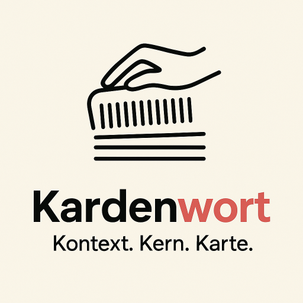
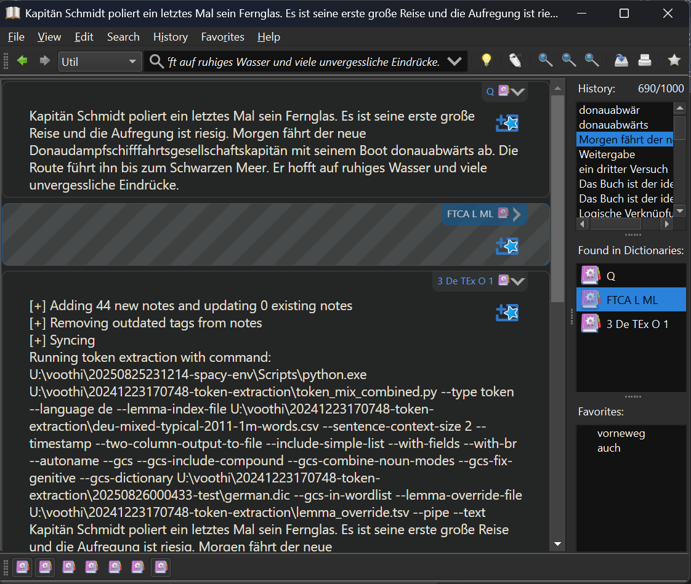
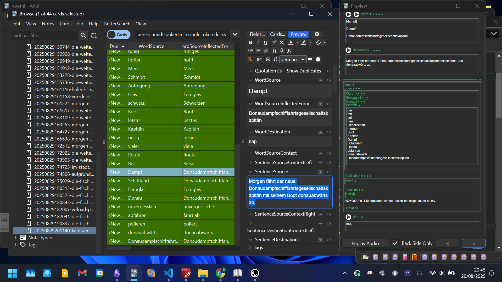

<p align="center">
  <!-- ЗАГЛУШКА ДЛЯ ЛОГОТИПА: Замените src на путь к вашему файлу логотипа -->
  
</p>

# **Kardenwort**

> *Kontext. Kern. Karte.*


Kardenwort is a powerful command-line utility designed to accelerate language learning by automatically creating Anki flashcards from any text. It intelligently processes your source material, extracts vocabulary (tokens) and full sentences, and generates a structured file ready for direct import into Anki.

This tool is perfect for language learners who want to build personalized decks from books, articles, subtitles, or any other text they are studying.

## Project Philosophy and Core Concepts

The Kardenwort project was created with one main goal: to provide an effective and flexible tool for mastering foreign language vocabulary by working with authentic text. At the heart of the project is `token_mix_combined.py`—a powerful command-line utility (CLI) developed for deep linguistic analysis of texts and the automatic creation of structured data for spaced repetition systems (SRS).

Our philosophy can be summarized in three words:

**Kontext. Kern. Karte.**

*   **Kontext:** We believe that words cannot be learned in a vacuum. Language is context. Kardenwort ensures that every vocabulary card retains the original sentence and surrounding phrases, allowing you to understand usage, nuance, and grammar naturally.
*   **Kern:** Our core engine, powered by advanced NLP, drills down to find the lexical kernel (the lemma or base form) of every word. It intelligently handles complex grammar, such as German compound nouns and separable verbs, to give you the most accurate and useful information.
*   **Karte:** The final output is a perfectly structured card (`Karte`), ready for import into Anki. It's not just a word and its translation; it's a rich, data-filled canvas for learning, complete with context, inflectional forms, and word lists.

This philosophy is supported by three core principles:

1.  **Openness and Free Access:** This is an open-source development that can be used anywhere without restrictions.
2.  **Your Data in Your Hands:** The project does not require registration or subscriptions. You are not dependent on third-party services that might one day charge a fee for access to the very cards you spent hours creating.
3.  **Maximum Flexibility:** The output of the utility is a starting point, not a rigid system. You get full control over your learning materials.

### Key Advantages and Differences from Alternatives

There are many solutions on the market for working with texts: LWT, Lute, LinguaCafe, VocabSieve, LingQ, Readlang, AnkiMorphs, lemmatize, alexandria-reader, LanguageCrush, Smart Book - KursX, KOReader, and others. However, `Kardenwort` offers a unique combination of capabilities:

*   **Intelligent German Language Processing:** None of the listed applications provide such a high level of German vocabulary processing. The utility correctly parses compound nouns, finds verbs with separable prefixes, and properly handles capitalization, which is a constant problem in other systems (e.g., nouns starting with a lowercase letter that cannot be corrected).
*   **Complete Freedom After Export:** Unlike readers where a card is rigidly tied to the source text, here you receive completely autonomous data. With all the necessary context in the card, you can edit any field in Anki on both PC and mobile. This truly frees you up and allows you to adapt the material to your needs.
*   **Quality You Can Influence:** The accuracy of the analysis depends on the capabilities of the `spaCy` library—a compromise between speed, resource consumption, and quality. However, you can directly influence the result by training the system through a rules/exceptions file (`lemma_override.tsv`), achieving perfect processing for your specific texts.

---

## Quick Start

Get your first Anki deck in 5 minutes:

1.  **Prerequisites**: Make sure **Anki Desktop is running** with the [AnkiConnect](https://ankiweb.net/shared/info/2055492159) add-on installed.
2.  **Clone & Setup**: Clone all three required projects and set up the Python environment.
    ```bash
    # Clone repositories
    git clone <url-for-this-repo>
    git clone <url-for-anki-csv-importer-repo>
    git clone <url-for-anki-template-repo>

    # Create and activate virtual environment
    python -m venv venv
    .\venv\Scripts\activate  # Windows

    # Install dependencies
    pip install spacy "german-compound-splitter>=2.0.0" requests
    python -m spacy download de_core_news_lg
    ```
3.  **Import Anki Template**: Import the `basic-20240218092126` note type from the `20241106211123-anki-template` project into Anki.
4.  **Prepare Text**: Open the file `in/text1.txt` and add some German sentences. For example:
    ```
    Die Fischer kennen die Austernbanken vor der Küste sehr gut.
    Sie fahren sie gezielt an.
    ```
5.  **Run**: Execute the batch script.
    ```bash
    t_batch_de.single.bat
    ```
**Done!** Check Anki for a new deck filled with cards created from your text.

## Key Features
*   **Dual Card Types**: Create both vocabulary cards (single words) and sentence cards (full phrases).
*   **Multiple Processing Modes**: `single`, `dual`, and `triple` text processing for monolingual, bilingual, or trilingual contexts.
*   **Multi-Language Support**: Currently supports **English (en)** and **German (de)**.
*   **Advanced NLP**: Uses `spaCy` for accurate lemmatization (finding the base form of words).
*   **German Compound Splitting (GCS)**: Intelligently breaks down long German compound words into their components.
*   **Direct Anki Integration**: Automatically imports the generated cards into your Anki collection using AnkiConnect.
*   **GoldenDict-ng Integration**: Create Anki cards directly from your favorite dictionary application.

---

## Core Functionality: In-Depth

To analyze text, advanced NLP libraries are used:
*   **`spaCy`**: for tokenization, lemmatization, part-of-speech tagging, and morphological analysis.
*   **`german-compound-splitter`**: for the complex task of parsing German compound nouns.

The utility's primary goal is to extract material from the source text to create two types of cards. This is achieved through two fundamental modes of operation, determined by the `--type` parameter:

1.  **`--type token` (Vocabulary Cards):**
    *   **Goal:** To create cards for studying individual words (one word per card).
    *   **Mechanism:** The script analyzes the entire input text, extracts all unique words, reduces them to their base form (lemma), and creates a separate row in the output file for each unique lemma. Each row contains the lemma itself, its original inflected form, the sentence in which it first appeared, and the surrounding context.
    *   **Special Feature:** This mode includes complex logic such as compound word splitting (GCS) and handling of separable prefixes for German verbs, making it particularly powerful for learning German.

2.  **`--type sentence` (Sentence Cards):**
    *   **Goal:** To create cards with sentences for studying phrases and grammar in context.
    *   **Mechanism:** The script processes input files line by line, assuming each line is a complete sentence. For each line from the first file (`--text1`), one record is created in the output file. If parallel texts are provided (`--text2`, `--text3`), the corresponding lines from them are added to the same record, creating a card with a translation.
    *   **Special Feature:** In this mode, a list of all lemmas found in the sentence can also be generated for the `SentenceSourceWordlist` field.

### The Result of Processing

The result of the script's execution is a **TSV (Tab-Separated Values) file**, which:
*   Is fully ready for direct import into **Anki** when used with the corresponding template.
*   Can be easily opened and analyzed in any spreadsheet application (e.g., MS Excel, LibreOffice Calc) or an editor like VS Code with the `vscode-edit-csv` plugin. This allows using the exports to create custom word lists and other study materials.

---

## Understanding Input Processing

Understanding how the utility receives and interprets input data is key to its effective use.

### Ways to Provide Data

*   **`--text "..."`**: Directly providing text as a string. This method is ideal for integration with other programs (e.g., GoldenDict, where the selected word `%GDWORD%` is passed) or for quickly processing short phrases. **Mutually exclusive with `--text1`**.
*   **`--text1 <path_to_file>`**: Specifying the path to the main text file. This is the standard method for processing large volumes of text (books, articles, subtitles).
*   **`--text2 <path_to_file>`** and **`--text3 <path_to_file>`**: Specifying paths to files with parallel texts (e.g., translations).

### File Format Requirements

*   **Format:** Plain text file (`.txt`).
*   **Encoding:** **UTF-8**. Using another encoding may lead to reading errors.
*   **Structure for Parallel Texts:** When using `--text2` or `--text3`, it is crucial to ensure **strict line-by-line correspondence**. Line N in `text2.txt` must be the exact translation of line N in `text1.txt`. Violating this rule will lead to incorrect sentence matching on Anki cards.

### The Hybrid Mechanism for Defining "Processing Units"

This is one of the most important features of the utility, directly affecting how context is formed in the final TSV file. The utility automatically chooses one of two ways to split the text into "processing units" (essentially, sentences):

1.  **"Line-by-Line" Mode:**
    *   **Trigger Condition:** Activates if the input text (from `--text` or `--text1`) contains at least one newline character (`\n`).
    *   **Logic:** The script treats each line as a separate and complete "processing unit." It does not attempt to further divide lines into sentences.
    *   **Application:** This mode is primary for working with parallel texts and subtitles, where each line is a self-contained phrase.

2.  **"Sentence Tokenization" Mode:**
    *   **Trigger Condition:** Activates if the entire input text is a single block without any newline characters.
    *   **Logic:** The script uses `spaCy`'s built-in sentence tokenizer to grammatically and correctly split the continuous text into individual sentences. Each detected sentence becomes a "processing unit."
    *   **Application:** This mode is ideal for processing prose—articles, paragraphs from books, etc.

**How this affects Anki cards:** The `SentenceSource` field on the card will contain the "processing unit" where the word was found. The context fields (`SentenceSourceContextLeft` and `SentenceSourceContextRight`) will contain the preceding and succeeding "processing units," respectively. Thus, how your source file was structured (line-by-line or as continuous text) directly determines what you will see as context on your Anki card.

---

## Deep Dive: The Processing Pipeline

The utility's workflow can be broken down into the following stages:

#### Step 1: Initialization and Setup

1.  **Argument Parsing:** Using `argparse`, the script reads all command-line parameters (`--type`, `--language`, file paths, GCS flags, etc.).
2.  **Loading the NLP Model:** Based on the `--language` parameter, the corresponding "large" `spaCy` model is loaded (`de_core_news_lg` for German or `en_core_web_lg` for English).
3.  **Loading Auxiliary Data:**
    *   **GCS Dictionary (`--gcs-dictionary`):** Used to validate the correctness of compound word splitting and to correct lemmas of genitive nouns.
    *   **Lemma Override Rules (`--lemma-override-file`):** A TSV file (`lemma_override.tsv`) is loaded, allowing the user to manually define lemmatization rules (globally or with context).
    *   **Lemma Index (`--lemma-index-file`):** A CSV file (e.g., a frequency dictionary) is loaded, which is used to sort the output data so that known words appear in a predictable order.

#### Step 2: Input Processing and Main Loop

1.  **Text Splitting:** The input text is divided into "processing units" according to the hybrid mechanism described above.
2.  **Token Iteration:** The script iterates through each token (word or punctuation mark) in every processing unit, using `spaCy` metadata (lemma, part of speech, morphology).
3.  **Filtering:** Tokens that are not words (punctuation, numbers, spaces) are discarded.
4.  **Lemmatization and Processing:** A complex sequence of actions is performed for each word:
    a. **Compound Word Splitting (GCS):** If the `--gcs` flag is enabled for German, the script attempts to break down long nouns into their component parts.
    b. **Standard Lemmatization:** If the word was not split by GCS, its lemma is determined using `spaCy`.
    c. **Correction and Normalization:**
        *   **Separable Prefixes (German):** Finds verbs with separable prefixes (e.g., `...fahren sie ... an`) and correctly combines them into a single lemma (`anfahren`).
        *   **Genitive Case (German):** Corrects lemmas of nouns in the genitive case (e.g., `Hauses` -> `Haus`).
        *   **Capitalization:** Correctly sets capitalization: nouns are always capitalized, other words are lowercase.
    d. **Applying Override Rules:** After all automatic transformations, the rules from `lemma_override.tsv` are checked, and if a match is found, the standard lemma is replaced with the user-defined one.
5.  **Collecting Unique Lemmas:** All resulting lemmas are collected into a dictionary, ensuring that only one card is created for each unique word.

#### Step 3: Sorting

Before writing to the file, the final list of unique lemmas is sorted: new words first, then known words (in the order from `--lemma-index-file`), and finally, alphabetically.

#### Step 4: Generating the Output TSV File

1.  **File Creation:** An output filename is generated.
2.  **Writing Headers:** If the `--with-fields` flag is specified, the first line with the names of all 80 fields corresponding to the Anki template is written to the file.
3.  **Writing Data:** A row is created in the TSV file for each sorted lemma.
4.  **Output to `stdout`:** If the `--pipe` flag is specified or no output file (`--output`) is provided, the result is printed directly to the standard output stream (important for integration with GoldenDict).

---

## Usage Scenarios

You can use Kardenwort in several ways, from simple batch files to direct command-line calls for advanced integration.

### 1. Basic Usage (Using Batch Files)

This is the easiest way to get started.

1.  **Prepare your input files** in the `in/` directory (`text1.txt`, `text2.txt`, etc.).
2.  **Ensure Anki is running** with AnkiConnect.
3.  **Run the appropriate `.bat` script**. The filename indicates its function: `t_batch_{language}.{mode}.bat`.
    *   `t_batch_de.dual.bat`: Creates German cards from `in/text1.txt` and `in/text2.txt`.
    *   `t_batch_en.single.bat`: Creates English cards from `in/text1.txt` only.

### 2. GoldenDict-ng Integration

Instantly create Anki cards from any word or phrase you look up in GoldenDict. This creates a seamless workflow from discovery to study.

<p align="center">
  
</p>

**Setup:**

1.  In GoldenDict-ng, go to `Edit` -> `Dictionaries`.
2.  Go to the **Programs** tab.
3.  Click **Add**, and configure a new program:
    *   **Type**: `Plain Text`
    *   **Enabled**: ☑️
    *   **Name**: `Create Anki Card (DE Token)` (or any name you like)
    *   **Command Line**:
        ```
        U:\voothi\20250825231214-spacy-env\Scripts\python.exe U:\voothi\20241223170748-token-extraction\t_starter.py --language de --type token --mode single --text "%GDWORD%"
        ```
        **Important:** You **must** replace the paths to `python.exe` and `t_starter.py` with the absolute paths on your system.

4.  Click **OK** to save.

**How to Use:**
Now, when you look up a word or highlight a sentence in GoldenDict, a new dictionary tab `Create Anki Card (DE Token)` will appear. Clicking on it will run the script in the background and automatically add the new cards to Anki.

### 3. Advanced Usage (Direct Command-Line)

For maximum flexibility, you can call the scripts directly. The main entry point is `t_starter.py`, which handles both processing and importing.

#### Command-Line Examples

*   **Create German token cards from a single text file:**
    ```bash
    python t_starter.py --language de --type token --mode single --text "Die Fischer kennen die Austernbanken."
    ```

*   **Create English sentence cards from parallel files:**
    ```bash
    # Ensure in/text1.txt and in/text2.txt are populated
    python t_starter.py --language en --type sentence --mode dual
    ```

*   **Create German cards from three files:**
    ```bash
    python t_starter.py --language de --type token --mode triple
    ```

---

## Command-Line Arguments (`token_mix_combined.py`)

Below is a detailed list of all available arguments for the core processing script, `token_mix_combined.py`. These can be passed through `t_starter.py`.

### Core Arguments

| Argument     | Description                                                            | Example                    |
| :----------- | :--------------------------------------------------------------------- | :------------------------- |
| `--type`     | **(Required)** The type of cards to create.                            | `token` or `sentence`      |
| `--language` | **(Required)** The source language of the text.                        | `de` or `en`               |
| `--mode`     | **(Required)** The processing mode based on the number of input files. | `single`, `dual`, `triple` |

### Input & Output

| Argument         | Description                                                                                                 | Example                      |
| :--------------- | :---------------------------------------------------------------------------------------------------------- | :--------------------------- |
| `--text`         | Process a string directly instead of a file. For `single` mode only. **Mutually exclusive with `--text1`**. | `--text "This is a test."`   |
| `--text1`        | Path to the primary source text file.                                                                       | `--text1 "in/source.txt"`    |
| `--text2`        | Path to the second text file (e.g., translation). For `dual`/`triple` modes.                                | `--text2 "in/target.txt"`    |
| `--text3`        | Path to the third text file. For `triple` mode only.                                                        | `--text3 "in/extra.txt"`     |
| `--output`       | The path for the output `.tsv` file.                                                                        | `--output "out/my_deck.tsv"` |
| `--timestamp`    | Prepend a `YYYYMMDDHHMMSS-` timestamp to the output filename.                                               | `--timestamp`                |
| `--autoname [N]` | Automatically generate part of the filename from the first `N` words of the text (default is 4).            | `--autoname 3`               |
| `--pipe`         | Print the final output filename to standard output. Useful for chaining scripts.                            | `--pipe`                     |

### NLP & Lemmatization Control

| Argument                | Description                                                                       | Example                                        |
| :---------------------- | :-------------------------------------------------------------------------------- | :--------------------------------------------- |
| `--lemma-override-file` | Path to a TSV file for context-aware lemma overrides (format: `original\tlemma`). | `--lemma-override-file "config/overrides.tsv"` |
| `--lemma-index-file`    | Path to a lemma index file (legacy functionality).                                | `--lemma-index-file "index.json"`              |

### Card Content & Formatting

| Argument                         | Description                                                                                                                                                                                       | Example                          |
| :------------------------------- | :------------------------------------------------------------------------------------------------------------------------------------------------------------------------------------------------ | :------------------------------- |
| `--sentence-context-size N`      | Number of preceding and succeeding sentences to include as context.                                                                                                                               | `--sentence-context-size 2`      |
| `--include-simple-list`          | Include a simple list of all unique words from the source sentence in the `SentenceSourceWordlist` field.                                                                                         | `--include-simple-list`          |
| `--original-form-in-simple-list` | When used with `--include-simple-list`, populates the `SentenceSourceWordlist` with original (inflected) word forms instead of their base lemmas. **(Status: Declared, but not yet implemented)** | `--original-form-in-simple-list` |
| `--with-fields`                  | Include the header row with all field names in the output TSV file.                                                                                                                               | `--with-fields`                  |
| `--with-br`                      | Use `<br>` tags instead of newlines for the `SentenceSourceWordlist`.                                                                                                                             | `--with-br`                      |
| `--two-column-output-to-file`    | Add the inflected (original) form of a word to the `WordSourceInflectedForm` field.                                                                                                               | `--two-column-output-to-file`    |

### German Compound Splitting (GCS) Options

**Note:** All GCS options require `--gcs` to be enabled and are only effective when using `--type token`. They will be ignored in `sentence` mode.

| Argument                   | Description                                                                                                                   | Example                               |
| :------------------------- | :---------------------------------------------------------------------------------------------------------------------------- | :------------------------------------ |
| `--gcs`                    | **Enable** German Compound Splitting.                                                                                         | `--gcs`                               |
| `--gcs-dictionary`         | Path to the dictionary file used by GCS for validation.                                                                       | `--gcs-dictionary "dicts/german.dic"` |
| `--gcs-include-compound`   | Include the original compound word in the card list along with its split parts.                                               | `--gcs-include-compound`              |
| `--gcs-in-wordlist`        | Also add the split components to the `SentenceSourceWordlist` field.                                                          | `--gcs-in-wordlist`                   |
| `--gcs-combine-noun-modes` | Runs GCS in two modes (splitting on nouns-only and any word type) and merges the results for more comprehensive splitting.    | `--gcs-combine-noun-modes`            |
| `--gcs-only-nouns-false`   | Allows any word type (verb, adjective, etc.) to be used for GCS splitting. **Ignored if `--gcs-combine-noun-modes` is used**. | `--gcs-only-nouns-false`              |
| `--gcs-fix-genitive`       | Attempts to correct German genitive noun lemmas (e.g., 'Hauses' -> 'Haus').                                                   | `--gcs-fix-genitive`                  |
| `--gcs-mask-unknown`       | During GCS splitting, mask word parts not found in the dictionary as 'unknown'.                                               | `--gcs-mask-unknown`                  |
| `--make-singular`          | Force making compound parts singular during GCS splitting, regardless of the word's part of speech.                           | `--make-singular`                     |
| `--no-make-singular`       | Prevent making compound parts singular, keeping their original form. **Overrides `--make-singular`**.                         | `--no-make-singular`                  |

### Debugging & Console Output
These flags are primarily for debugging and direct console output, not for generating the final Anki `.tsv` file.

| Argument              | Description                                                              | Example               |
| :-------------------- | :----------------------------------------------------------------------- | :-------------------- |
| `--detailed`          | Print detailed token information (text, lemma, POS tag) to the console.  | `--detailed`          |
| `--two-column-output` | Print a simple two-column output (original and lemma) to the console.    | `--two-column-output` |
| `--html`              | Generate and print an HTML table with processing results to the console. | `--html`              |

---

## Project Ecosystem: Integration and Automation

The power of `Kardenwort` is fully unlocked through its integration with other tools, creating a seamless and fully automated pipeline from the source text to ready-to-study flashcards.

### The Complete Workflow with Anki

This tight integration is managed by the `t_starter.py` script and involves three key components:

1.  **Kardenwort (This Project)**
    *   **Role:** The "brain" of the operation. It performs all the heavy lifting of text processing (NLP) and generates a highly structured `.tsv` file.

2.  **Anki CSV Importer (project `20250401192017-anki-csv-importer`)**
    *   **Role:** The "bridge" to Anki. A separate script that uses the AnkiConnect add-on to programmatically import the `.tsv` file into a specified Anki deck without manual intervention.

3.  **Anki Template (project `20241106211123-anki-template`)**
    *   **Role:** The "canvas" for the cards. A specially designed Anki note type (`basic-20240218092126`) containing over 80 fields that perfectly match the columns in the `.tsv` file and transform the data into an interactive card.

**The Automated Process:**
By running a single command (e.g., `t_batch_de.dual.bat`), you trigger a chain reaction: `t_starter.py` calls `token_mix_combined.py` to create the `.tsv` file, and then immediately calls `anki-csv-importer.py` to import that file into Anki using the correct template.

### AI-Powered Enrichment

The rich and structured context generated for each card provides an ideal foundation for further processing with large language models. Using the Anki plugin **IntelliFilter** (ID: `20250212113752-intellifilter`), you can send requests directly from Anki to OpenAI to automatically add translations, synonyms, usage examples, and any other information, significantly enriching your study materials.

## Related Utilities

The generated TSV files are designed to be used with a specific, feature-rich Anki template named `basic-20240218092126`. This template organizes the information into a clean, interactive, and powerful layout for effective learning.

-   `20250421115831-gtts-player`
-   `20250212113752-intellifilter`
-   `20250228230803-whisper`
-   `20250311224733-search-py`
-   `deep-translator`
-   `gTTS`
-   `argotranslate`
-   `fabric`
-   `piper-tts`
-   `merge_media`
-   `split_media_by_subtitles`
-   and others.

## The Anki Card Template

The generated TSV files are designed to be used with a specific, feature-rich Anki template named `basic-20240218092126`. This template organizes the information into a clean, interactive, and powerful layout for effective learning.

<p align="center">
  
</p>

**Template Features:**

*   **Interactive Collapsible Sections**: Information is grouped into sections like "Source", "Destination", and "AI". You can click on a header to reveal or hide the content, keeping the card uncluttered.
*   **Dynamic Fields**: Fields only appear if they contain data. For example, the "Wordlist" section won't show up if it's empty.
*   **Integrated Audio**: Supports both pre-recorded audio files and automatic text-to-speech (TTS) for words and sentences.
*   **Context Display**: Shows the sentence in its original context (previous and next sentences) to aid comprehension.
*   **Full Word List**: Displays all unique words (lemmas) found in the source sentence.

## Requirements

1.  **Python 3.9**: The scripts are tested with Python 3.9. Using newer versions might cause compatibility issues with dependencies.
2.  **Anki Desktop**: The Anki application must be installed and running.
3.  **AnkiConnect Add-on**: You need to install the [AnkiConnect](https://ankiweb.net/shared/info/2055492159) add-on in Anki.
4.  **Git**: To clone the required repositories.

## Installation

1.  **Clone the repositories**:
    It is recommended to clone all three projects into the same parent directory.

    ```bash
    git clone <url-for-this-repo>
    git clone <url-for-anki-csv-importer-repo>
    git clone <url-for-anki-template-repo>
    ```

2.  **Import the Anki Template**:
    Open Anki Desktop and import the note type from the `20241106211123-anki-template` project. This will add the `basic-20240218092126` note type to your collection.

3.  **Set up the Python Virtual Environment**:
    Navigate to the project directory and create a virtual environment.

    ```bash
    # Navigate to your environment directory (e.g., 20250825231214-spacy-env)
    python -m venv venv
    ```

4.  **Activate the Environment**:
    -   On Windows: `.\venv\Scripts\activate`
    -   On macOS/Linux: `source ./venv/bin/activate`

5.  **Install Dependencies**:
    Install the required Python packages.

    ```bash
    pip install spacy "german-compound-splitter>=2.0.0" requests
    ```

6.  **Download SpaCy Models**:
    Download the language models for English and German.

    ```bash
    python -m spacy download en_core_web_lg
    python -m spacy download de_core_news_lg
    ```

## Configuration

Before running the scripts, you need to update the hardcoded paths to match your system setup.

-   **In all `.bat` files** (e.g., `t_batch_de.dual.bat.txt`):
    -   `PYTHON_PATH`: Set this to the path of the Python executable inside your virtual environment.
    -   `WORKSPACE`: Set this to the root directory of the `Kardenwort` project.
-   **In `t_starter.py`**:
    -   Update the paths for `python_path`, `token_workspace`, and `importer_workspace` if you did not clone the projects into the same parent folder.
-   **In `anki-csv-importer.py` (from the importer project)**:
    -   The script is configured to get the note type name (`--note`) as an argument, which is correctly set to `"Basic 20240218092126"` in `t_starter.py`.

## Usage

1.  **Prepare your input files**:
    -   Place your source text in `in/text1.txt`. Each line should correspond to a sentence.
    -   If using `dual` or `triple` mode, place the corresponding translation(s) in `in/text2.txt` and `in/text3.txt`. The line numbers must match `text1.txt`.

2.  **Ensure Anki is running** with the AnkiConnect add-on enabled.

3.  **Run a batch script**:
    Execute one of the provided `.bat` files to start the process.

    -   **To create German vocabulary and sentence cards from two text files:**
        ```bash
        t_batch_de.dual.bat
        ```

The script will run, generate a timestamped `.tsv` file in the `out/` directory, and then automatically call the importer. A new deck named after the generated file will appear in Anki.

## License and Acknowledgements

This project is licensed under the MIT License. See the `LICENSE` file for details.

This project utilizes code from the `anki-csv-importer` project.
-   **Author**: Gulshan Singh
-   **License**: MIT License
-   A copy of the license is included in the header of the `anki-csv-importer.py` file. We are grateful for this contribution to the open-source community.